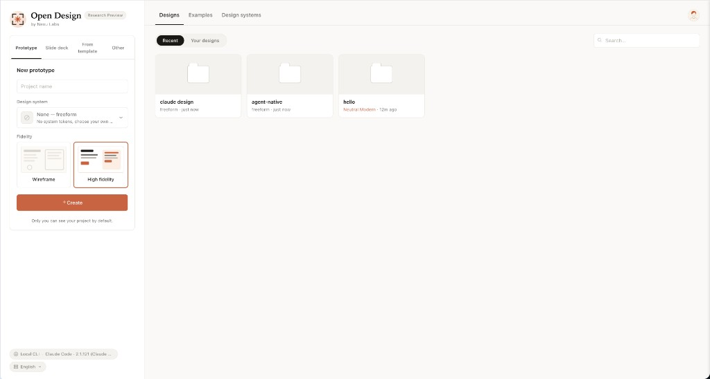
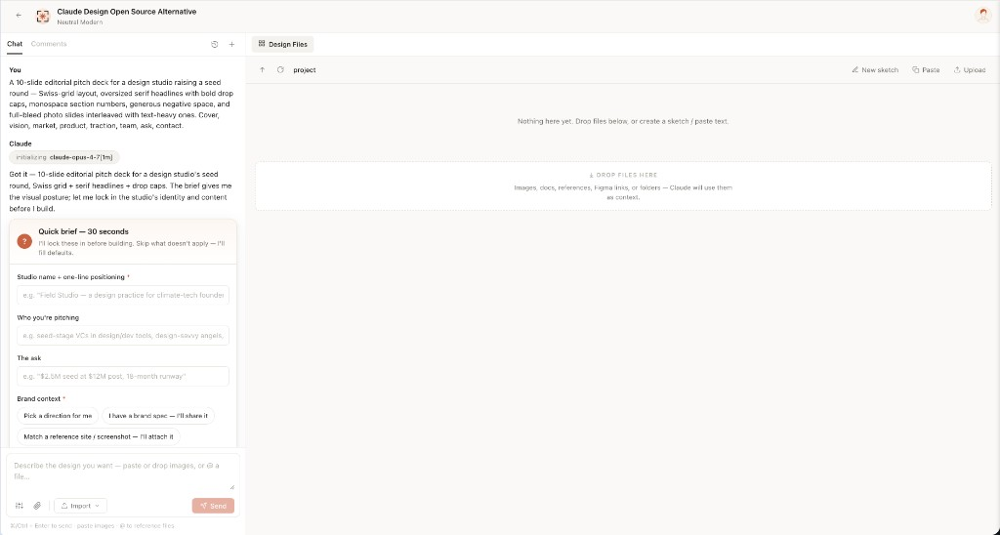
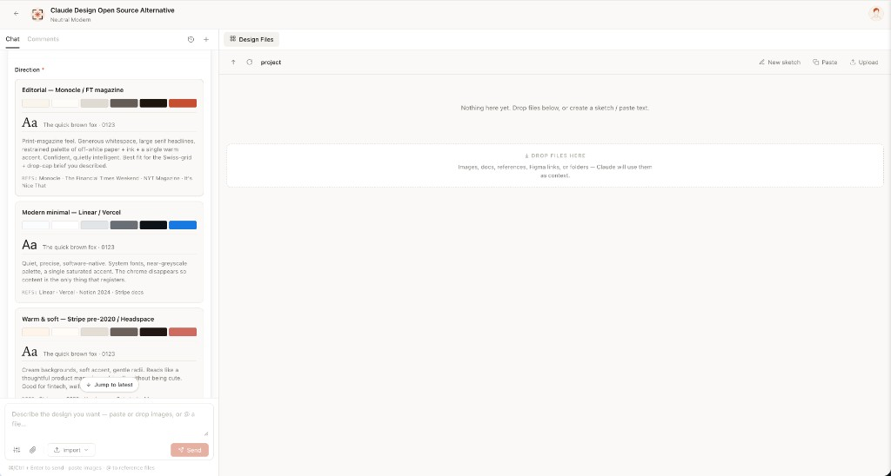
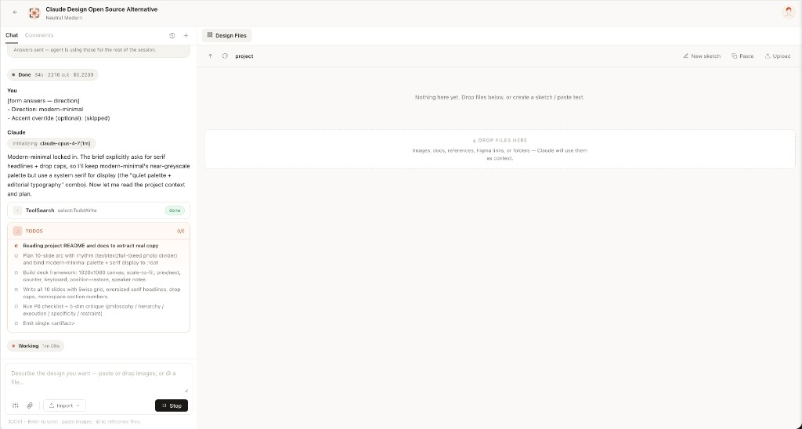
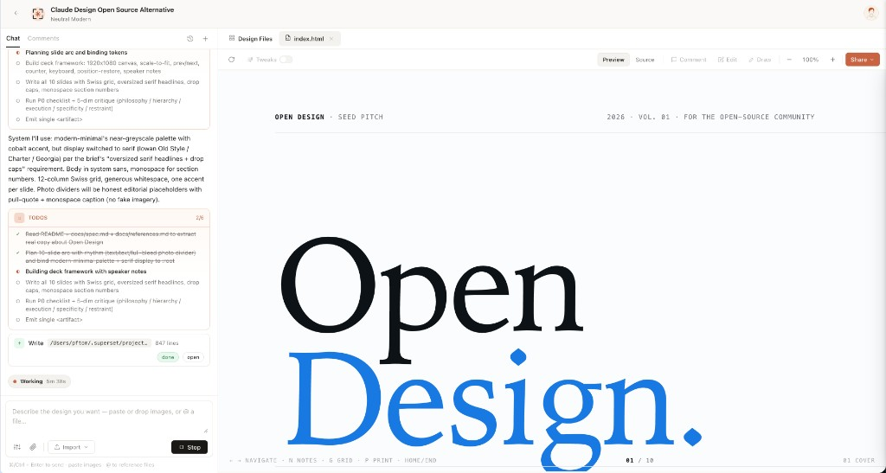
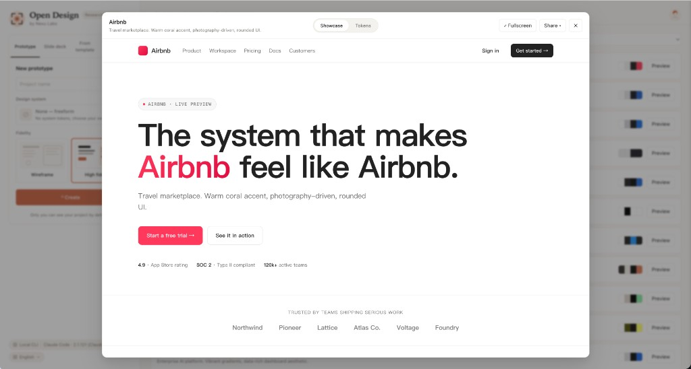
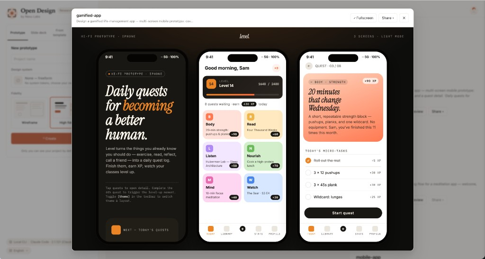
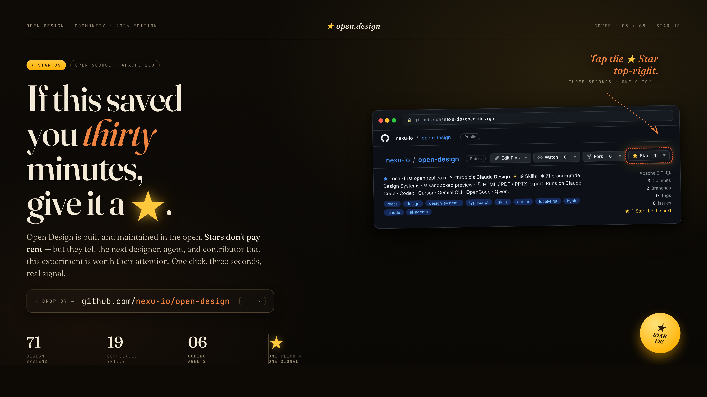

# Open Design
 
> **The open-source alternative to [Claude Design](https://x.com/claudeai/status/2045156267690213649).** Local-first, web-deployable, BYOK at every layer — your existing coding agent (Claude Code, Codex, Cursor Agent, Gemini CLI, OpenCode, Qwen) becomes the design engine, driven by **19 composable Skills** and **71 brand-grade Design Systems**.
 
[](LICENSE)
[](#supported-coding-agents)
[](#design-systems)
[](#skills)
[](QUICKSTART.md)

<p align="center">
  
</p>

<p align="center">
  <a href="https://github.com/nexu-io/open-design/stargazers"></a>
  <a href="https://github.com/nexu-io/open-design/network/members"></a>
  <a href="https://github.com/nexu-io/open-design/issues"></a>
  <a href="https://github.com/nexu-io/open-design/pulls"></a>
  <a href="https://github.com/nexu-io/open-design/graphs/contributors"></a>
  <a href="https://github.com/nexu-io/open-design/commits/main"></a>
  <a href="https://github.com/nexu-io/open-design/commits/main"></a>
</p>

<p align="center">
  <a href="https://open-design.ai/"></a>
  <a href="https://github.com/nexu-io/open-design/releases"></a>
  <a href="LICENSE"></a>
  <a href="#supported-coding-agents"></a>
  <a href="#design-systems"></a>
  <a href="#skills"></a>
  <a href="https://discord.gg/qhbcCH8Am4"></a>
  <a href="https://x.com/nexudotio"></a>
  <a href="QUICKSTART.md"></a>
</p>

<p align="center"><b>English</b> · <a href="README.es.md">Español</a> · <a href="README.pt-BR.md">Português (Brasil)</a> · <a href="README.de.md">Deutsch</a> · <a href="README.fr.md">Français</a> · <a href="README.zh-CN.md">简体中文</a> · <a href="README.zh-TW.md">繁體中文</a> · <a href="README.ko.md">한국어</a> · <a href="README.ja-JP.md">日本語</a> · <a href="README.ar.md">العربية</a> · <a href="README.ru.md">Русский</a> · <a href="README.uk.md">Українська</a></p>

---

## What it looks like
 
|  |  |
| --- | --- |
| [](docs/screenshots/01-entry-view.png) **Entry view** — pick a skill, pick a design system, type the brief. The same surface for prototypes, decks, mobile apps, dashboards, and editorial pages. | [](docs/screenshots/02-question-form.png) **Turn-1 discovery form** — before the model writes a pixel, OD locks the brief: surface, audience, tone, brand context, scale. 30 seconds of radios beats 30 minutes of redirects. |
| [](docs/screenshots/03-direction-picker.png) **Direction picker** — when you have no brand, the agent emits a second form with 5 curated directions (Monocle / Modern Minimal / Tech Utility / Brutalist / Soft Warm). One radio click → a deterministic palette + font stack, no model freestyle. | [](docs/screenshots/04-todo-progress.png) **Live todo progress** — the agent's plan streams as a live card. `in_progress` → `completed` updates land in real time. Redirect cheaply, mid-flight. |
| [](docs/screenshots/05-preview-iframe.png) **Sandboxed preview** — every `<artifact>` renders in a clean srcdoc iframe. Editable in place via the file workspace; downloadable as HTML, PDF, ZIP. | [](docs/screenshots/06-design-systems-library.png) **71-system library** — every product system shows its 4-color signature. Click for the full `DESIGN.md`, swatch grid, and live showcase. |
| [](docs/screenshots/07-magazine-deck.png) **Deck mode (guizang-ppt)** — the bundled [`guizang-ppt-skill`](https://github.com/op7418/guizang-ppt-skill) drops in unchanged. Magazine layouts, WebGL hero backgrounds, single-file HTML output, PDF export. | [](docs/screenshots/08-mobile-app.png) **Mobile prototype** — pixel-accurate iPhone 15 Pro chrome (Dynamic Island, status bar SVGs, home indicator). Multi-screen prototypes use shared `/frames/` assets — the agent never re-draws a phone. |
 
---
 
## What is Open Design?
 
[Claude Design](https://x.com/claudeai/status/2045156267690213649) (released 2026-04-17) showed what happens when an LLM stops writing prose and starts shipping design artifacts. It went viral — and stayed closed-source, paid-only, cloud-only, locked to one model and one skill set.
 
**Open Design (OD) is the open-source alternative.** Same artifact-first loop, none of the lock-in. We don't ship an agent — the strongest coding agents already live on your laptop. We wire them into a skill-driven design workflow that runs on `pnpm dev`, deploys to Vercel, and stays BYOK at every layer.
 
Type `make me a magazine-style pitch deck for our seed round`. The discovery form pops up before the agent touches a pixel. You pick a visual direction. A live plan streams into the UI. The daemon builds a real on-disk project folder with a seed template and checklist. The agent reads them, runs a five-dimensional critique against its own output, and emits a single `<artifact>` that renders in a sandboxed iframe seconds later.
 
That's not "AI tries to design something." That's an agent trained, by the prompt stack, to behave like a senior designer with a working filesystem, a deterministic palette library, and a checklist culture.
 
OD stands on four open-source shoulders: [`alchaincyf/huashu-design`](https://github.com/alchaincyf/huashu-design) (design-philosophy compass), [`op7418/guizang-ppt-skill`](https://github.com/op7418/guizang-ppt-skill) (deck mode), [`OpenCoworkAI/open-codesign`](https://github.com/OpenCoworkAI/open-codesign) (UX north star), and [`multica-ai/multica`](https://github.com/multica-ai/multica) (daemon architecture). Full provenance → [`docs/references.md`](docs/references.md).
 
---
 
## Quickstart
 
```bash
git clone https://github.com/nexu-io/open-design.git
cd open-design
pnpm install          # or npm install
pnpm dev:all          # daemon (:7456) + Vite (:5173)
open http://localhost:5173
```
 
On first load OD auto-detects your installed agent CLIs, loads 19 skills + 71 design systems, and asks for an Anthropic key (only needed for the BYOK fallback). The `.od/` runtime folder is created automatically — no `init` step needed.
 
Full setup, environment variables, Vercel deploy, and troubleshooting → **[QUICKSTART.md](QUICKSTART.md)**
 
---
 
## At a glance
 
|  | What you get |
| --- | --- |
| **Coding agents** | Claude Code · Codex CLI · Cursor Agent · Gemini CLI · OpenCode · Qwen Code · Anthropic API (BYOK fallback) |
| **Design systems** | **71** — 2 hand-authored starters + 69 product systems (Linear, Stripe, Vercel, Airbnb, Tesla, Notion, Anthropic, Apple, Cursor, Supabase, Figma, …) |
| **Skills** | **19** — prototype, deck, mobile, dashboard, pricing, docs, blog, SaaS landing, plus 10 document templates (PM spec, OKRs, runbook, kanban, …) |
| **Visual directions** | 5 curated schools — each ships a deterministic OKLch palette + font stack |
| **Device frames** | iPhone 15 Pro · Pixel · iPad Pro · MacBook · Browser Chrome — pixel-accurate, shared across screens |
| **Agent runtime** | Local daemon spawns the CLI in your project folder — agent gets real `Read`, `Write`, `Bash`, `WebFetch` |
| **Deployable to** | Local (`pnpm dev`) · Vercel · Single-process prod (`npm start`) |
| **License** | Apache-2.0 |
 
---
 
## Skills
 
19 skills ship in the box. Each is a folder under [`skills/`](skills/) following the Claude Code [`SKILL.md`](https://docs.anthropic.com/en/docs/claude-code/skills) convention. Drop a folder in, restart the daemon, it appears in the picker — no code, no plugins.
 
### Showcase examples
 
Each ships a real `example.html` you can open straight from the repo — no auth, no setup.
 
|  |  |
| --- | --- |
| [`dating-web`](skills/dating-web) · *prototype* — Consumer dating dashboard, left rail nav, KPIs, 30-day chart, editorial typography. | [`digital-eguide`](skills/digital-eguide) · *template* — Two-spread digital e-guide, cover + lesson spread with pull-quote. |
| [`email-marketing`](skills/email-marketing) · *prototype* — Brand product-launch HTML email, masthead, hero, CTA, specs grid. | [`gamified-app`](skills/gamified-app) · *prototype* — Three-frame gamified mobile app, XP ribbons, level bar, quest detail. |
| [`mobile-onboarding`](skills/mobile-onboarding) · *prototype* — Three-frame onboarding flow, splash, value-prop, sign-in. | [`motion-frames`](skills/motion-frames) · *prototype* — Motion-design hero with looping CSS animations, rotating type ring, animated globe. |
| [`social-carousel`](skills/social-carousel) · *prototype* — Three-card 1080×1080 social carousel, cinematic panels, connected headlines. | [`sprite-animation`](skills/sprite-animation) · *prototype* — Pixel / 8-bit animated explainer, animated mascot, looping CSS keyframes. |
 
### Design surfaces
 
| Skill | Mode | What it produces |
| --- | --- | --- |
| [`web-prototype`](skills/web-prototype) | prototype | Single-page HTML — landings, marketing, hero pages |
| [`saas-landing`](skills/saas-landing) | prototype | Hero / features / pricing / CTA marketing layout |
| [`dashboard`](skills/dashboard) | prototype | Admin / analytics with sidebar + data-dense layout |
| [`pricing-page`](skills/pricing-page) | prototype | Standalone pricing + comparison tables |
| [`docs-page`](skills/docs-page) | prototype | 3-column documentation layout |
| [`blog-post`](skills/blog-post) | prototype | Editorial long-form |
| [`mobile-app`](skills/mobile-app) | prototype | iPhone 15 Pro / Pixel framed app screen(s) |
| [`simple-deck`](skills/simple-deck) | deck | Minimal horizontal-swipe deck |
| [`guizang-ppt`](skills/guizang-ppt) | deck | Magazine-style web PPT — default for deck mode |
 
### Document / work-product templates
 
`pm-spec` · `weekly-update` · `meeting-notes` · `eng-runbook` · `finance-report` · `hr-onboarding` · `invoice` · `kanban-board` · `team-okrs` · `mobile-onboarding`
 
Adding a skill → [`docs/skills-protocol.md`](docs/skills-protocol.md)
 
---
 
## Design Systems
 
[](docs/assets/design-systems-library.png)
 
71 systems out of the box, each as a single `DESIGN.md` (color, typography, spacing, layout, components, motion, voice, brand, anti-patterns). Switch the active system → the next artifact uses those tokens.
 
**AI & LLM** — `claude` · `cohere` · `mistral-ai` · `minimax` · `together-ai` · `replicate` · `runwayml` · `elevenlabs` · `ollama` · `x-ai`
 
**Developer Tools** — `cursor` · `vercel` · `linear-app` · `framer` · `expo` · `clickhouse` · `mongodb` · `supabase` · `hashicorp` · `posthog` · `sentry` · `warp` · `webflow` · `sanity` · `mintlify` · `lovable` · `composio` · `opencode-ai` · `voltagent`
 
**Productivity** — `notion` · `figma` · `miro` · `airtable` · `superhuman` · `intercom` · `zapier` · `cal` · `clay` · `raycast`
 
**Fintech** — `stripe` · `coinbase` · `binance` · `kraken` · `mastercard` · `revolut` · `wise`
 
**E-Commerce** — `shopify` · `airbnb` · `uber` · `nike` · `starbucks` · `pinterest`
 
**Media** — `spotify` · `playstation` · `wired` · `theverge` · `meta`
 
**Automotive** — `tesla` · `bmw` · `ferrari` · `lamborghini` · `bugatti` · `renault`
 
**Other** — `apple` · `ibm` · `nvidia` · `vodafone` · `resend` · `spacex`
 
**Starters** — `default` (Neutral Modern) · `warm-editorial`
 
Full catalog → [`design-systems/README.md`](design-systems/README.md) · Re-import upstream: [`scripts/sync-design-systems.mjs`](scripts/sync-design-systems.mjs)
 
---
 
## How it works (six load-bearing ideas)
 
**1 · We don't ship an agent. Yours is good enough.**
The daemon scans your `PATH` for `claude`, `codex`, `cursor-agent`, `gemini`, `opencode`, and `qwen` on startup. Whichever it finds becomes the design engine — driven via stdio, with one adapter per CLI. No CLI? Anthropic API BYOK is the same pipeline minus the spawn.
 
**2 · Skills are files, not plugins.**
Following the Claude Code [`SKILL.md` convention](https://docs.anthropic.com/en/docs/claude-code/skills), each skill is `SKILL.md` + `assets/` + `references/`. Drop a folder into `skills/`, restart the daemon, done.
 
**3 · Design Systems are portable Markdown, not theme JSON.**
The 9-section `DESIGN.md` schema — color, typography, spacing, layout, components, motion, voice, brand, anti-patterns. Every artifact reads from the active system. Switch system → next render uses the new tokens.
 
**4 · The discovery form prevents 80% of redirects.**
Every fresh brief begins with a `<question-form id="discovery">` — not code. Surface · audience · tone · brand context · scale · constraints. 30 seconds of choices locks the visual direction before the agent paints a pixel.
 
**5 · The daemon makes the agent feel local, because it is.**
The daemon spawns the CLI with `cwd` set to `.od/projects/<id>/`. The agent gets real `Read`, `Write`, `Bash`, `WebFetch` against a real filesystem. Sessions, conversations, messages, and tabs persist in a local SQLite DB.
 
**6 · The prompt stack is the product.**
```
DISCOVERY directives  (turn-1 form, turn-2 brand branch, TodoWrite, 5-dim critique)
  + identity charter   (OFFICIAL_DESIGNER_PROMPT, anti-AI-slop, junior-pass)
  + active DESIGN.md   (71 systems available)
  + active SKILL.md    (19 skills available)
  + project metadata   (kind, fidelity, speakerNotes, animations, inspiration ids)
  + skill side files   (auto-injected pre-flight: assets/template.html + references/*.md)
  + (deck kind) DECK_FRAMEWORK_DIRECTIVE   (nav / counter / scroll / print)
```
Every layer is a file you can edit. See [`src/prompts/system.ts`](src/prompts/system.ts) and [`src/prompts/discovery.ts`](src/prompts/discovery.ts).
 
---
 
## Quality guardrails (anti-AI-slop)
 
Ported from the [`huashu-design`](https://github.com/alchaincyf/huashu-design) playbook and enforced per-skill via the prompt stack:
 
- **Question form first** — turn 1 is `<question-form>` only, no narration, no code.
- **Brand-spec extraction** — when you attach a screenshot or URL, the agent runs a five-step protocol (locate · download · grep hex · codify `brand-spec.md` · vocalise) before writing CSS. Never guesses brand colors from memory.
- **Five-dim critique** — before emitting `<artifact>`, the agent scores itself across philosophy / hierarchy / execution / specificity / restraint. Anything under 3/5 triggers a fix + rescore. Two passes is normal.
- **P0/P1/P2 checklists** — every skill ships a `references/checklist.md`. The agent must pass P0 gates before emitting.
- **Slop blacklist** — aggressive purple gradients, generic emoji icons, rounded card with left-border accent, hand-drawn SVG humans, Inter as a display face, invented metrics — explicitly forbidden in the prompt.
- **Honest placeholders** — when there's no real number, the agent writes `—` or a labelled grey block, not "10× faster".
---
 
## Architecture
 
```
┌────────────────────────── browser ─────────────────────────────┐
│   Vite + React SPA  (chat · file workspace · iframe preview)   │
└──────────────┬───────────────────────────────────┬─────────────┘
               │ /api/* (proxied in dev)           │ direct (BYOK)
               ▼                                   ▼
   ┌──────────────────────┐              ┌──────────────────────┐
   │   Local daemon       │              │   Anthropic SDK      │
   │   (Express + SQLite) │              │   (browser fallback) │
   │   /api/agents        │              └──────────────────────┘
   │   /api/skills        │
   │   /api/design-systems│
   │   /api/projects/...  │
   │   /api/chat (SSE)    │
   └─────────┬────────────┘
             │ spawn(cli, { cwd: .od/projects/<id> })
             ▼
   claude · codex · cursor-agent · gemini · opencode · qwen
   reads SKILL.md + DESIGN.md, writes artifacts to disk
```
 
| Layer | Stack |
| --- | --- |
| Frontend | Vite 5 + React 18 + TypeScript |
| Daemon | Node 18+ · Express · SSE streaming · `better-sqlite3` |
| Agent transport | `child_process.spawn` with `claude-stream-json` parser for Claude Code, line-buffered for the rest |
| Storage | Plain files in `.od/projects/<id>/` + SQLite at `.od/db.sqlite` (gitignored) |
| Preview | Sandboxed iframe via `srcdoc` + per-skill `<artifact>` parser |
| Export | HTML (inline assets) · PDF (browser print) · PPTX (skill-defined) · ZIP (archiver) |
 
Full architecture, data-flow diagrams, and component map → **[docs/architecture.md](docs/architecture.md)**
 
---
 
## Repository structure
 
```
open-design/
├── daemon/          ← Node + Express, agent adapters, SQLite, SSE chat
├── src/             ← Vite + React + TypeScript frontend
│   ├── components/  ← 27 components (chat, composer, picker, preview, …)
│   ├── prompts/     ← system.ts · discovery.ts · directions.ts · deck-framework.ts
│   ├── artifacts/   ← <artifact> parser, <question-form> schema
│   ├── runtime/     ← iframe sandbox, exports (HTML/PDF/ZIP)
│   └── providers/   ← daemon SSE consumer, Anthropic BYOK, registry
├── skills/          ← 19 SKILL.md skill bundles
├── design-systems/  ← 71 DESIGN.md systems
├── assets/frames/   ← shared device frames (iPhone, Pixel, iPad, MacBook, Browser)
├── templates/       ← deck-framework.html baseline
├── scripts/         ← sync-design-systems.mjs (re-import upstream tarball)
└── docs/            ← spec · architecture · skills-protocol · agent-adapters · roadmap
```
 
Full annotated file map → [`docs/architecture.md`](docs/architecture.md)
 
---
 
## Supported coding agents
 
Auto-detected from `PATH` on daemon boot. No config required.
 
| Agent | Bin | Streaming | Notes |
| --- | --- | --- | --- |
| [Claude Code](https://docs.anthropic.com/en/docs/claude-code) | `claude` | `--output-format stream-json` | First-class — best fidelity |
| [Codex CLI](https://github.com/openai/codex) | `codex` | line-buffered | `codex exec <prompt>` |
| [Cursor Agent](https://www.cursor.com/cli) | `cursor-agent` | line-buffered | `cursor-agent -p` |
| [Gemini CLI](https://github.com/google-gemini/gemini-cli) | `gemini` | line-buffered | `gemini -p` |
| [OpenCode](https://opencode.ai/) | `opencode` | line-buffered | `opencode run` |
| [Qwen Code](https://github.com/QwenLM/qwen-code) | `qwen` | line-buffered | `qwen -p` |
| Anthropic API · BYOK | n/a | SSE direct | Browser fallback when no CLI is on PATH |
 
Adding a new CLI is one entry in [`daemon/agents.js`](daemon/agents.js) → [`docs/agent-adapters.md`](docs/agent-adapters.md)
 
---
 
## Comparison
 
| Axis | [Claude Design](https://x.com/claudeai/status/2045156267690213649) | [Open CoDesign](https://github.com/OpenCoworkAI/open-codesign) | **Open Design** |
| --- | --- | --- | --- |
| License | Closed | MIT | **Apache-2.0** |
| Form factor | Web (claude.ai) | Desktop (Electron) | **Web app + local daemon** |
| Deployable on Vercel | ❌ | ❌ | **✅** |
| Agent runtime | Bundled (Opus 4.7) | Bundled ([`pi-ai`](https://github.com/mariozechner/pi-ai)) | **Your existing CLI** |
| Skills | Proprietary | 12 custom TS modules | **19 file-based SKILL.md bundles** |
| Design system | Proprietary | DESIGN.md (roadmap) | **71 DESIGN.md systems shipped** |
| Provider flexibility | Anthropic only | 7+ via pi-ai | **Whatever your agent supports** |
| Discovery form | ❌ | ❌ | **✅ Hard rule, turn 1** |
| Direction picker | ❌ | ❌ | **✅ 5 deterministic directions** |
| Live todo + tool stream | ❌ | ✅ | **✅** |
| Sandboxed iframe preview | ❌ | ✅ | **✅** |
| Comment-mode surgical edits | ❌ | ✅ | 🚧 roadmap |
| AI-emitted tweaks panel | ❌ | ✅ | 🚧 roadmap |
| Filesystem-grade workspace | ❌ | partial | **✅ Real cwd, real tools, SQLite** |
| 5-dim self-critique | ❌ | ❌ | **✅ Pre-emit gate** |
| Export formats | Limited | HTML/PDF/PPTX/ZIP/Markdown | **HTML/PDF/PPTX/ZIP/Markdown** |
| Minimum billing | Pro / Max / Team | BYOK | **BYOK** |
 
---
 
## Visual directions
 
When you have no brand spec, a second form offers 5 curated directions. Each is a deterministic OKLch palette + font stack — one radio click produces a fully specified visual system, no AI improvisation.
 
| Direction | Mood | Refs |
| --- | --- | --- |
| Editorial — Monocle / FT | Print magazine, ink + cream + warm rust | Monocle · FT Weekend · NYT Magazine |
| Modern minimal — Linear / Vercel | Cool, structured, minimal accent | Linear · Vercel · Stripe |
| Tech utility | Information density, monospace, terminal | Bloomberg · Bauhaus tools |
| Brutalist | Raw, oversized type, no shadows, harsh accents | Bloomberg Businessweek · Achtung |
| Soft warm | Generous, low contrast, peachy neutrals | Notion marketing · Apple Health |
 
Full spec → [`src/prompts/directions.ts`](src/prompts/directions.ts)
 
---
 
## References & lineage
 
| Project | Role here |
| --- | --- |
| [`alchaincyf/huashu-design`](https://github.com/alchaincyf/huashu-design) | Design-philosophy core — Junior-Designer workflow, brand-asset protocol, anti-AI-slop checklist, 5-dim critique, direction picker |
| [`op7418/guizang-ppt-skill`](https://github.com/op7418/guizang-ppt-skill) | Magazine-web-PPT skill bundled verbatim under `skills/guizang-ppt/` with original LICENSE preserved |
| [`OpenCoworkAI/open-codesign`](https://github.com/OpenCoworkAI/open-codesign) | Closest peer — UX patterns adopted: streaming-artifact loop, sandboxed-iframe preview, live agent panel, five-format export |
| [`multica-ai/multica`](https://github.com/multica-ai/multica) | Daemon + adapter architecture — PATH-scan detection, local daemon as the only privileged process |
| [`VoltAgent/awesome-design-md`](https://github.com/VoltAgent/awesome-design-md) | Source of the 9-section `DESIGN.md` schema and 69 product systems |
| [`farion1231/cc-switch`](https://github.com/farion1231/cc-switch) | Inspiration for symlink-based skill distribution |
| [Claude Code skills](https://docs.anthropic.com/en/docs/claude-code/skills) | `SKILL.md` convention adopted verbatim |
 
Long-form provenance → [`docs/references.md`](docs/references.md)
 
---
 
## Roadmap
 
- [x] Daemon + agent detection + skill registry + design-system catalog
- [x] Web app + chat + question form + todo progress + sandboxed preview
- [x] 19 skills + 71 design systems + 5 visual directions + 5 device frames
- [x] SQLite-backed projects · conversations · messages · tabs
- [ ] Comment-mode surgical edits (click element → instruction → patch)
- [ ] AI-emitted tweaks panel
- [ ] Vercel + tunnel deployment recipe
- [ ] `npx od init` scaffold command
- [ ] Skill marketplace (`od skills install <github-repo>`)
Phased delivery → [`docs/roadmap.md`](docs/roadmap.md)
 
---

## Status

This is an early implementation — the closed loop (detect → pick skill + design system → chat → parse `<artifact>` → preview → save) runs end-to-end. The prompt stack and skill library are where most of the value lives, and they're stable. The component-level UI is shipping daily.

## Stay in the loop

Follow **[@nexudotio](https://x.com/nexudotio)** on X for release notes, new skills, new design systems, and the occasional behind-the-scenes thread on what's shipping next. Discord is for chat, X is for the milestones — both links are in the badges above.

## Star us

<p align="center">
  <a href="https://github.com/nexu-io/open-design"></a>
</p>

If this saved you thirty minutes — give it a ★. Stars don't pay rent, but they tell the next designer, agent, and contributor that this experiment is worth their attention. One click, three seconds, real signal: [github.com/nexu-io/open-design](https://github.com/nexu-io/open-design).

## Contributing

Issues, PRs, new skills, and new design systems are all welcome. The highest-leverage contributions are usually one folder, one Markdown file, or one PR-sized adapter:

- **Add a skill** — drop a folder into [`skills/`](skills/) following the [`SKILL.md`][skill] convention.
- **Add a design system** — drop a `DESIGN.md` into [`design-systems/<brand>/`](design-systems/) using the 9-section schema.
- **Wire up a new coding-agent CLI** — one entry in [`apps/daemon/src/agents.ts`](apps/daemon/src/agents.ts).

Full walkthrough, bar-for-merging, code style, and what we don't accept → [`CONTRIBUTING.md`](CONTRIBUTING.md) ([Deutsch](CONTRIBUTING.de.md), [Français](CONTRIBUTING.fr.md), [简体中文](CONTRIBUTING.zh-CN.md)).

## Contributors

Thanks to everyone who has helped move Open Design forward — through code, docs, feedback, new skills, new design systems, or even a sharp issue. Every real contribution counts, and the wall below is the easiest way to say so out loud.

<a href="https://github.com/nexu-io/open-design/graphs/contributors">
  
</a>

If you've shipped your first PR — welcome. The [`good-first-issue`/`help-wanted`](https://github.com/nexu-io/open-design/issues?q=is%3Aissue+is%3Aopen+label%3A%22good+first+issue%22%2C%22help+wanted%22) label is the entry point.

## Repository activity

<picture>
  
</picture>

The SVG above is regenerated daily by [`.github/workflows/metrics.yml`](.github/workflows/metrics.yml) using [`lowlighter/metrics`](https://github.com/lowlighter/metrics). Trigger a manual refresh from the **Actions** tab if you want it sooner; for richer plugins (traffic, follow-up time), add a `METRICS_TOKEN` repository secret with a fine-grained PAT.

## Star History

<a href="https://star-history.com/#nexu-io/open-design&Date">
  <picture>
    <source media="(prefers-color-scheme: dark)" srcset="https://api.star-history.com/svg?repos=nexu-io/open-design&type=Date&theme=dark&cache_bust=2026-05-07" />
    <source media="(prefers-color-scheme: light)" srcset="https://api.star-history.com/svg?repos=nexu-io/open-design&type=Date&cache_bust=2026-05-07" />
    
  </picture>
</a>

If the curve bends up, that's the signal we look for. ★ this repo to push it.

## Credits

The HTML PPT Studio family of skills — the master [`skills/html-ppt/`](skills/html-ppt/) and the per-template wrappers under [`skills/html-ppt-*/`](skills/) (15 full-deck templates, 36 themes, 31 single-page layouts, 27 CSS animations + 20 canvas FX, the keyboard runtime, and the magnetic-card presenter mode) — are integrated from the open-source project [`lewislulu/html-ppt-skill`](https://github.com/lewislulu/html-ppt-skill) (MIT). The upstream LICENSE ships in-tree at [`skills/html-ppt/LICENSE`](skills/html-ppt/LICENSE) and authorship credit goes to [@lewislulu](https://github.com/lewislulu). Each per-template Examples card (`html-ppt-pitch-deck`, `html-ppt-tech-sharing`, `html-ppt-presenter-mode`, `html-ppt-xhs-post`, …) delegates authoring guidance to the master skill so the upstream's prompt → output behavior is preserved end-to-end when you click **Use this prompt**.

The magazine / horizontal-swipe deck flow under [`skills/guizang-ppt/`](skills/guizang-ppt/) is integrated from [`op7418/guizang-ppt-skill`](https://github.com/op7418/guizang-ppt-skill) (MIT). Authorship credit goes to [@op7418](https://github.com/op7418).

## License

Apache-2.0. The bundled `skills/guizang-ppt/` retains its original [LICENSE](skills/guizang-ppt/LICENSE) (MIT) and authorship attribution to [op7418](https://github.com/op7418). The bundled `skills/html-ppt/` retains its original [LICENSE](skills/html-ppt/LICENSE) (MIT) and authorship attribution to [lewislulu](https://github.com/lewislulu).
