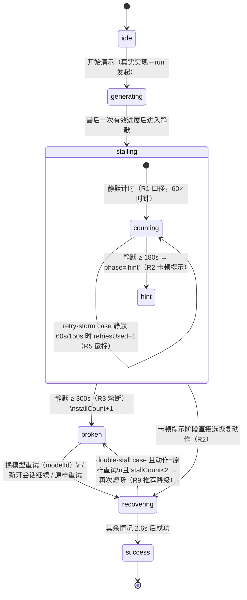
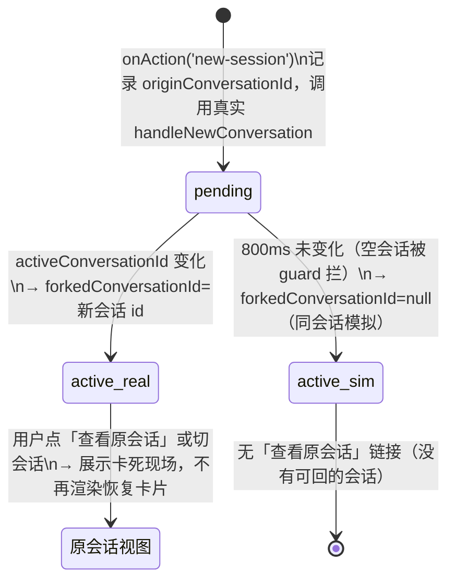

# 生成卡死熔断与恢复引导 — 前端 Demo 交接说明

对应 PRD：[生成卡死熔断与恢复引导 PRD](https://powerformer.feishu.cn/docx/T6BDdU7Lhoi3G4xqtMCcd8TInNb)（已准出）
技术归因与参数依据：[熔断机制技术分析](https://powerformer.feishu.cn/docx/OcG2d3YejoSPpSxdI9ucvijtnje)

## 怎么跑 demo

```bash
pnpm tools-dev run web --daemon-port 17491 --web-port 17592
```

在**任意项目会话** URL 后加 `?stallDemo=1`，右下角出现「熔断 demo」控制面板：

- **case 选择**：首次卡死 / 重试后仍卡死 / 二次卡死
- **演示时钟**：60×（1 真实秒 = 60 演示秒），显示「无有效进展」计时
- **快进**：跳到卡顿提示（3:00）/ 跳到熔断（5:00）
- 「新开会话继续」要走**真实**会话创建链路，需在有过真实消息的会话里演示；
  空会话会被产品的防抖 guard 拦下，demo 自动退化为同会话模拟（此时来源横幅无「查看原会话」链接）。

## 状态机

demo 驱动（`useStallBreakerDemo.tsx`）的核心状态是 `beat`，UI 层的 `phase` 由它派生。
正式集成时整个 demo 驱动删除，`beat/phase` 的语义由 daemon 的静默计时与
`stall_timeout` 终态事件承载（见「正式集成落点」）。



fork（新开会话继续）子流程：



关键参数（demo 值 = PRD 值，时钟 60×）：

| 参数 | 值 | PRD 规则 |
| --- | --- | --- |
| 卡顿提示阈值 | 静默 180s | R2 |
| 熔断阈值 | 静默 300s | R3 |
| 自动重试节拍（retry-storm） | 静默 60s / 150s，合计 ≤2 | R5 |
| 单步骤硬上限 | 900s（demo 未演示，见 PRD R4） | R4 |
| 推荐模型 | 目录 `default:true` 且非卡死通道，否则第一个可用项 | R8 |

## 组件清单与挂载点

```
stall-breaker/
├── types.ts                  StallBreakerPaneProps —— UI 契约，正式集成的接口
├── StallHintBanner.tsx       R2 卡顿提示（composer 上方，常驻挂载类切换出入场）
├── StallRecoveryCard.tsx     R3/R7/R8/R9 熔断恢复卡（chat-log 内，UserActionCard 视觉语言）
├── StallForkNotice.tsx       新会话来源横幅（chat-log 顶部）
└── useStallBreakerDemo.tsx   ★ demo 驱动，正式集成时整体删除（含 StallDemoControls 浮层）
```

- `ChatPane.tsx`：新增可选 prop `stallBreaker?: StallBreakerPaneProps | null`，
  三个渲染点（banner 在 `PinnedTodoSlot` 前；卡片在 `ChatRows` 后；横幅在 `ChatRows` 前）。
- `ProjectView.tsx`：demo hook 接线（messages 叠加、streaming 取或、controls 渲染），
  正式集成时替换为 daemon 事件 → `stallBreaker` props 的映射。

## 已敲定的交互决策（评审沉淀，实现时请勿回退）

1. **默认推荐 + 显式执行**：模型 chip 预选推荐模型，「立即重试」按钮执行；
   popover（统一 `SearchableModelSelect`）里**选中只改选择、不执行**。主路径一次点击。
2. 卡死通道的模型在列表中 `enabled:false` + `disabledOptionHint`（「本会话已卡住 N 次」），不可选。
3. 卡片视觉 = UserActionCard 的 warning 语言（琥珀徽章 + panel 底），与 composer 形态区分；
   正式实现可直接换用 `UserActionCard` 组件本体。
4. 信息只有三层：一句话终态（含「已完成的内容已保留」）、推荐执行行、次级描边按钮行。
   不罗列已保留文件（消息流工具卡已展示）、不写「非用户取消」这类口径注释。
5. 卡片出现时 `scrollIntoView`，避免与「回到最新」浮钮重叠。
6. 二次卡死：标题「又卡住了」+ 换模型理由，原样重试按钮降透明度并标注失败次数。

## 正式集成落点（按 PRD 分期 P1/P2）

- [ ] contracts：`failure_category` 增加 `stall_timeout` 枚举 + 终态 payload（卡死阶段、retryable、可选动作）
- [ ] daemon：语义静默计时 + 熔断终态事件；`stallBreaker` props 由 run 事件流驱动（替换 demo hook）
- [ ] 「新开会话继续」：daemon fork 端点（复制种子消息 + 附件引用，返回实际数量 → 来源横幅展示真实值）
- [ ] 模型目录：`modelOptions` 改由 agent def 真实目录提供（demo 中为硬编码演示数据）
- [ ] CLI 双轨：`od` 子命令 + `--json` 终态字段（AGENTS.md capability closure 三步）
- [ ] i18n：所有硬编码中文文案补 19 locale（`types.ts` 加 key）
- [ ] 埋点：stall_timeout 触发（model × provider × 阶段）、提示曝光 → 动作转化（PRD 第八节）
