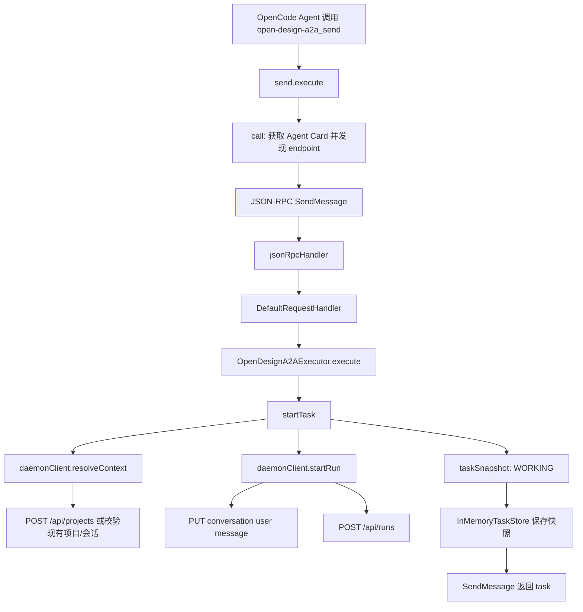
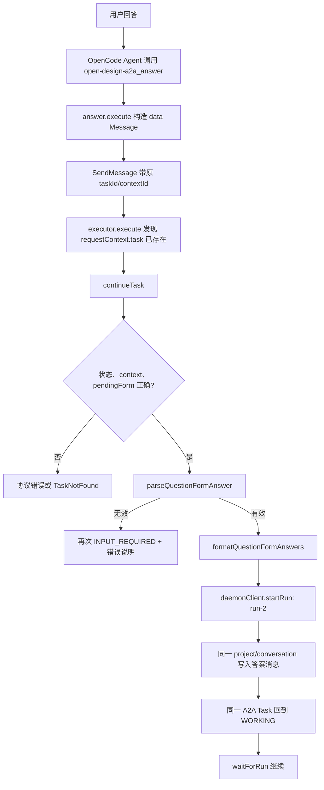

# Open Design × OpenCode A2A 源码全链路导读

> 文档状态：基于 `D:\open-design` 的 `odmcp` 分支与 `D:\opencode` 当前工作区整理。本文只描述本次 A2A 实现涉及的代码；与本功能无关的工作区改动不计入。

## 1. 代码改动总览

本次实现遵循“Open Design 改服务端，OpenCode 只加薄客户端”的原则。

Open Design 侧新增了：

- A2A 共享 DTO 和三个自定义 media type；
- A2A Agent Card 和 JSON-RPC 路由；
- A2A Task 到 Open Design project/conversation/run 的状态桥；
- Open Design Question Form 的提取、校验与答案格式化；
- 对现有 daemon API 的内部 HTTP client；
- 四组测试，包括真实 HTTP 多轮闭环测试；
- 官方 `@a2a-js/sdk@1.0.1` 依赖和接入文档。

OpenCode 侧只新增了一个项目级 custom tool 文件：

```text
D:\opencode\.opencode\tool\open-design-a2a.ts
```

没有修改 OpenCode 核心源码、会话模型、UI 或内置 tool registry。OpenCode 现有 registry 会自动扫描 `.opencode/tool/*.{js,ts}`，因此这个文件会自动注册为四个工具。

## 2. 目录结构与职责

### 2.1 Open Design

```text
D:\open-design
├─ packages/contracts/src/
│  ├─ api/a2a.ts                         # 跨边界 DTO、media type、请求元数据
│  └─ index.ts                           # 导出 A2A contracts
├─ apps/daemon/
│  ├─ package.json                       # 引入官方 @a2a-js/sdk 1.0.1
│  ├─ src/
│  │  ├─ a2a/
│  │  │  ├─ question-form.ts             # 表单提取、规范化、答案校验与格式化
│  │  │  ├─ daemon-client.ts             # 把 A2A 动作映射到现有 daemon REST/SSE API
│  │  │  └─ executor.ts                  # A2A Task 状态机与多轮编排核心
│  │  ├─ routes/a2a.ts                   # Agent Card、JSON-RPC 路由和 SDK 装配
│  │  └─ server.ts                       # 在 External services 区注册 A2A 路由
│  └─ tests/
│     ├─ a2a-question-form.test.ts        # 表单单元测试
│     ├─ a2a-executor.test.ts             # executor 状态机测试
│     ├─ a2a-route.test.ts                # Agent Card 与 JSON-RPC 路由测试
│     └─ a2a-http-loop.test.ts            # HTTP 级完整多轮回路
├─ docs/
│  ├─ a2a.md                             # 简明运行说明
│  ├─ a2a-technical-guide.zh-CN.md        # 协议、架构和多轮机制
│  └─ a2a-code-walkthrough.zh-CN.md       # 本文
└─ pnpm-lock.yaml                         # 锁定 A2A SDK 依赖树
```

### 2.2 OpenCode

```text
D:\opencode
├─ .opencode/tool/
│  └─ open-design-a2a.ts                  # 本次唯一新增文件
└─ packages/opencode/src/tool/
   └─ registry.ts                         # OpenCode 既有代码，本次未修改；负责自动加载 custom tool
```

## 3. Open Design 侧逐文件讲解

### 3.1 `packages/contracts/src/api/a2a.ts`：双方都要理解的数据契约

文件：[packages/contracts/src/api/a2a.ts](../packages/contracts/src/api/a2a.ts)

这一层只放纯 TypeScript 数据结构，不依赖 Express、Node 文件系统、SQLite 或 A2A server 实现。

首先定义三个稳定的内容类型：

```ts
OPEN_DESIGN_QUESTION_FORM_MEDIA_TYPE
OPEN_DESIGN_QUESTION_FORM_ANSWER_MEDIA_TYPE
OPEN_DESIGN_A2A_ARTIFACT_MEDIA_TYPE
```

它们分别表示：

1. Open Design 向客户端提出的问题；
2. 客户端返回的表单答案；
3. Open Design 完成任务后的结构化产物元数据。

随后定义 Question Form 的完整 DTO：

- `QuestionType`：radio、checkbox、select、text、file、direction-cards 等控件类型；
- `FormOption`、`DirectionCard`：有限选项和视觉方向卡片；
- `FormQuestion`：单个问题的 label、required、defaultValue、maxSelections 等规则；
- `QuestionForm`：表单级 id、title、description 和 questions；
- `QuestionFormEnvelope`：服务端输出，固定 `schemaVersion: 1`；
- `QuestionFormAnswerEnvelope`：客户端输入，包含 `formId` 和 `answers`。

`OpenDesignA2ARequestMetadata` 是 OpenCode 可传入的 Open Design 特有参数，包括已有 project/conversation、agent、model、skill、plugin 及 plugin inputs。它位于 A2A request 的 `metadata.openDesign` 中，不污染 A2A 标准字段。

`OpenDesignA2AArtifactData` 则是最终 Artifact 的 data part，包括 project、conversation、run、入口文件、Studio/preview URL 和文件元数据。

[packages/contracts/src/index.ts](../packages/contracts/src/index.ts) 增加导出，使 daemon 能通过 `@open-design/contracts` 使用这些类型和常量。

### 3.2 `apps/daemon/src/a2a/question-form.ts`：Question Form 适配层

文件：[apps/daemon/src/a2a/question-form.ts](../apps/daemon/src/a2a/question-form.ts)

Open Design 原有机制不是原生工具调用：Agent 在 assistant 文本中输出 `<question-form>...</question-form>`，Web UI 再解析并渲染。本次实现保留这个业务事实，在 A2A 边界做转换。

#### `parseCompletedQuestionForm(input)`

该函数负责从完整 assistant 文本中寻找第一个闭合的 `<question-form>` 或兼容别名 `<ask-question>`：

- 没有开标签：返回 `kind: 'none'`；
- 有开标签但未闭合：返回 `kind: 'invalid'`；
- 标签体不是有效 JSON：返回 `invalid`；
- 能解析且至少有一个有效问题：返回 `valid`，并同时给出 `form`、原始表单块 `raw` 和去掉表单后的说明文字 `prose`。

只有“完整、闭合、可解析”的表单才会进入 A2A `INPUT_REQUIRED`，避免流式输出尚未完成时泄露半截 JSON。

#### 规范化辅助函数

`normalizeQuestionForm` 和 `normalizeQuestion` 兼容 Open Design 已有的宽松表单写法：

- 表单 body 可以是问题数组，也可以是含 `questions` 的对象；
- 缺少 question id 时自动生成 `q1`、`q2`；
- 缺少 type 时，有 options 默认使用 radio，否则使用 text；
- option 可以是字符串，也可以是 `{label, value, description}`；
- direction card 的 references 和 palette 会限制长度；
- 非法或无法理解的字段不会直接传播到 wire contract。

#### `parseQuestionFormAnswer(value, expected)`

该函数在继续任务前执行严格校验：

- schema 版本；
- `formId` 是否是当前等待的表单；
- question id 是否存在；
- 字符串与字符串数组类型；
- required、maxSelections；
- `allowCustom: false` 时答案是否属于允许的 option。

这样即使客户端 UI 或模型产生了错误参数，也不会把无效内容送入下一次 Open Design run。

#### `formatQuestionFormAnswers(form, answers)`

Open Design Web 的既有续轮输入是：

```text
[form answers — discovery]
- Visual tone: Bold [value: bold]
- Audience: Developers
```

该函数把结构化 A2A 答案恢复成相同格式。这样 Open Design 现有 prompt/workflow 无须认识 A2A，也不需要维护第二种答案语法。

### 3.3 `apps/daemon/src/a2a/daemon-client.ts`：复用现有业务 API

文件：[apps/daemon/src/a2a/daemon-client.ts](../apps/daemon/src/a2a/daemon-client.ts)

`OpenDesignA2ADaemonClient` 是 executor 依赖的窄接口，便于测试时注入 fake client。生产实现是 `HttpOpenDesignA2ADaemonClient`。

#### `resolveContext(metadata, prompt)`

它决定 A2A context 落到哪个 Open Design project/conversation：

- 传入 `projectId`：先验证项目存在，再验证指定 conversation 确实属于该项目；如果没指定 conversation，则复用第一个或新建一个；
- 没传 `projectId`：根据 `projectName` 或 prompt 前 72 个字符生成项目名和带随机后缀的 project id，然后调用 `POST /api/projects`。

这一层没有直接操作数据库，而是走现有项目 API，继续遵守 Open Design 的数据和业务边界。

#### `startRun(context, prompt, metadata)`

启动一轮 Open Design 执行分两步：

1. `appendUserMessage` 通过 conversation message API 显式写入用户消息；
2. `POST /api/runs` 启动 run，并按需传递 agent/model/skill/plugin 选择。

显式写 transcript 很重要：每次表单答案都会成为同一 conversation 的下一条用户消息，下一轮 Agent 能从会话历史中理解先前需求。

#### `getRun` 与 `getRunMessage`

`getRun` 调用 `GET /api/runs/:runId`，把 queued、running、succeeded、failed、canceled 状态提供给 executor。

`getRunMessage` 调用 `GET /api/runs/:runId/events` 回放 SSE，只拼接 `event: agent` 中的 `text_delta`。这段文本既可能是最终答复，也可能包含 Question Form。

#### `getRunResult`

run 成功后并行获取：

- assistant 文本；
- project metadata；
- project files；
- `/api/mcp/install-info` 中可用的 Web base URL。

随后推断入口文件，生成：

- raw preview URL；
- Open Design Studio URL；
- 最多 200 条文件名、mime、size 元数据。

#### `cancelRun`

调用 `POST /api/runs/:runId/cancel`，让 A2A CancelTask 真正取消底层 Agent run，而不只是把上层 Task 标记为取消。

### 3.4 `apps/daemon/src/a2a/executor.ts`：多轮状态机核心

文件：[apps/daemon/src/a2a/executor.ts](../apps/daemon/src/a2a/executor.ts)

`OpenDesignA2AExecutor` 实现官方 SDK 的 `AgentExecutor`。它是 A2A task 和 Open Design run 之间的编排器。

#### 内存记录 `OpenDesignTaskRecord`

每个 A2A Task 保存：

```text
taskId + contextId
projectId + conversationId
currentRun
pendingForm
requestMetadata
seenMessageIds
cancelRequested
```

其中：

- `currentRun` 指向当前正在执行的 Open Design run；
- `pendingForm` 是 `INPUT_REQUIRED` 时等待回答的表单；
- `seenMessageIds` 用于识别相同 A2A message 的重试，防止重复创建 run；
- `requestMetadata` 保证后续表单答案仍使用最初指定的 agent/model/skill/plugin。

executor 内还有两个 map：

- `tasks: Map<taskId, OpenDesignTaskRecord>`；
- `contexts: Map<contextId, {projectId, conversationId}>`。

这也是当前重启后任务会丢失的直接原因。

#### `execute(requestContext, eventBus)`

这是所有 `SendMessage` 的入口：

1. 如果 `messageId` 已处理，返回 SDK 当前 Task 快照，不重复执行；
2. 如果 `requestContext.task` 已存在，说明是在继续已有任务，进入 `continueTask`；
3. 否则是新任务，进入 `startTask`。

#### `startTask`

新任务路径：

1. `requireTextPrompt` 从输入 parts 中提取 text；
2. `requestMetadataFrom` 合并 request 和 message 上的 `metadata.openDesign`；
3. `resolveContext` 创建或复用 Open Design project/conversation；
4. `startRun` 启动第一次 run；
5. 创建 `OpenDesignTaskRecord`；
6. 通过 `taskSnapshot` 发布 `TASK_STATE_WORKING`；
7. 进入 `waitForRun`。

`taskSnapshot` 的 `metadata.openDesign` 会暴露当前 project、conversation 和 run id，方便客户端排查和后续展示。

#### `waitForRun`

这是执行态到终态/中断态的转换器：

- queued/running：等待 `pollIntervalMs` 后继续；
- canceled：发布 `TASK_STATE_CANCELED`；
- 非 succeeded：将 run error/errorCode 映射为 `TASK_STATE_FAILED`；
- succeeded：获取完整结果并解析 Question Form。

成功分支再分三种：

1. 表单非法：任务 `FAILED`；
2. 表单有效：保存 `pendingForm`，调用 `publishQuestionForm` 发布 `INPUT_REQUIRED`；
3. 没有表单：构造 Artifact，先发布 artifact update，再发布 `COMPLETED`。

#### `publishQuestionForm`

它把 Open Design 表单包装成：

```ts
{
  schemaVersion: 1,
  form
}
```

然后放入 Agent status message 的 data part，并设置 Question Form media type。普通 text part 保留表单前后的说明文字，让不支持专用 UI 的客户端也能给用户一个可读提示。

#### `continueTask`

只有同时满足以下条件才允许恢复：

- task 存在；
- `contextId` 与记录一致；
- 当前状态是 `INPUT_REQUIRED`；
- executor 确实保存了 `pendingForm`。

它从输入 message 中寻找 Question Form answer media type 的 data part。缺少或校验失败时，再次发布同一个 Question Form 和错误说明，Task 继续停留在 `INPUT_REQUIRED`。

答案有效时：

1. 调用 `formatQuestionFormAnswers`；
2. 使用原 project/conversation 启动一个新的 run；
3. 清空 `pendingForm`，更新 `currentRun`；
4. 保留已有 history 和 artifacts，发布同一 Task 的 `WORKING` 快照；
5. 再次进入 `waitForRun`。

因此第二轮、第三轮都不会创建新 task，也不会切换 Open Design conversation。

#### `resultArtifact`

最终 Artifact 固定 id 为 `${taskId}-result`，parts 顺序是：

1. 可选的最终 text；
2. 必有的结构化 artifact data；
3. 可选 Studio URL；
4. 可选 preview URL。

#### `cancelTask`

先设置 `cancelRequested`，如果有活动 run 就调用 daemon client 取消，然后发布 `CANCELED` 并清理 `currentRun`、`pendingForm`。重复取消会抛 `TaskNotCancelableError`。

### 3.5 `apps/daemon/src/routes/a2a.ts`：协议入口和 SDK 装配

文件：[apps/daemon/src/routes/a2a.ts](../apps/daemon/src/routes/a2a.ts)

这里使用官方 `@a2a-js/sdk@1.0.1`，没有手写 A2A server protocol parser。

`registerA2ARoutes` 依次组装：

```text
HttpOpenDesignA2ADaemonClient
  → OpenDesignA2AExecutor
  → InMemoryTaskStore
  → DefaultRequestHandler
  → Express agentCardHandler/jsonRpcHandler
```

注册两个端点：

- `GET /.well-known/agent-card.json`；
- `POST /api/a2a`。

Agent Card 的 public base URL 按当前请求动态生成，避免托管时把 `127.0.0.1` 暴露给远程客户端。Card 的 cache max age 当前设为 0，便于验证阶段立即反映地址和认证变化。

`buildOpenDesignAgentCard` 声明：

- protocol binding：`JSONRPC`；
- protocol version：`1.0`；
- streaming、push notification、extended Agent Card 均为 false；
- 一个 `design-artifact` skill；
- 支持的输入/输出 media type；
- 需要时声明 HTTP Bearer security scheme。

SDK 的 `DefaultRequestHandler` 负责解析 `SendMessage`、`GetTask`、`CancelTask`，把 execute/cancel 交给 executor，并通过 `InMemoryTaskStore` 保存 SDK Task 快照。

### 3.6 `apps/daemon/src/server.ts`：接入 daemon composition root

文件：[apps/daemon/src/server.ts](../apps/daemon/src/server.ts)

本次只做两处接线：

1. import `registerA2ARoutes`；
2. 在 `External services` 区紧跟 MCP 路由注册 A2A 路由。

传入依赖包括 daemon 自身 URL、应用版本、是否需要 Bearer，以及对外 base URL 计算函数。

因为 `/api/a2a` 注册在 daemon 的全局 `/api` token middleware 之后，它自然继承现有认证策略。Agent Card 不在 `/api` 下，保持公开发现。

### 3.7 依赖文件

文件：[apps/daemon/package.json](../apps/daemon/package.json)、[pnpm-lock.yaml](../pnpm-lock.yaml)

daemon 增加精确版本依赖：

```json
"@a2a-js/sdk": "1.0.1"
```

锁文件记录其完整传递依赖，确保本地、CI 和托管构建使用同一协议实现。

### 3.8 测试文件

#### `a2a-question-form.test.ts`

文件：[apps/daemon/tests/a2a-question-form.test.ts](../apps/daemon/tests/a2a-question-form.test.ts)

验证完整/残缺表单识别、Question Form 规范化、答案规则和最终 `[form answers — id]` 文本。

#### `a2a-executor.test.ts`

文件：[apps/daemon/tests/a2a-executor.test.ts](../apps/daemon/tests/a2a-executor.test.ts)

使用 fake daemon client 直接驱动 executor，验证：

- 第一次 run 进入 `INPUT_REQUIRED`；
- 答案后同一 Task 启动第二个 run；
- 最后变为 `COMPLETED` 并产生 Artifact；
- task/context/project/conversation 不变；
- 不合法输入、重复 message 和取消路径按预期处理。

#### `a2a-route.test.ts`

文件：[apps/daemon/tests/a2a-route.test.ts](../apps/daemon/tests/a2a-route.test.ts)

启动真实 daemon server，验证 Agent Card、Bearer 声明和 A2A 1.0 JSON-RPC 路由能够接收请求。

#### `a2a-http-loop.test.ts`

文件：[apps/daemon/tests/a2a-http-loop.test.ts](../apps/daemon/tests/a2a-http-loop.test.ts)

这是最接近真实联调的一层。测试起一个 Express 应用，伪造现有 Open Design project/run/files API，再通过真正的 `/api/a2a` JSON-RPC wire 执行：

```text
SendMessage(initial)
  → GetTask(INPUT_REQUIRED)
  → SendMessage(answer)
  → GetTask(COMPLETED)
```

它还断言 conversation 中实际写入两条用户消息，最终 Artifact 指向第二次 run。

## 4. OpenCode 侧逐函数讲解

新增文件：`D:\opencode\.opencode\tool\open-design-a2a.ts`

### 4.1 为什么不改 OpenCode 核心

OpenCode 既有 `packages/opencode/src/tool/registry.ts` 会扫描配置目录下：

```text
{tool,tools}/*.{js,ts}
```

每个文件以文件名作为 namespace；每个符合 tool 结构的 named export 都会注册为：

```text
<文件名>_<导出名>
```

所以 `open-design-a2a.ts` 的四个 named export 自动成为：

| TypeScript export | OpenCode 工具名 |
| --- | --- |
| `send` | `open-design-a2a_send` |
| `get` | `open-design-a2a_get` |
| `answer` | `open-design-a2a_answer` |
| `cancel` | `open-design-a2a_cancel` |

这个加载能力是 OpenCode 原有功能，本次没有修改 `registry.ts`。迁移到 Mobilework 时只需重写这层很薄的 A2A client，而不需要携带 OpenCode 核心代码。

### 4.2 `send`

`send` 接受：

- 必填 `prompt`；
- 可选 projectId/projectName/conversationId；
- 可选 agentId/model/skillId/pluginId。

它构造 A2A `ROLE_USER` text message，并把 Open Design 特定选项放到 `metadata.openDesign`。`acceptedOutputModes` 明确列出 text、Question Form、Artifact 和 HTML URL，`returnImmediately: true` 要求服务端立即返回 Task 快照。

工具 description 还指导 OpenCode Agent：拿到结果后继续调用 `get`，而不是把第一次返回误认为最终结果。

### 4.3 `get`

`get` 只接收 `taskId`，调用 `GetTask` 并请求最多 100 条 history。其 description 告诉 Agent 如何按状态分支：

- submitted/working：继续轮询；
- input-required：读取 Question Form data part 并询问用户；
- completed：提取 Artifact 链接和结果；
- failed/canceled：停止轮询并说明结果。

### 4.4 `answer`

`answer` 要求客户端使用 `get` 返回的原始：

- `taskId`；
- `contextId`；
- Question Form `formId`；
- 以 question id 为 key 的 `answers`。

它再次调用 `SendMessage`，但这次 Message 带有原 task/context，part 是 Question Form answer data。服务端据此判断这是“继续已有任务”，而不是“创建新任务”。

`answer` 返回后仍要调用 `get`，因为第二次 run 可能完成，也可能提出第二批问题。

### 4.5 `cancel`

`cancel` 将 taskId 传给 `CancelTask`。Open Design executor 会继续把取消传递到底层 run。

### 4.6 `call`

四个工具共享 `call`：

1. 从 `OD_A2A_URL` 读取 Open Design 地址，默认 `http://127.0.0.1:7456`；
2. 如果存在 `OD_A2A_TOKEN`，加入 `Authorization: Bearer ...`；
3. 请求 `/.well-known/agent-card.json`；
4. 在 `supportedInterfaces` 中寻找 `JSONRPC` + `1.0`；
5. 向发现到的 endpoint 发送 JSON-RPC 2.0 envelope；
6. 所有请求携带 `A2A-Version: 1.0`；
7. 将 HTTP 或 JSON-RPC error 转成明确异常；
8. 对 `SendMessage` 解包 SDK v1 返回的 `{task: ...}`，最终向 OpenCode Agent 返回格式化 JSON。

OpenCode 侧没有引入 A2A SDK，原因是客户端只需要三个方法和很小的数据面。服务端协议复杂度由官方 SDK 承担，客户端保持为可迁移的最小 adapter。

## 5. 代码层面的完整调用链

### 5.1 第一轮：创建任务



这里 A2A SDK 负责 wire protocol 和 TaskStore，Open Design 自己的 executor 负责业务映射。

### 5.2 run 成功但需要澄清

```text
waitForRun
  → daemonClient.getRun(run-1) == succeeded
  → daemonClient.getRunResult(run-1)
  → getRunMessage 拼接 SSE text_delta
  → parseCompletedQuestionForm
  → record.pendingForm = parsedForm.form
  → publishQuestionForm
  → AgentEvent.statusUpdate(INPUT_REQUIRED)
  → SDK 更新 InMemoryTaskStore
  → OpenCode 的 get/GetTask 读到结构化问题
```

OpenCode Agent 再把问题交给用户。当前没有 OpenCode 原生表单组件参与这一步。

### 5.3 用户回答并恢复



### 5.4 最终完成

```text
waitForRun
  → run-N succeeded
  → assistant 文本没有 Question Form
  → daemonClient.getRunResult 获取文件和 URL
  → resultArtifact
  → AgentEvent.artifactUpdate(lastChunk=true)
  → AgentEvent.statusUpdate(COMPLETED)
  → OpenCode get/GetTask 返回最终 Task
  → OpenCode Agent 向用户展示说明、Studio 和 preview
```

## 6. 状态、错误与重试在代码中的落点

| 情况 | 处理位置 | A2A 结果 |
| --- | --- | --- |
| 初始 Message 没有 text | `requireTextPrompt` | `ContentTypeNotSupportedError` |
| taskId 不存在 | `continueTask` / `cancelTask` | `TaskNotFoundError` |
| taskId 与 contextId 不匹配 | `continueTask` | `RequestMalformedError` |
| Task 不在等待输入状态 | `continueTask` | `RequestMalformedError` |
| 缺少正确 answer media type | `continueTask` | 保持 `INPUT_REQUIRED` |
| 答案字段非法 | `parseQuestionFormAnswer` | 保持 `INPUT_REQUIRED`，允许修正 |
| Question Form 残缺或 JSON 非法 | `waitForRun` | `FAILED` |
| Open Design run failed | `waitForRun` | `FAILED`，带 error/errorCode |
| daemon 请求异常 | `waitForRun` catch | `FAILED`，提示服务不可用 |
| 重复 messageId | `execute` | 返回当前 Task，不重复开 run |
| CancelTask | `cancelTask` | 取消底层 run 并发布 `CANCELED` |

## 7. 哪些是通用机制，哪些是本项目决策

### A2A/SDK 通用机制

- Agent Card discovery；
- Message、Part、Task、Artifact 数据模型；
- SendMessage、GetTask、CancelTask；
- `INPUT_REQUIRED` 等 TaskState；
- JSON-RPC binding；
- SDK RequestHandler、TaskStore 和 AgentExecutor 接口。

### Open Design 项目决策

- `/api/a2a` 作为 JSON-RPC endpoint；
- 三个 `application/vnd.open-design.*+json` media type；
- A2A context 映射到 Open Design project/conversation；
- 一个 A2A task 跨多个 run；
- 从 assistant 文本提取 `<question-form>`；
- 用 `[form answers — id]` 恢复 Open Design 既有续轮输入；
- 最终 Artifact 返回 Studio/preview URL 和有界文件元数据；
- 当前使用内存 TaskStore 和轮询。

理解这一区分很重要：迁移 Mobilework 时需要遵守 A2A 通用 wire contract 和 Open Design 自定义 media type，但不必复制 daemon-client、executor 或 OpenCode tool registry 的内部代码。

## 8. 推荐阅读顺序

如果要继续维护或迁移，建议按下面顺序读：

1. [contracts `a2a.ts`](../packages/contracts/src/api/a2a.ts)：先掌握双方交换的数据；
2. [HTTP 多轮测试](../apps/daemon/tests/a2a-http-loop.test.ts)：用最短路径看到完整行为；
3. [executor](../apps/daemon/src/a2a/executor.ts)：理解 Task 状态机；
4. [question-form adapter](../apps/daemon/src/a2a/question-form.ts)：理解中断和恢复的内容转换；
5. [daemon client](../apps/daemon/src/a2a/daemon-client.ts)：理解如何复用现有 Open Design API；
6. [route assembly](../apps/daemon/src/routes/a2a.ts)：理解 SDK 和 Express 的边界；
7. `D:\opencode\.opencode\tool\open-design-a2a.ts`：理解客户端最小实现；
8. `D:\opencode\packages\opencode\src\tool\registry.ts`：只需确认 custom tool 的自动注册机制。

## 9. 继续开发时最容易踩的坑

- 不要把 `runId` 当作 `taskId`。澄清一次就会换 run，但 Task 必须保持不变。
- 不要在回答时创建新的 A2A task。必须把原 `taskId` 和 `contextId` 放回 Message。
- 不要只解析 Question Form 的可读文本。客户端应按 media type 读取 data part。
- 不要看到 Open Design run succeeded 就直接把 A2A Task completed；先检查该 run 是否以 Question Form 结束。
- 不要用半截流式文本发布表单。只有闭合、合法的表单才能进入 `INPUT_REQUIRED`。
- 不要把无效答案映射成 Task failed。它是可修正的用户输入，应保持 `INPUT_REQUIRED`。
- 不要在 Mobilework 迁移时复制 Open Design workflow。Mobilework 只实现 A2A Client、表单 renderer 和任务状态 UI。
- 不要把当前 `InMemoryTaskStore` 直接用于多租户托管生产环境。

## 10. 当前实现的最小验收标准

一次真实客户端联调只有同时满足以下条件才算闭环成功：

1. Agent Card 能发现 A2A 1.0 JSON-RPC endpoint；
2. 初始 SendMessage 返回可查询的 `taskId/contextId`；
3. Open Design 的 Question Form 被转换为 `INPUT_REQUIRED` data part；
4. 客户端使用同一 task/context 返回匹配 formId 的答案；
5. Open Design conversation 中能看到初始需求和格式化答案两条用户消息；
6. 第二次或后续 run 在同一 project/conversation 执行；
7. Task 最终 `COMPLETED`，Artifact 包含结构化元数据和可用链接；
8. 重复消息、非法答案、取消和失败都不会破坏其他 Task。

满足这八项后，OpenCode 概念验证就证明了 Mobilework 可以在不内化 Open Design agent/workflow 的前提下，通过 A2A 完成结构化多轮设计协作。
