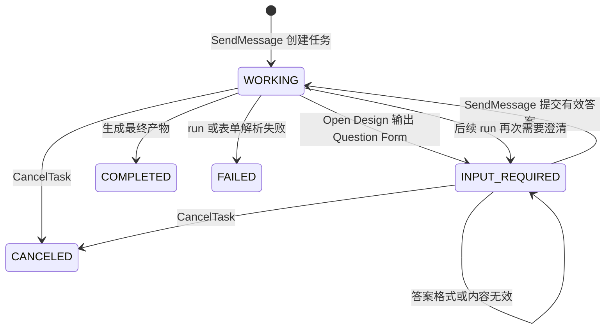
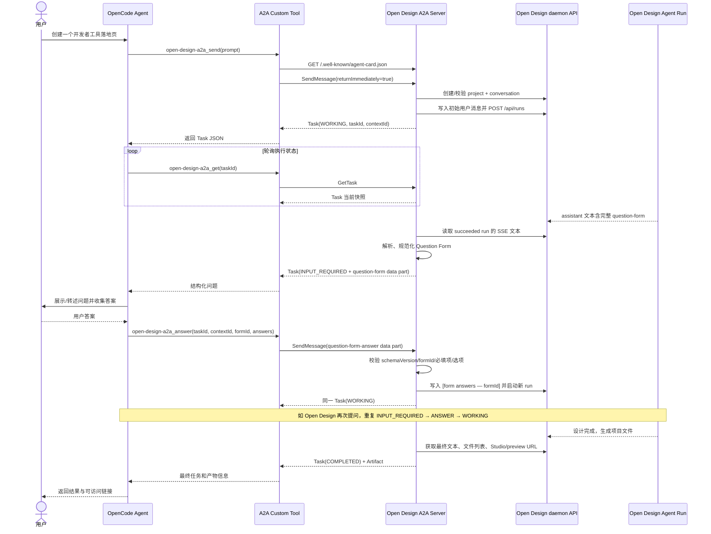

# Open Design A2A 技术说明与多轮对话流程

> 文档状态：基于 `odmcp` 分支当前实现整理。当前验证客户端是 OpenCode，后续可将同一客户端职责迁移到 Mobilework。

## 1. 结论先行

当前方案把 Open Design 作为一个独立的远程设计 Agent 服务，把 OpenCode 当作用户侧的编排 Agent：

- Open Design 继续拥有自己的 agent CLI、skills、plugins、workflow、project、conversation 和 artifact 运行时。
- OpenCode 不复制 Open Design 的工具或 workflow，只负责发起任务、查询状态、把澄清问题交给用户、再把答案送回去。
- 一个 A2A `taskId` 可以跨越多次 Open Design `runId`。每轮澄清都会新建一个 run，但始终复用同一个 Open Design project 和 conversation。
- Open Design 原本输出在 assistant 文本中的 `<question-form>`，会被 A2A 层转换为 `TASK_STATE_INPUT_REQUIRED` 和结构化 `data` part；答案回来后再转换为 Open Design 已能理解的 `[form answers — formId]` 用户消息。

因此，这不是“OpenCode 远程调用一个无状态函数”，而是“一个 Agent 将有状态任务委托给另一个 Agent，并在任务执行过程中多次补充输入”。这正是 A2A 比普通 MCP tool call 更贴合本场景的地方。

## 2. A2A 是什么

A2A（Agent2Agent Protocol）用于不同 Agent 系统之间发现能力、委托任务、交换消息、追踪任务状态和接收产物。它不要求两端使用同一个模型、框架或运行时。

在当前系统里：

| A2A 角色 | 当前承担者 | 职责 |
| --- | --- | --- |
| Client Agent | OpenCode；未来是 Mobilework | 理解用户请求、调用远程 Agent、展示问题和结果 |
| Remote Agent | Open Design daemon | 运行设计 Agent、skill、plugin 和 workflow，管理项目与产物 |
| 用户 | OpenCode/Mobilework 的使用者 | 提出原始需求并回答澄清问题 |

官方 A2A 1.0 规范定义了 Agent Card、Message、Task、Part、Artifact、任务状态以及 JSON-RPC、gRPC、HTTP+JSON/REST 等 binding。当前实现只选择了其中最小且足够验证闭环的一组能力：A2A 1.0 + JSON-RPC + 轮询。

官方资料：

- [A2A 1.0 规范](https://a2a-protocol.org/latest/specification/)
- [A2A 1.0 变化说明](https://a2a-protocol.org/latest/whats-new-v1/)
- [官方 JavaScript SDK](https://github.com/a2aproject/a2a-js)

## 3. A2A 的核心对象

### 3.1 Agent Card：远程 Agent 的能力名片

客户端先访问：

```text
GET /.well-known/agent-card.json
```

Open Design 的 Agent Card 告诉客户端：

- Agent 名称和用途；
- A2A 协议版本为 `1.0`；
- JSON-RPC 地址为 `/api/a2a`；
- 支持的输入、输出 media type；
- 当前不支持 streaming 和 push notification；
- 如果 daemon 对公网启用了 API token，客户端需要 Bearer token。

Agent Card 的价值是让客户端通过发现决定“如何通信”，而不是把服务地址、协议版本和能力全部写死在业务逻辑里。

### 3.2 Message 与 Part：一轮通信的载体

`Message` 表示 Agent 之间的一条消息，包含：

- `messageId`：这条消息的唯一标识；
- `role`：`ROLE_USER` 或 `ROLE_AGENT`；
- `taskId`、`contextId`：继续既有任务时用于关联状态；
- `parts`：消息内容，可以是 text、data、url 或 raw 等不同形式。

当前实现使用三类 part：

| 内容 | Part 形态 | media type |
| --- | --- | --- |
| 用户的初始设计需求 | text | `text/plain` |
| Open Design 的结构化问题 | data | `application/vnd.open-design.question-form+json` |
| 用户的结构化答案 | data | `application/vnd.open-design.question-form-answer+json` |
| 最终产物元数据 | data | `application/vnd.open-design.artifact+json` |
| Studio 和预览入口 | url | `text/html` |

### 3.3 Task：跨多轮存在的任务

`Task` 不是某一次 HTTP 请求，也不是某一次模型调用。它是用户委托给远程 Agent 的完整工作单元。

当前闭环中，一个 Task 的状态可能依次变化为：



`INPUT_REQUIRED` 是非终态。它表示远程 Agent 暂时中断执行并等待用户输入，而不是任务失败。用户回答后继续使用原 `taskId`。

### 3.4 Artifact：任务最终交付物

`Artifact` 表示任务产出，而不是普通聊天回复。当前最终 Artifact 包含：

- Open Design 最终文本说明；
- project、conversation、最后一次 run、入口文件和文件清单等结构化元数据；
- Open Design Studio URL；
- 可直接打开的 preview URL。

当前实现只返回有界的文件元数据和 URL，不把完整 HTML、图片或其他大文件内联到 A2A 响应中。

## 4. A2A 与 MCP 在本场景中的区别

| 维度 | MCP | A2A |
| --- | --- | --- |
| 主要关系 | Host/模型调用工具、资源或提示词 | 一个 Agent 向另一个 Agent 委托任务 |
| 远端是否拥有自主执行逻辑 | 通常是工具能力提供者 | 是独立 Agent，可自主规划和多轮执行 |
| 一等状态模型 | 主要围绕一次 tool call/result | Task 有 working、input-required、completed 等生命周期 |
| 多轮澄清 | 依赖 host 的 elicitation 能力或自定义返回约定 | 可用同一 task/context 继续 SendMessage |
| 最终交付 | tool result | Artifact |
| 当前 Open Design 适配度 | 会把完整 workflow 压缩成工具调用语义 | 能保留 Open Design 作为 Agent/workflow 所有者 |

这并不表示 MCP 和 A2A 互斥。Open Design 内部仍可通过 MCP 使用外部工具；OpenCode/Mobilework 与 Open Design 之间则用 A2A 委托完整设计任务。二者处在不同层级：MCP 更像 Agent 的“工具总线”，A2A 更像 Agent 之间的“任务协作总线”。

Question Form 通过普通 MCP result 返回时，只是一段客户端需要自行解释的数据；MCP Elicitation 则是 MCP 协议中由 server 请求 host 采集用户输入的标准交互。当前 A2A 路径没有依赖 MCP Elicitation，而是将问题映射到 A2A 的 `INPUT_REQUIRED` 任务状态，因而更符合独立远程 Agent 的生命周期。

## 5. 当前技术架构

```mermaid
flowchart LR
    U[用户] --> OC[OpenCode Agent<br/>未来可替换为 Mobilework]
    OC --> CT[项目级 A2A Custom Tool]
    CT -->|GET Agent Card| CARD[Open Design Agent Card]
    CT -->|A2A 1.0 JSON-RPC| ROUTE[/Open Design /api/a2a/]
    ROUTE --> SDK[@a2a-js/sdk<br/>Request Handler + Task Store]
    SDK --> EX[OpenDesignA2AExecutor]
    EX --> QC[Question Form<br/>解析与答案校验]
    EX --> DC[Daemon Client]
    DC -->|复用现有 /api/projects、/api/runs、SSE、files API| OD[Open Design 现有运行时]
    OD --> AG[Agent CLI + skills + plugins + workflow]
    AG --> OD
```

这层设计刻意避免另起一套 Open Design 执行引擎。A2A adapter 只负责协议和状态转换，真正的业务仍走现有 daemon API：

- 创建或校验 project、conversation；
- 写入用户消息；
- 启动 run；
- 查询 run 状态；
- 回放 run 的 SSE 文本；
- 获取项目文件和预览信息；
- 取消 run。

这样 Web UI、`od` CLI 与 A2A 调用最终使用同一个 Open Design 业务运行时，不会出现“网页能做但 A2A 走另一套逻辑”的分叉。

## 6. 标识符如何映射

多轮闭环最容易混淆的是五种 ID：

| 标识符 | 所属层 | 生命周期 | 当前映射含义 |
| --- | --- | --- | --- |
| `contextId` | A2A | 可容纳一个或多个相关 Task | 在 executor 内映射到一个 Open Design project + conversation |
| `taskId` | A2A | 从需求提出到最终完成 | 一个设计委托；可跨多个 Open Design run |
| `messageId` | A2A | 单条输入消息 | 用于识别重复提交，避免同一消息重复启动 run |
| `projectId` | Open Design | 项目长期存在 | 产物文件和项目设置的边界 |
| `conversationId` | Open Design | 项目内会话长期存在 | 保存初始需求、表单答案和 Agent 输出上下文 |
| `runId` | Open Design | 单次 Agent 执行 | 每次初始请求或表单答案都会产生新的 run |

关键不变量是：

```text
一个 A2A taskId
  = 同一个 A2A contextId
  = 同一个 Open Design projectId + conversationId
  = 一个或多个按顺序执行的 Open Design runId
```

因此，“多轮”并不是强行让一个进程永远不退出。每次 Open Design run 可以正常结束；A2A executor 保存任务级状态，在用户回答后用同一会话开启下一次 run。

## 7. 完整多轮流程



### 7.1 初始请求

OpenCode 调用 `open-design-a2a_send`。工具先发现 Agent Card，再向 `/api/a2a` 发送 `SendMessage`。请求配置了 `returnImmediately: true`，所以客户端不会让一次 tool call 长时间阻塞，而是立即拿到 `WORKING` Task，随后使用 `GetTask` 轮询。

### 7.2 Open Design 产生问题

Open Design Agent 仍按原有系统提示词输出完整 `<question-form>...</question-form>` 文本。A2A executor 等 run 成功后读取这一轮的 SSE `text_delta`，只在检测到完整闭合且 JSON 有效的表单时进入等待输入状态：

- 没有 Question Form：视为最终完成；
- 有完整有效 Question Form：发布 `INPUT_REQUIRED`；
- 只有开标签、JSON 无效或没有有效问题：发布 `FAILED`，避免客户端把残缺表单展示给用户。

### 7.3 客户端采集答案

`INPUT_REQUIRED` 的 status message 同时包含普通说明文本和结构化 Question Form data part。OpenCode 试验版本目前没有改原生 UI，只把它作为 custom tool 结果交给 OpenCode Agent，由 Agent 在聊天里向用户展示或转述问题。

这验证的是 A2A 的状态和数据闭环，还不是最终 Mobilework 的表单渲染效果。迁移到 Mobilework 时，应直接按照该 media type 渲染 radio、checkbox、text、direction-cards 等控件，而不是让模型重新解析问题文本。

### 7.4 答案校验与恢复

用户答案必须使用 Question Form answer media type，并携带：

```json
{
  "schemaVersion": 1,
  "formId": "discovery",
  "answers": {
    "tone": "bold",
    "audience": ["developer", "team-lead"]
  }
}
```

服务端校验：

- `schemaVersion` 必须为 `1`；
- `formId` 必须匹配当前待回答表单；
- 不允许未知 question id；
- 必填题不能缺失；
- 单选题是字符串，多选题是字符串数组；
- `maxSelections` 和禁止自定义答案的有限选项必须满足约束。

无效答案不会让 Task 失败，而是继续保持 `INPUT_REQUIRED`，并返回具体错误，允许客户端修正后重试。有效答案会被格式化为 Open Design 已有 Web 表单流程所使用的用户消息格式，然后在同一 project/conversation 中启动新 run。

### 7.5 完成与产物

如果成功 run 的文本不包含 Question Form，executor 获取文件清单、入口文件、Studio URL 和 preview URL，发布一次 Artifact update，再把 Task 标记为 `COMPLETED`。

## 8. 为什么采用轮询，而不是 streaming

当前 Agent Card 明确声明：

```text
streaming = false
pushNotifications = false
```

因此客户端使用 `SendMessage(returnImmediately=true)` + `GetTask`。这种方式的优点是代码少、OpenCode 改动小、易于测试；代价是状态更新存在一个轮询间隔，客户端需要控制频率和超时。

这里有两层轮询：

1. OpenCode 通过 A2A `GetTask` 查询任务状态；
2. Open Design executor 在服务端查询当前 `/api/runs/:runId` 状态。

生产版本可以增加 A2A streaming 或 push notification，但不应改变 Task、Question Form 和 Artifact 的业务语义。

## 9. 安全与部署边界

- Agent Card 是公开发现端点。
- `/api/a2a` 位于 `/api/*` 下，继承 daemon 现有 Bearer token middleware。
- 绑定非 loopback 地址时，Open Design 的既有安全规则要求配置 `OD_API_TOKEN`，除非可信反向代理已经承担认证。
- OpenCode 客户端通过 `OD_A2A_TOKEN` 发送同一 Bearer token。
- 当前 Agent Card 只描述认证方案；executor 的 task/context map 还没有租户级所有权校验。

托管上线前至少需要补齐：

- 持久化、租户隔离的 TaskStore 和 task/context 映射；
- 每个 project/conversation 的授权校验；
- token scope、轮换与审计；
- 速率限制、并发限制、任务超时和资源配额；
- 防止通过返回 URL 越权访问项目文件；
- 服务重启后的任务恢复或明确的失败恢复协议。

## 10. 当前范围与已知限制

当前实现是可运行的多轮闭环验证，不是完整托管版：

- TaskStore、task map 和 context map 都在内存中，daemon 重启后未完成任务不可恢复。
- 仅实现 JSON-RPC 的 `SendMessage`、`GetTask`、`CancelTask` 主路径。
- 不支持 A2A streaming、push notification、gRPC 或 HTTP+JSON/REST binding。
- OpenCode 侧没有专门的 Question Form UI，只由 Agent 基于工具结果与用户对话。
- `file` 类型问题目前没有完成跨 A2A 的文件上传传输；答案层只能承载结构化字符串值。
- 最终产物只返回文本、URL 和最多 200 条文件元数据，不内联大文件。
- A2A executor 读取 run SSE 回放来获得 assistant 文本；未来可改为直接读取持久化 assistant message 作为更稳定的真源。
- 客户端当前每次调用都会重新发现 Agent Card；生产版可以按 Agent Card 的缓存规则安全缓存并处理版本变化。

## 11. 验证结果

当前分支已经覆盖以下自动化场景：

- Question Form 解析、规范化、答案校验和答案文本格式化；
- executor 的创建任务、等待输入、回答后恢复、完成、错误与取消；
- Agent Card 内容和 A2A 1.0 JSON-RPC 路由；
- 真实 HTTP 级多轮回路：`SendMessage → GetTask(INPUT_REQUIRED) → SendMessage(answer) → GetTask(COMPLETED)`；
- 同一回路内 `taskId`、`contextId`、`projectId`、`conversationId` 保持不变，而 `runId` 从第一轮变为第二轮。

已执行并通过：

```powershell
pnpm guard
pnpm typecheck
pnpm --filter @open-design/daemon exec vitest run -c vitest.config.ts `
  tests/a2a-question-form.test.ts `
  tests/a2a-executor.test.ts `
  tests/a2a-route.test.ts `
  tests/a2a-http-loop.test.ts
```

## 12. 迁移到 Mobilework 时应保留的契约

Mobilework 不需要移植 OpenCode 的内部实现，只需承担同样的 A2A Client 职责：

1. 发现并校验 Agent Card；
2. 发送初始 `SendMessage`；
3. 通过轮询、streaming 或 push 接收 Task 更新；
4. 遇到 `INPUT_REQUIRED` 时按 media type 渲染 Question Form；
5. 使用原 `taskId`、`contextId` 和 `formId` 回传结构化答案；
6. 遇到多个 Question Form 时重复步骤 4—5；
7. 在 `COMPLETED` 后展示 Artifact，而不是只展示最后一条文本消息；
8. 对 `FAILED`、`CANCELED`、重试、超时和服务重启提供明确 UI 状态。

只要这组 wire contract 保持稳定，Open Design 内部可以继续演进 agent CLI、skills 和 workflow，而 Mobilework 不需要同步复制这些业务代码。
