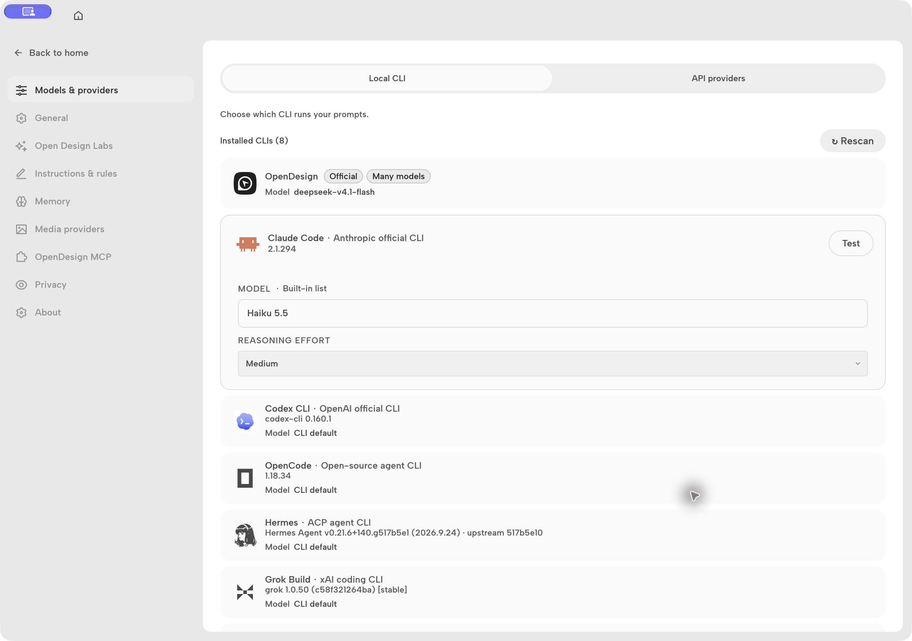
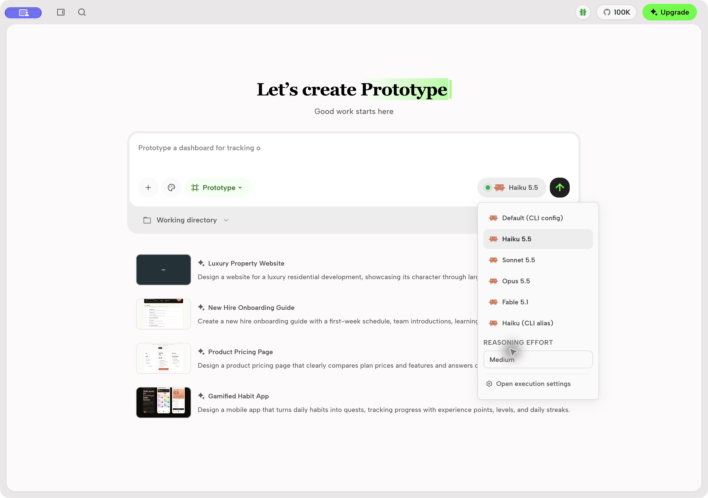

# Claude model picker and reasoning

Open Design offers explicit Claude model versions and model-specific reasoning effort
to the Local CLI settings and the chat model picker. Haiku 5.5, Sonnet 5.5,
Opus 5.5, and Fable 5.1 offer Low, Medium, High, Extra high, and Max. CLI default
omits `--effort`, preserving Claude Code's own settings. Legacy models hide
unsupported effort controls. CLI aliases and custom model IDs remain available.

Claude Code must support the selected model and `--effort`; Haiku 5.5 requires
Claude Code 2.1.293 or newer. Open Design forwards the model ID and effort to
Claude Code, which handles account and provider availability. The authoritative
capability reference is [Claude Code model configuration](https://code.claude.com/docs/en/model-config).





The command-line entry point supports the same selection:

```sh
od run start --project <project-id> --agent claude \
  --model claude-haiku-5-5 --reasoning medium
```
