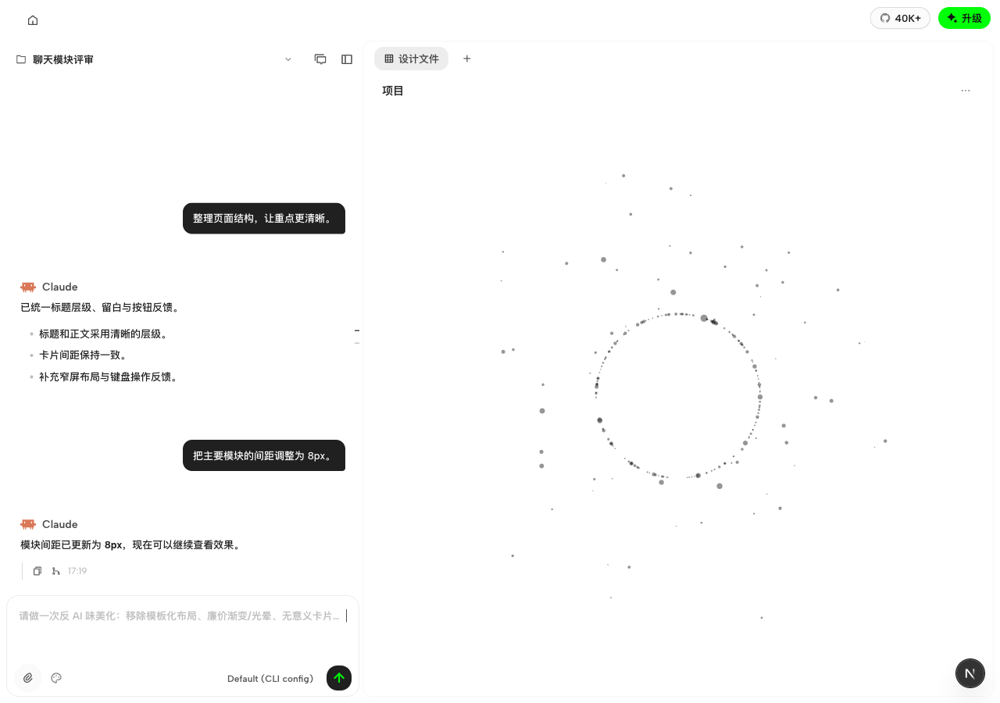

# Chat module demo

Open `index.html` directly in a browser, or download it from the repository and send the single file to a reviewer. Fonts and icons are embedded; no server, installation, account, or network connection is required.

The scene controls cover generation in progress, queued messages, execution plans, clarification questions, completion, and failure/retry. The chat includes project and conversation menus, a message navigation rail, attachment and design-system controls, model selection, and an expandable message queue.

This is an offline presentation fixture using synthetic conversations and simulated execution. It does not invoke models, publish projects, upload attachments, or replace the application runtime. Local file previews and edits remain in the current page; reload or Reset restores the sample state. The Download HTML control exports a clean copy of the original demo, without messages or attachments entered during the session.

The embedded Albert Sans, JiduMono Pro, Remix Icon font, and Claude icon are copied from the existing web assets. Remix Icon retains its upstream attribution in the HTML.

Client integration screenshot (local project with synthetic messages; no model run):

