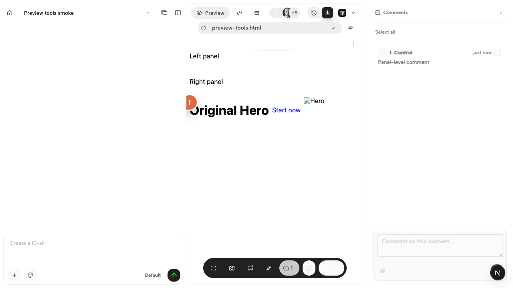

# Workspace preview and editing review

This change set continues the home and project-chat integration in PR #7635. It consolidates the subsequent workspace UI feedback on the same application and generation APIs.

## Changes by area

| Area | Result | Main owners |
| --- | --- | --- |
| Workspace navigation | Aligned project controls, a unified file selector, matching hover states, and persistent preview actions while viewing history | `WorkspaceTabsBar`, `FileWorkspace`, workspace styles |
| Generation preview | Preview is selected once at run start. Renderable HTML replaces the initial status view; refreshes retain the last usable frame | `ProjectPreviewPane`, `DesignFilesBuildingState` |
| Generation activity | The current plan title and the latest write anchor are retained independently. The real module receives an outline and a nearby status bubble; unmatched steps stay docked | `run-progress`, preview build-focus bridge |
| Shared right inspector | Comments and Edit use one far-right column. Switching retains its width; closing releases it and restores focus. The preview stays mounted and only reserves the column once | `WorkspaceEditLayout`, `FileViewer`, `ProjectView` |
| Inspector controls | Gray field surfaces deepen on focus, values are centered, padding/margin rows read icon → minus → value → plus, and numeric transitions respect reduced motion | `ManualEditPanel`, `AnimatedNumberInput`, `AnimateDigits` |
| Color editing | Six-digit HEX and opacity are separate. Swatches show the selected RGB color while saved values retain alpha, with a custom saturation/hue/alpha popover | `ManualEditColorPopover`, `color-picker` |
| Edit history and saving | Reset clears the current editing session across targets; explicit Save establishes a new baseline. Undo/redo use the supplied icons. Exiting or changing files waits for persistence and retains the inspector on failure; stale HTML cannot overwrite newer styles or inline text | `ManualEditPanel`, `FileViewer`, `WorkspaceTabsBar` |
| Preview toolbar | Uniform 8 px horizontal gaps. The presentation arrow opens three vertically stacked actions above the toolbar, with no selected white surface on the Present trigger while its menu is open | `FileViewer`, presentation tools and canvas dock styles |
| Export controls | Editable filenames and format selectors share one row; exported filenames preserve CJK text and spaces while removing invalid filename characters | `ExportFilenameField`, image export runtime |
| Preview layout recovery | Critical layout styles load in the initial stylesheet, preventing the preview from collapsing to zero height when an async stylesheet is unavailable | App Router root layout |
| Chat and composer | Keeps the shared Home/Add controls from the base branch; adjusts queued-card spacing and makes queue expansion mutually exclusive with floating chat navigation | Project chat components and styles |
| Desktop and supporting UI | Aligns native window controls, updates toolbar icons, account placement and localized labels | Desktop runtime, app chrome, i18n |

The sample preview avatars remain presentation data. This change does not add a collaboration-membership backend, generation endpoint, persistence migration, or model prompt.

The preview's bottom **Edit** button opens the separate inspector at the right:

## Manual review

1. Open an HTML design. Check the preview toolbar, file selector and version history actions.
2. Choose **Edit** in the bottom preview toolbar. The page stays mounted and a separate inspector opens at the right. Drag its divider, then resize the window.
3. Select text and check gray fields, centered values, focus shading, and icon → minus → value → plus spacing controls. Open a color swatch; HEX stays six digits while opacity and the swatch remain synchronized.
4. Change multiple elements, use the undo/redo icons, then Reset. Save establishes the new reset baseline. Cancel/Delete footer actions are absent. On a failed save, retain the draft and error; changing from Edit to Comments must wait for a successful save.
5. Open Comments. Resize its right column, switch to Edit and back, and confirm the same width and only one panel. Close with the header button or Escape and confirm preview space and focus are restored. Narrow and widen the window to verify width clamping/restoration.
6. Open the presentation arrow and check the vertical action menu above it. Inspect the 8 px toolbar spacing. Export an image with a Chinese filename and a space, then verify the chosen format and downloaded name.
7. Generate into an empty project. Confirm the status view gives way to real HTML, activity follows a matched module, and a manual switch to Design Files is respected.
8. Expand queued chat cards with hover or keyboard focus. Confirm floating chat navigation yields, the sixth card is partially visible as a scroll cue, and the queue remains scrollable.

## Follow-up verification on 2026-09-14

The automated browser capture uses an isolated fixture with no local chat transcript:

- Root `pnpm typecheck` and e2e package typecheck: **passed**.
- Inspector, numeric/color controls, editing history and dock suites: **72/72 passed** across five files.
- Supplemental workspace navigation/export suites: **147 passed, 3 failed, 1 skipped**. The three image-export failures expect a viewport option list from the current cyclic viewport control; no clean baseline comparison was made.
- Shared-dock and save-order regression selection: **21/21 passed**. The container-style overwrite regression was observed failing before the save-intent fix and passing afterwards.
- Final full `FileViewer.test.tsx` + `WorkspaceEditLayout.test.tsx`: **277 passed, 12 failed**. New cases passed; remaining failures concern editing-selection/old Save-Cancel assumptions and preview/presentation CSS assertions. No clean baseline comparison was made for these 12 failures.
- Browser assertions passed for creating and displaying a real comment, far-right bounds, 320 → 360 px resizing, width retention across both switches, an 800 px window clamp, closing/Escape and focus restoration. The full toolbar workflow subsequently timed out in its mark step during the mocked run because the button was outside the viewport; that broader workflow is **not green**.
- Actual desktop checks confirmed the same column for Comments and Edit, retained width, transparent shell, no duplicate preview reservation, and focus restoration on close.
- `pnpm guard` still reports the untouched cross-app reference in `apps/web/tests/styles/font-weight-normalization.test.ts:10`.

These checks supplement the earlier validation below; they do not resolve or reclassify its outstanding failures. Keep the PR in draft.

## Validation on 2026-09-12

- Workspace `pnpm typecheck`: passed.
- Focused preview, bridge, progress, inspector and queue integration: **83 passed**.
- Wider affected-web regression selection: **965 passed, 29 failed, 4 skipped** (998 total).
- An isolated comparison against base commit `877980fb1` reproduced five failures: the legacy Design Toolbox quick-pill contract, two presentation CSS assertions, composer-layer CSS lookup, and split-width geometry.
- The other 24 failures need review against the consolidated file-selector, tab/menu and toolbar-geometry behavior. They are not reported as passing or as baseline failures.
- `pnpm guard`: blocked by the existing cross-app source reference in `apps/web/tests/styles/font-weight-normalization.test.ts:10`.
- Native desktop checks previously verified a nonzero preview height, retained iframe identity while resizing, the separate transparent inspector, and computed control radii. Desktop status was checked again during consolidation.

The PR remains a draft while the remaining regression assertions and the baseline guard failure are unresolved. Temporary probes, runtime logs, source archives and unused scratch imagery are kept outside the commit.
