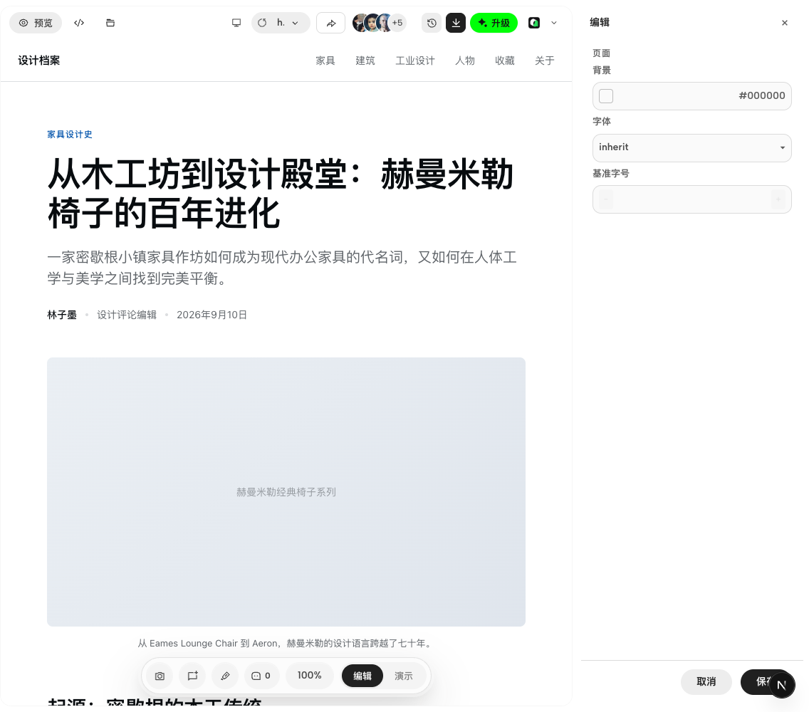

# Workspace preview and editing review

This change set continues the home and project-chat integration in PR #7635. It consolidates the subsequent workspace UI feedback on the same application and generation APIs.

## Changes by area

| Area | Result | Main owners |
| --- | --- | --- |
| Workspace navigation | Aligned project controls, a unified file selector, matching hover states, and persistent preview actions while viewing history | `WorkspaceTabsBar`, `FileWorkspace`, workspace styles |
| Generation preview | Preview is selected once at run start. Renderable HTML replaces the initial status view; refreshes retain the last usable frame | `ProjectPreviewPane`, `DesignFilesBuildingState` |
| Generation activity | The current plan title and the latest write anchor are retained independently. The real module receives an outline and a nearby status bubble; unmatched steps stay docked | `run-progress`, preview build-focus bridge |
| Manual editing | Edit opens a separate resizable pane at the far right. Its outer surface is transparent, input corners are 12 px, and the scrollbar thumb uses faint gray at 40% opacity | `WorkspaceEditLayout`, `ManualEditPanel` |
| Preview layout recovery | Critical layout styles load in the initial stylesheet, preventing the preview from collapsing to zero height when an async stylesheet is unavailable | App Router root layout |
| Chat and composer | Keeps the shared Home/Add controls from the base branch; adjusts queued-card spacing and makes queue expansion mutually exclusive with floating chat navigation | Project chat components and styles |
| Desktop and supporting UI | Aligns native window controls, updates toolbar icons, account placement and localized labels | Desktop runtime, app chrome, i18n |

The sample preview avatars remain presentation data. This change does not add a collaboration-membership backend, generation endpoint, persistence migration, or model prompt.

The preview's bottom **Edit** button opens the separate inspector at the right:

## Manual review

1. Open an HTML design. Check the preview toolbar, file selector and version history actions.
2. Choose **Edit** in the bottom preview toolbar. The page stays mounted and a separate inspector opens at the right. Drag its divider, then resize the window.
3. Select text. Check the content, text color and parameter controls: each has a 12 px radius, and the inspector scrollbar has a faint 40% gray thumb.
4. Save or cancel an element change, return to page settings, then exit editing. A failed save must retain the draft and error.
5. Generate into an empty project. Confirm the status view gives way to real HTML, activity follows a matched module, and a manual switch to Design Files is respected.
6. Expand queued chat cards with hover or keyboard focus. Confirm floating chat navigation yields, the sixth card is partially visible as a scroll cue, and the queue remains scrollable.

## Validation on 2026-09-12

- Workspace `pnpm typecheck`: passed.
- Focused preview, bridge, progress, inspector and queue integration: **83 passed**.
- Wider affected-web regression selection: **965 passed, 29 failed, 4 skipped** (998 total).
- An isolated comparison against base commit `877980fb1` reproduced five failures: the legacy Design Toolbox quick-pill contract, two presentation CSS assertions, composer-layer CSS lookup, and split-width geometry.
- The other 24 failures need review against the consolidated file-selector, tab/menu and toolbar-geometry behavior. They are not reported as passing or as baseline failures.
- `pnpm guard`: blocked by the existing cross-app source reference in `apps/web/tests/styles/font-weight-normalization.test.ts:10`.
- Native desktop checks previously verified a nonzero preview height, retained iframe identity while resizing, the separate transparent inspector, and computed control radii. Desktop status was checked again during consolidation.

The PR remains a draft while the remaining regression assertions and the baseline guard failure are unresolved. Temporary probes, runtime logs, source archives and unused scratch imagery are kept outside the commit.
