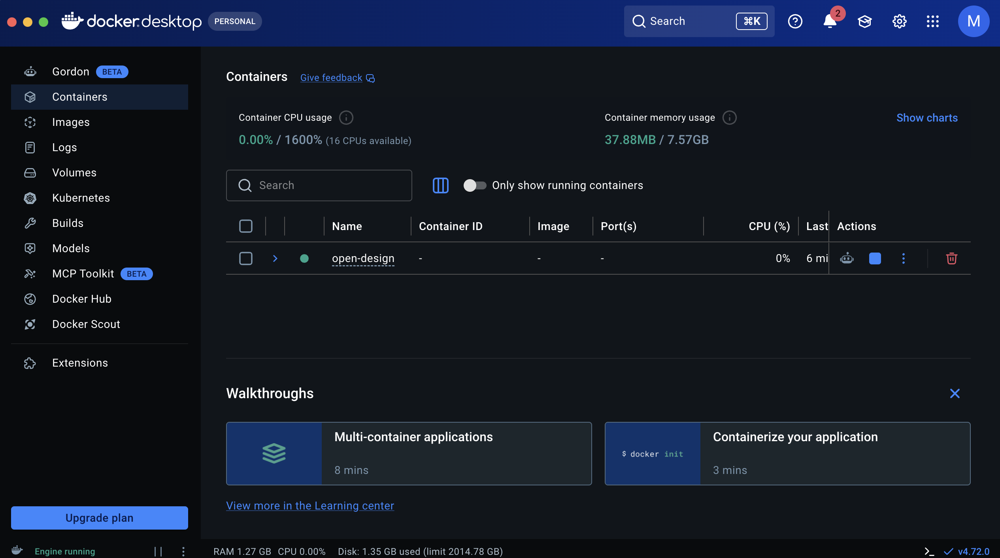
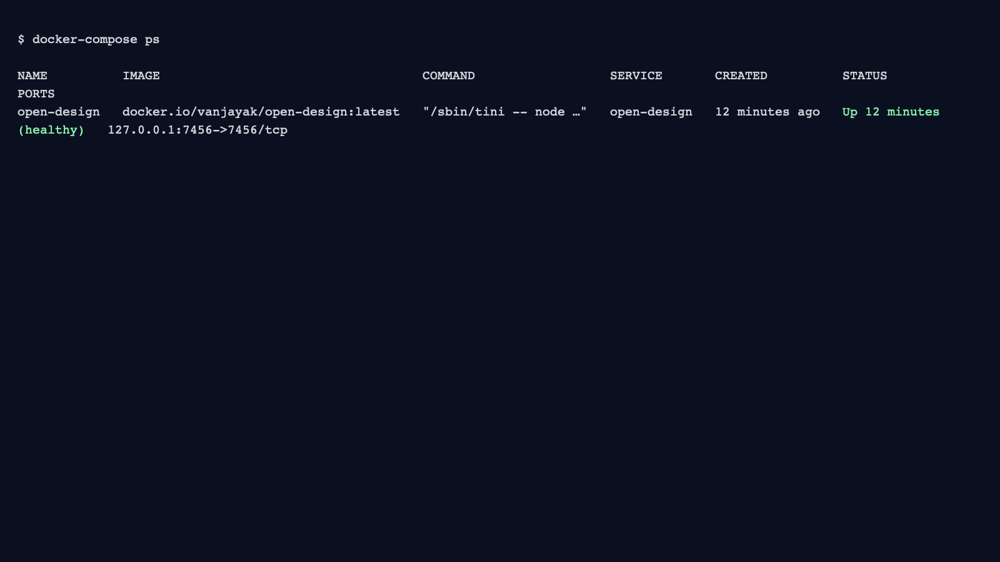
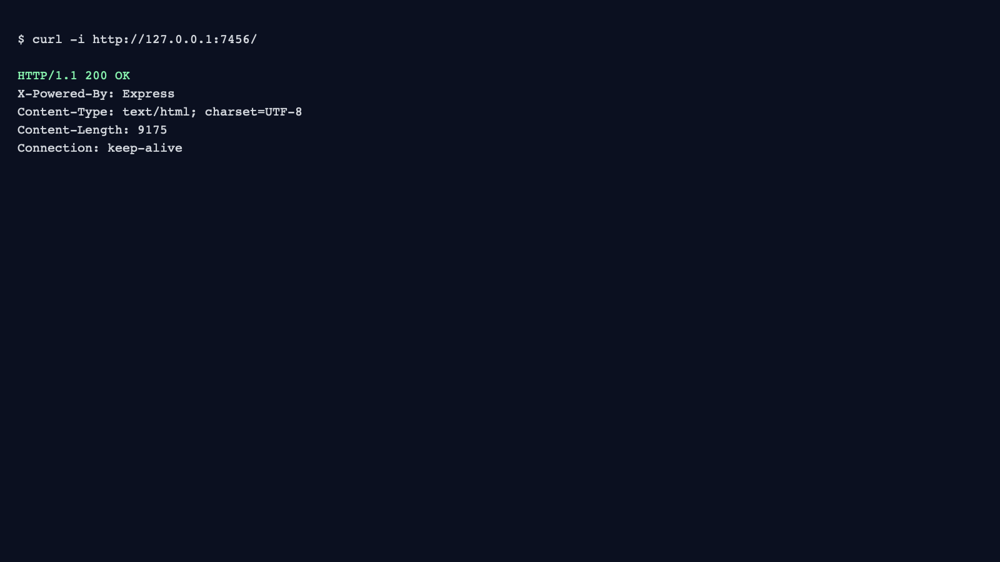
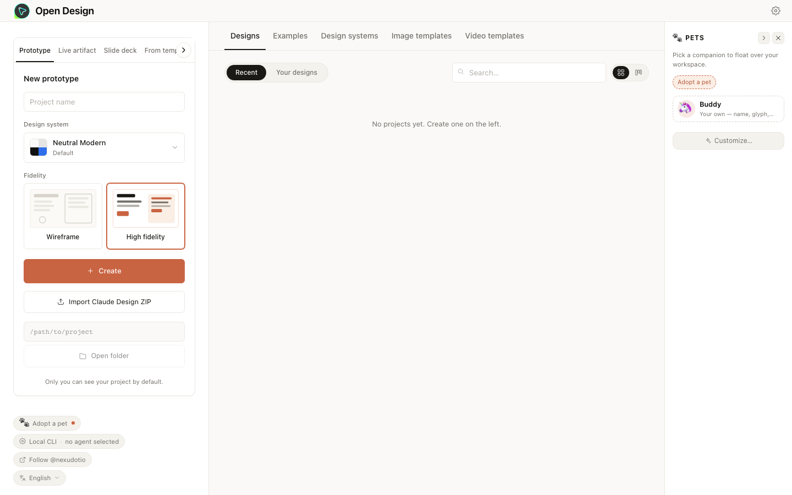
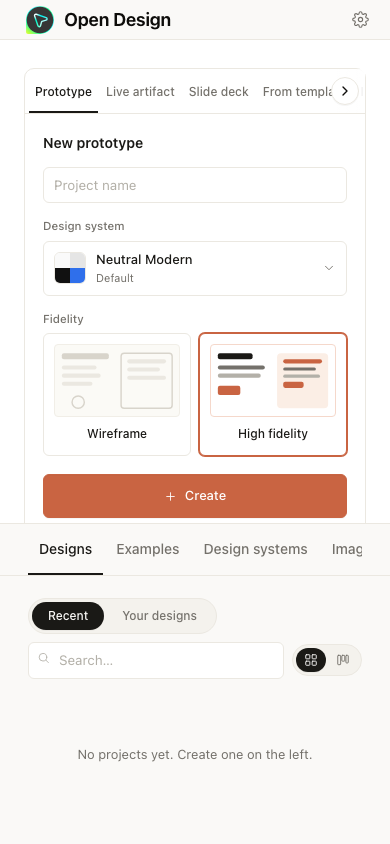

# Docker and Docker Compose

This is the easiest self-hosting path for beginners.

> **Tip:** For the quickest setup, run the one-click installer instead of following the manual steps below:
> ```bash
> cd deploy/scripts && bash install.sh
> ```
> It handles Docker detection, `.env` generation (with a random token), pull, start, health check, and optional systemd service installation — all interactively.

## Before You Start

- Docker Desktop installed and running
- Internet connection (first run downloads the image)

## Step 1: Open the Deploy Folder

```bash
git clone https://github.com/nexu-io/open-design.git
cd open-design/deploy
```

What this does:
- Downloads the project
- Moves into the folder that contains `docker-compose.yml`

## Step 2: Create `.env` and choose an API auth mode

Create `deploy/.env` from the tracked template:

```bash
cp .env.example .env
```

Generate a token if you want the default protected mode:

```bash
openssl rand -hex 32
```

Then edit `.env` and configure one of these before first start:

- **recommended (authenticated):** paste the generated token into `OD_API_TOKEN=` and set `OD_DISABLE_API_AUTH=0` in `.env`
- **localhost-only (no token):** leave `OD_API_TOKEN=` empty and keep the compose default (`OD_DISABLE_API_AUTH=1`). Only safe because `docker-compose.yml` binds to `127.0.0.1`
- **trusted reverse proxy only:** leave `OD_API_TOKEN=` empty and set `OD_DISABLE_API_AUTH=1` only when the proxy already authenticates every request

If you expose Open Design through a reverse proxy, also set:

```bash
OD_ALLOWED_ORIGINS=https://yourdomain.com
# Also set OD_WEB_PORT if the browser-visible port differs from OPEN_DESIGN_PORT
# (e.g. behind a reverse proxy remapping ports). Omit to auto-derive from OPEN_DESIGN_PORT.
```

## Environment variable reference

<!-- AUTO-GENERATED from deploy/.env.example and deploy/docker-compose.yml -->
| Variable | Default | Required | Description |
|----------|---------|----------|-------------|
| `OPEN_DESIGN_IMAGE` | `ghcr.io/nexu-io/od:latest` | No | Container image reference. Pin a digest with `@sha256:<digest>` for immutability |
| `OPEN_DESIGN_PORT` | `7456` | No | Host port (bound to `127.0.0.1`). Only the Docker host can reach this port |
| `OD_ALLOWED_ORIGINS` | (empty) | No | Comma-separated browser origins for CORS, e.g. `https://od.example.com,http://203.0.113.10:7456` |
| `OD_WEB_PORT` | auto-derived from `OPEN_DESIGN_PORT` | No | Browser-visible port when it differs from `OPEN_DESIGN_PORT` (e.g. behind a reverse proxy) |
| `OD_API_TOKEN` | (empty) | No | 32-byte hex token for API auth. Generate with `openssl rand -hex 32` |
| `OD_DISABLE_API_AUTH` | `1` (compose default) | No | Set to `0` to enable API token enforcement. Must also set `OD_API_TOKEN` |
| `OD_BOOTSTRAP_ALLOW_PRIVATE_SUBNET` | `1` (compose default) | No | Trusts RFC1918 addresses as loopback. Required when Docker port-publishing rewrites source IP. Set to `0` to harden LAN/remote deployments |
| `OD_ADDITIONAL_ALLOWED_DIRS` | (empty) | No | Comma-separated directories the agent CLI can read/write inside the container |
| `OD_CODEX_SANDBOX` | (empty) | No | Codex sandbox mode. Set to `danger-full-access` only when Codex fails with workspace-write sandbox errors |
| `OD_TRUST_PROXY` | (empty) | No | Hop count (`1`), specific IP (`172.18.0.1`), or comma-separated list of IPs/CIDRs to trust for `X-Forwarded-*` headers |
| `OD_PUBLIC_BASE_URL` | (empty) | No | Externally-reachable base URL for the daemon |
| `OPEN_DESIGN_MEM_LIMIT` | `384m` | No | Compose-level container memory limit (idle uses ~18-22 MiB). Raise for large exports or concurrent agents |
| `NODE_OPTIONS` | `--max-old-space-size=192` | No | Node.js heap cap inside the container |

> The compose file uses Docker Compose **list format** (`- KEY=value`) in the `environment` block
> instead of YAML mapping format (`KEY: value`). List format works reliably across all platforms
> including Windows and macOS. If environment variables don't seem to reach the daemon, run
> `docker compose config` to see the resolved values, and check that you used `- KEY=value` syntax
> if you modified the compose file.

## Step 3: Start Open Design

```bash
docker-compose up -d
```

What to expect:
- First run can take 1-2 minutes while Docker pulls the image
- You should see container creation and startup messages

## Step 4: Confirm Container Health

```bash
docker-compose ps
```

Success looks like:
- `open-design` container is listed
- `STATUS` shows `Up` and eventually `healthy`
- Port mapping includes `127.0.0.1:7456->7456/tcp`




## Step 5: Verify HTTP Response

```bash
curl -i http://127.0.0.1:7456/
```

Success looks like:
- HTTP status `200 OK`



## Step 6: Open Open Design in Your Browser

Open:
- `http://localhost:7456/`

You should see the Open Design interface.




## Common Issues

- `failed to connect to the docker API`: Docker Desktop is not running yet
- `address already in use`: Port `7456` is occupied by another process
- `curl: (7) Failed to connect`: container is still starting; wait 10-20 seconds and retry
- reverse proxy + `OD_API_TOKEN`: either inject `Authorization: Bearer <OD_API_TOKEN>` at the proxy, or set `OD_DISABLE_API_AUTH=1` (the compose default) only when that proxy already authenticates every request and the daemon is not directly exposed.
- `Authorization: Bearer <OD_API_TOKEN> required` on macOS: Docker Desktop bridge networking makes the daemon see requests as non-loopback. See [Docker Desktop on macOS](../../deploy/README.md#docker-desktop-on-macos) for the host networking workaround.
