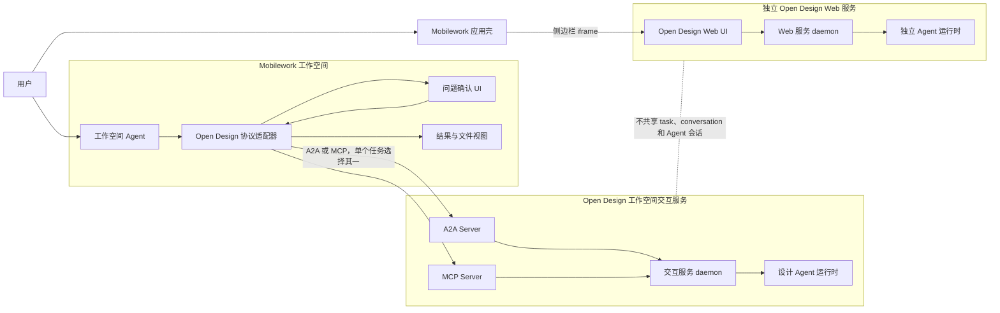
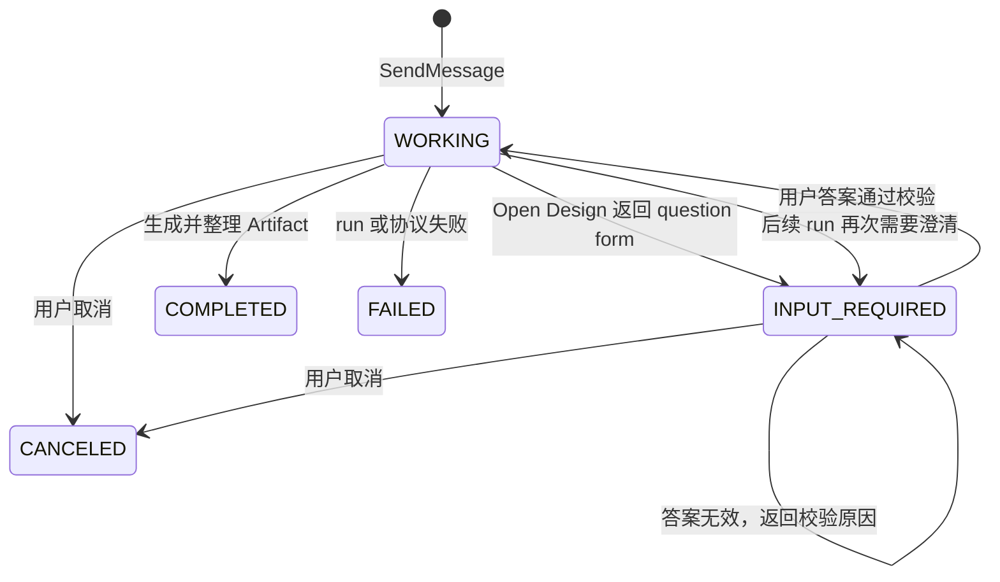
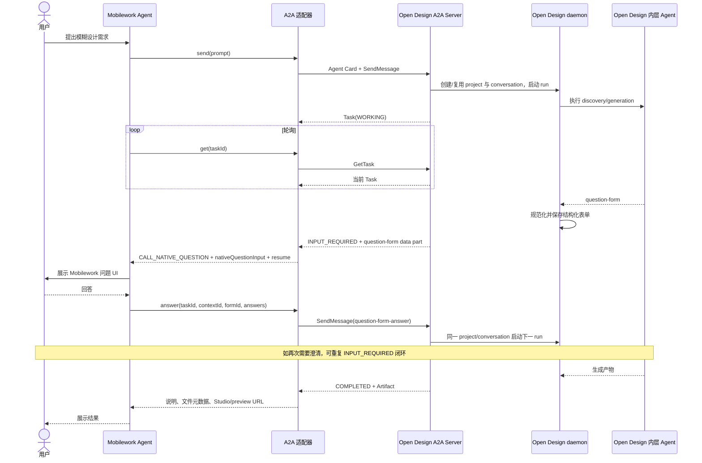
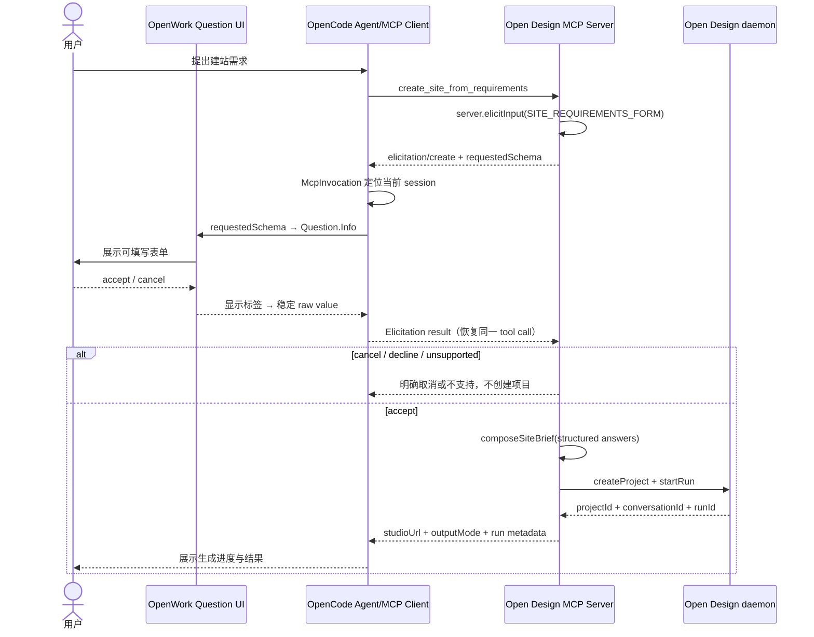
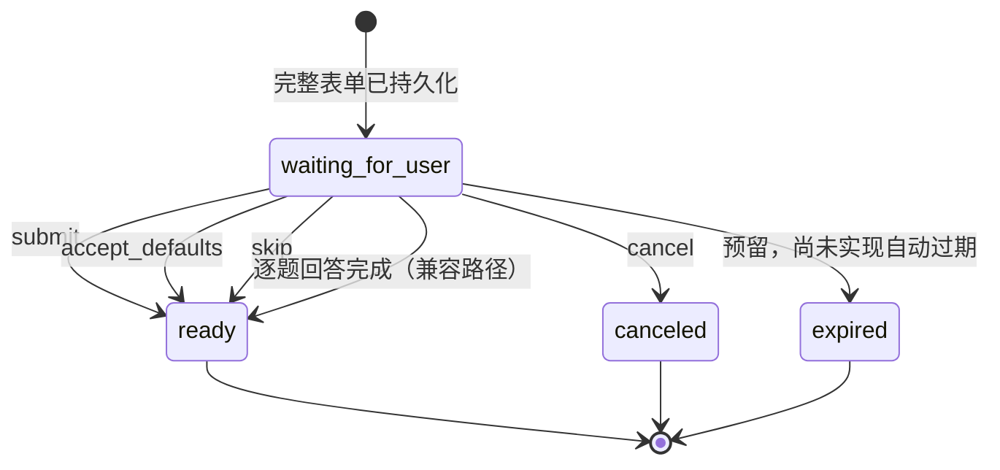
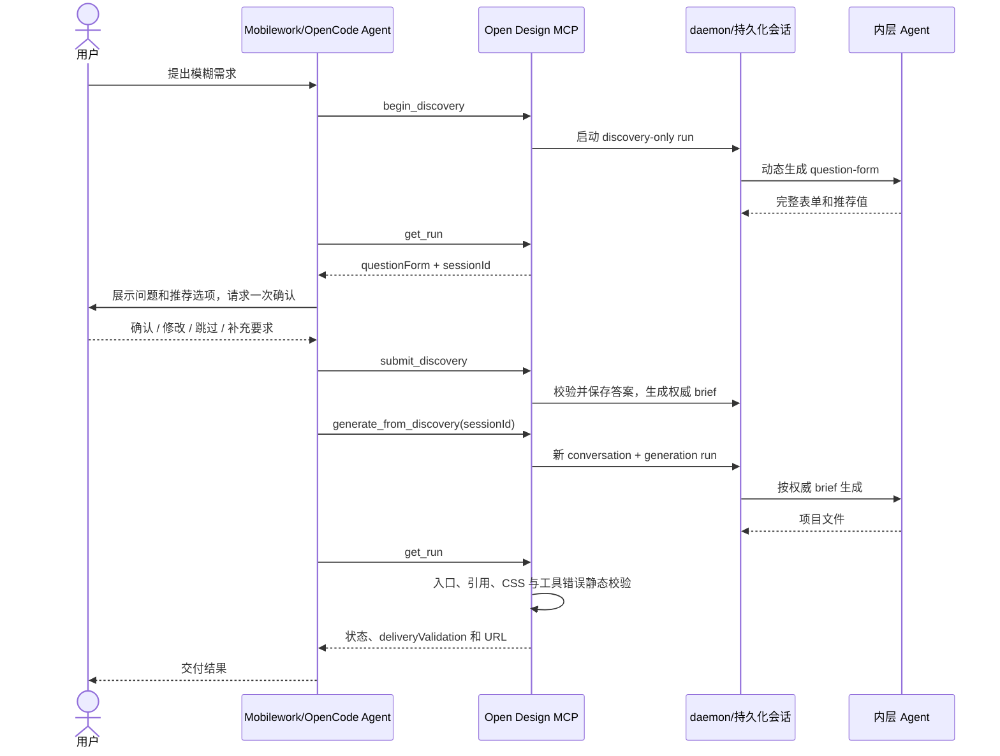
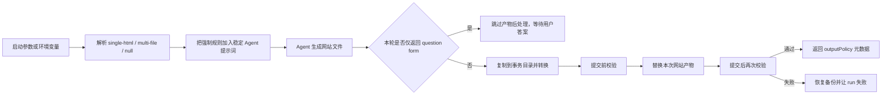

# Mobilework × Open Design 应用集成技术文档

> 文档状态：目标架构与已验证实现说明  
> 当前 Open Design 分支：`odmcp-a2a-question-form`  
> 实现基线：A2A、MCP Elicitation、多轮 MCP，以及网站产物可控生成  
> 最近核对日期：2026-08-06

## 1. 文档目的

本文说明 Open Design 作为 Mobilework 应用时的产品形态、服务边界和多轮交互流程，并记录当前已经完成或经过 OpenCode 验证的实现路径。

目标形态包含两个相互独立的入口：

1. **工作空间入口**：用户在 Mobilework 工作空间的对话中提出设计需求，由 Mobilework 通过 A2A 或 MCP 把任务交给 Open Design。Open Design 可以先返回若干澄清问题，用户确认后再生成网站或其他设计产物。
2. **侧边栏 Web 入口**：Mobilework 侧边栏提供 Open Design 应用入口，点击后在 iframe 中打开 Open Design Web 服务。该 Web 服务拥有独立的 Agent 运行时和会话，不自动继续工作空间中通过 A2A/MCP 创建的任务。

本文重点回答以下问题：

- Mobilework 在什么场景下调用 Open Design；
- A2A、MCP Elicitation 和多轮 MCP 分别如何完成“提问—确认—生成”；
- 工作空间运行时与 iframe Web 运行时为什么必须明确隔离；
- 当前实现对应哪些代码目录，哪些能力仍需要产品化；
- 后续应采集哪些真实案例作为验收证据。

### 1.1 实现基线说明

本文描述的是 Mobilework × Open Design 团队已经完成或验证的整体成果。三种通信方案是同一产品目标下的并列实现，相关代码当前分布在不同分支或实验线上：

- **A2A 路径**：已实现 Open Design A2A Server、多轮 Task 闭环、question form 结构化处理，以及工作区 `open-design-a2a.ts` 适配器；
- **MCP Elicitation 路径**：已实现并在 OpenCode 上验证；
- **多轮 MCP 路径**：已实现并在 OpenCode 上验证；
- **Mobilework iframe Web 入口**：当前属于已确定的产品形态，后续由 Mobilework 应用集成实现。

因此，第 7 节将三种方案作为统一成果放在同一个层级，用于形成完整的应用技术基线和协议选型依据。分支差异只表示当前代码组织状态，不表示成果或责任归属。

## 2. 一句话架构结论

Open Design 在 Mobilework 中不是一组被复制进客户端的生成工具，而是一个拥有独立 Agent、skills、plugins、workflow、project、conversation 和 artifact 生命周期的外部设计应用；Mobilework 负责用户入口、协议适配、问题展示和结果承接，Open Design 负责需求澄清、设计生成和产物管理。

## 3. 应用场景和范围

### 3.1 典型应用场景

#### 场景一：从模糊需求生成网站

用户只提供较粗略的目标，例如“帮我设计一个高端酒店官网”。Open Design 根据业务类型动态生成问题，确认页面结构、目标用户、视觉方向、内容语言和交付方式，再生成网站。

#### 场景二：基于已有项目继续迭代

用户指定已有 Open Design project 或 conversation，要求调整首页、增加页面、修改配色或修复交付结构。Mobilework 复用对应标识，Open Design 在原项目上下文中执行新的 run。

#### 场景三：生成过程需要多次补充输入

Open Design 可以在首轮 discovery 之外再次提出问题。例如生成过程中发现导航层级、品牌素材或交付格式存在冲突，任务再次进入等待输入状态；用户回答后继续同一业务任务。

#### 场景四：用户直接使用完整 Open Design Studio

用户不从工作空间委托任务，而是从 Mobilework 侧边栏打开 iframe 中的 Open Design Web，自行创建项目、对话、预览和修改产物。这是一条独立使用路径。

### 3.2 本期范围

- Mobilework 工作空间能够选择 A2A 或 MCP 与 Open Design 通信；
- Open Design 负责生成与需求相关的动态问题，而不是由 Mobilework 写死问题；
- 用户确认发生在正式生成之前；
- A2A 支持结构化 `INPUT_REQUIRED` 多轮闭环；
- MCP 同时保留协议级 Elicitation 和多轮 MCP 两种路径；
- Open Design 服务启动时可选择强制 `single-html` 或 `multi-file` 网站产物，也可以不选择并保持原有生成行为；
- 结果包含状态、说明、产物元数据、Studio URL、preview URL 和文件信息；
- Mobilework 侧边栏可以加载独立的 Open Design Web 服务；
- 工作空间交互服务和 iframe Web 服务的 Agent 运行时、任务状态和会话相互独立。

### 3.3 非目标

- 不把 Open Design 的完整 Agent CLI、skills、plugins 和 workflow 复制进 Mobilework；
- 不要求 A2A、MCP 与 iframe Web 三个入口共享同一段对话上下文；
- 不把 iframe 当作工作空间任务的原生问题弹窗；
- 不让 Mobilework Agent在 Open Design 任务仍处于运行状态时自行替代 Open Design 生成产物；
- 不在 A2A/MCP 响应中内联体积较大的完整网站或图片二进制；
- 不通过 question form 或 MCP Elicitation 索取密码、令牌等敏感信息。

## 4. 总体应用架构



### 4.1 两套运行时的边界

| 维度 | 工作空间 A2A/MCP 服务 | iframe Web 服务 |
|---|---|---|
| 用户入口 | Mobilework 工作空间聊天 | Mobilework 侧边栏 iframe |
| 调用者 | Mobilework 工作空间 Agent/协议适配器 | 用户直接操作 Open Design Web |
| Agent 运行时 | 工作空间交互服务自己的内层 Agent | Web 服务自己的内层 Agent |
| 会话状态 | A2A task/context 或 MCP discovery session | Web project/conversation/run |
| 问题展示 | Mobilework 原生 question、Elicitation UI 或确认摘要 | Open Design Web 的 `QuestionFormView` |
| 结果承接 | Mobilework 消息、文件和链接 | Open Design Studio 内预览和文件视图 |
| 默认关系 | 与 Web 运行时无隐式共享 | 与工作空间任务无隐式共享 |

隔离的含义不是“两个界面长得不同”，而是二者不会共享当前 Agent 进程、模型上下文、待回答表单或正在执行的 run。用户在 iframe 中的回答不能自动恢复工作空间的 A2A/MCP 任务；反过来也一样。

如果未来需要跨入口跳转，只能通过显式的授权链接、导入/导出或任务映射功能实现，不能依赖两个服务恰好使用相同端口、目录或 project 名称。

## 5. 核心角色和职责

| 角色 | 职责 | 不负责 |
|---|---|---|
| Mobilework 应用壳 | 注册 Open Design 应用、提供工作空间与侧边栏入口 | 执行 Open Design workflow |
| Mobilework 工作空间 Agent | 理解用户意图、选择 A2A/MCP、调用适配器、展示状态和结果 | 重写 Open Design 的动态问题或擅自替代生成 |
| Mobilework 协议适配器 | 发现服务、转换协议对象、保存恢复标识、映射问题 UI | 决定设计内容 |
| Open Design A2A Server | 管理 Task 生命周期并把 question form 映射为 `INPUT_REQUIRED` | 渲染 Mobilework UI |
| Open Design MCP Server | 暴露工具、Elicitation 或显式 discovery session | 控制具体客户端如何显示表单 |
| Open Design daemon | 管理 project、conversation、run、文件和产物 | 与 Mobilework 共享 Agent 内存上下文 |
| Open Design 内层 Agent | 生成动态问题、执行 skills/plugins/workflow、写入产物 | 直接操作 Mobilework UI |
| Open Design Web 服务 | 提供完整 Studio 交互体验 | 自动接管工作空间任务 |

## 6. 核心功能

### 6.1 三种并列通信方案

Mobilework 可按部署、客户端能力或任务类型，在 A2A、MCP Elicitation、多轮 MCP 中选择一种。三者是并列的工作空间通信方案，不存在 A2A 包含 MCP 或 MCP 作为 A2A 兜底的固定层级。一个业务任务只选择一条主通信路径，不能由多个方案同时修改同一任务状态。

- **A2A** 更适合把 Open Design 作为完整远程 Agent 委托任务；
- **MCP Elicitation** 适合客户端具备原生 Elicitation 与 Question UI 转换能力、并希望在同一次 tool call 中完成确定性表单确认的场景；
- **多轮 MCP** 适合客户端不能直接调用原生 question UI，或需要把每一步状态显式持久化的场景。

### 6.2 动态需求澄清

A2A 和多轮 MCP 的问题可以由 Open Design 内层 Agent 结合用户请求动态生成；当前 MCP Elicitation PoC 使用固定 `SITE_REQUIREMENTS_FORM`，后续计划接入相同的动态 discovery。无论问题来自动态 Agent 还是固定 Schema，都应面向普通用户，优先询问业务和视觉目标，例如：

- 网站服务什么用户；
- 需要哪些页面或核心内容；
- 希望呈现什么品牌气质；
- 是否有必须使用的素材或品牌规范；
- 需要单文件还是多文件交付。

问题不应询问用户是否“使用 Open Design”，因为调用入口已经确定；也不应默认要求普通用户理解 CSS、JavaScript 等实现细节。

### 6.3 显式确认门

Open Design 可以给出推荐选项，但推荐值不等于用户答案。生成前必须出现一次可审计的确认：

- 用户逐项填写；
- 用户明确接受全部推荐值；
- 用户修改部分推荐后确认；
- 用户明确跳过澄清，允许系统依据原始需求生成。

### 6.4 异步任务和状态反馈

网站生成可能持续数分钟。Mobilework 必须展示“仍在工作”，不能因固定轮询次数或短时间没有文件变化就判断任务卡死。只有协议返回终态、超出明确超时策略或用户主动取消时，才能停止等待。

### 6.5 结果和产物交付

完成结果至少应包含：

- 任务终态和最终说明；
- `projectId`、`conversationId`、`runId` 或对应恢复标识；
- 入口文件和文件列表；
- Studio URL；
- preview URL；
- 输出策略或交付校验结果；
- 明确的失败原因，而不是由 Mobilework 自动改成本地生成。

### 6.6 可控网站产物

Open Design 可以在 daemon 启动时选择 `single-html` 或 `multi-file`，对三种通信方案产生的网站执行相同的产物约束、自动修复和最终校验。未选择模式时不改变原有生成行为。

### 6.7 独立 Web 应用入口

Mobilework 侧边栏提供 Open Design Web URL，并以 iframe 加载。该入口用于完整 Studio 操作，不承担工作空间协议适配职责。宿主只应提供必要的导航、尺寸管理、认证交接和 iframe 安全策略。

## 7. 工作空间三种并列通信方案

| 方案 | 核心交互模型 | 当前实现状态 |
|---|---|---|
| A2A | 远程 Agent Task 在 `WORKING`、`INPUT_REQUIRED`、`COMPLETED` 等状态间流转 | 已实现并完成自动测试与适配验证 |
| MCP Elicitation | 固定 Schema 在同一次 tool call 中转成 OpenWork Question UI，回答后恢复原调用 | 已完成真实 OpenWork GUI E2E |
| 多轮 MCP | 内层 Agent 动态生成 question form，daemon 持久化 session，下一轮确认后启动新 generation conversation | 已完成状态闭环与 188 个聚焦测试 |

三种方案最终都完成“提出需求 → Open Design 返回问题 → 用户确认 → Open Design 生成 → Mobilework 接收结果”，区别在于状态模型、客户端要求和恢复标识不同。

### 7.1 方案一：A2A

#### 7.1.1 当前协议选择

当前 Open Design A2A 实现采用 A2A 1.0、JSON-RPC 和轮询：

- Agent Card：`GET /.well-known/agent-card.json`；
- JSON-RPC：`POST /api/a2a`；
- 初始委托：`SendMessage`；
- 状态查询：`GetTask`；
- 取消：`CancelTask`；
- 客户端使用 `returnImmediately: true`，随后轮询；
- 当前 Agent Card 声明 `streaming: false`、`pushNotifications: false`。

#### 7.1.2 状态机



`TASK_STATE_INPUT_REQUIRED` 是中断态，不是失败。客户端必须保存 `taskId` 和 `contextId`，回答后继续同一个 A2A Task。

#### 7.1.3 完整时序



#### 7.1.4 Question Form 数据约定

问题使用媒体类型：

```text
application/vnd.open-design.question-form+json
```

回答使用媒体类型：

```text
application/vnd.open-design.question-form-answer+json
```

示例：

```json
{
  "schemaVersion": 1,
  "form": {
    "id": "discovery",
    "title": "开始前确认",
    "questions": [
      {
        "id": "visual_style",
        "label": "你希望网站呈现什么气质？",
        "type": "radio",
        "required": true,
        "defaultValue": "premium",
        "options": [
          { "label": "高端克制", "value": "premium" },
          { "label": "明快现代", "value": "modern" }
        ]
      }
    ]
  }
}
```

#### 7.1.5 当前代码路径

| 目录/文件 | 作用 |
|---|---|
| `apps/daemon/src/routes/a2a.ts` | Agent Card、A2A JSON-RPC 路由和内存 TaskStore |
| `apps/daemon/src/a2a/executor.ts` | Task 状态机、轮询、表单等待、答案恢复和 Artifact 发布 |
| `apps/daemon/src/a2a/daemon-client.ts` | 把 A2A 操作转换成现有 daemon HTTP API |
| `apps/daemon/src/a2a/question-form.ts` | 表单解析、规范化、答案校验和损坏表单恢复 |
| `packages/contracts/src/api/a2a.ts` | question form、answer 和 artifact 的共享契约 |
| `apps/daemon/src/server.ts` | A2A run 的表单捕获、结构化状态和输出策略终结 |
| `D:\_0803test\.opencode\tool\open-design-a2a.ts` | 当前 Mobilework/OpenCode 工作区侧的 A2A 实验适配器 |

工作区适配器在收到 `INPUT_REQUIRED` 后返回 `CALL_NATIVE_QUESTION` 和可直接传给原生 question 工具的 `nativeQuestionInput`。这能最大限度约束外层 Agent，但只修改工作区工具仍属于“强指令 + 结构化数据”，不能像修改 Mobilework 核心调度器那样从程序层百分之百强制下一步一定调用 question。

### 7.2 方案二：MCP Elicitation

#### 7.2.1 当前实现定位

当前已经验证的 MCP Elicitation 是一条固定网站需求 Schema 的协议原生表单转接链路：OpenCode 调用 Open Design 的 `create_site_from_requirements` 工具后，Open Design 不立即创建项目，而是在同一次 tool call 中通过 `server.elicitInput` 发起 `elicitation/create`。OpenCode 把 `requestedSchema` 转换成 OpenWork 现有 Question UI；用户提交后，答案回到原来的 MCP tool call，Open Design 再组合 brief 并复用既有 `createProject`、`startRun` 完成生成。

这条实现验证的是“服务端发起表单 → 客户端正确渲染 → 答案回到正确会话 → 原调用继续生成”的完整 round-trip。当前问题来自固定 `SITE_REQUIREMENTS_FORM`，不是由内层 Agent 动态 discovery 生成。

#### 7.2.2 实际时序



#### 7.2.3 OpenCode 侧实现

OpenCode 侧补齐的是通用 MCP Elicitation Client 能力，不是仅针对 Open Design 写一张特例表单。

| 文件 | 实现内容 |
|---|---|
| `packages/opencode/src/mcp/index.ts` | 声明 `elicitation.form` 能力，注册 `ElicitRequestSchema` handler，通过 EffectBridge 回到当前 workspace/Effect 环境 |
| `packages/opencode/src/mcp/elicitation.ts` | 将 MCP `requestedSchema` 转成 `Question.Info`；支持 string、boolean、string enum、string array/array enum；处理 accept、cancel 和 unsupported；完成 `enumNames` 与 raw value 反向映射 |
| `packages/opencode/src/mcp/invocation.ts` | 使用 `McpInvocation` 保存 Client、`sessionID` 和 active invocation；重叠调用抛出 `ConcurrentInvocationError`；结束后清理 |
| `packages/opencode/src/session/tools.ts` | MCP tool execute 外层使用 `McpInvocation.run(entry.client, ctx.sessionID, ...)` 包裹，把异步 Elicitation 请求绑定到正确会话 |
| `packages/opencode/test/mcp/elicitation.test.ts` | 覆盖文本、枚举、布尔、数组、取消、无 active invocation、并发保护、`enumNames` 和稳定 raw value |

显式 `McpInvocation` 是必要的：Elicitation handler 运行在 transport 读取循环中，普通 `AsyncLocalStorage` 不能保证继承 `callTool` 的上下文。如果没有显式关联，表单可能显示在错误的 OpenWork/OpenCode session 中。

#### 7.2.4 Open Design 侧实现

| 文件 | 实现内容 |
|---|---|
| `apps/daemon/src/mcp.ts` | 新增 `create_site_from_requirements`；把 `server.elicitInput` 传给 tool handler；定义 `SITE_REQUIREMENTS_FORM`；使用 `composeSiteBrief` 生成 brief；复用 `createProject` 和 `startRun` |
| `apps/daemon/tests/mcp-create-site.test.ts` | 覆盖 Schema、single/multi contract、accept、cancel、decline、客户端不支持 Elicitation、项目/run 创建失败和稳定值传递 |
| `experiments/opendesign-e2e-demo/opencode.json` | 配置本地 Open Design MCP，并把演示 workspace 的 MCP tool timeout 从 SDK 默认 60 秒调整为 600 秒 |

固定表单字段为：

- `siteName`；
- `siteType`：`personal`、`business`、`event`、`dashboard`；
- `outputMode`：界面显示 Single-file HTML / Multi-file project，后端稳定值为 `single` / `multi`；
- `sections`：`home`、`about`、`services`、`menu`、`portfolio`、`pricing`、`contact`；
- `interactive`；
- `notes`。

取消或拒绝不会创建项目、不会启动 run。客户端不支持 Elicitation、项目创建失败或 run 创建失败时也会在对应边界停止，不继续伪装成功。

#### 7.2.5 验证结果与当前局限

已经完成的验证包括：

- OpenCode focused Elicitation tests：10/10；
- OpenCode MCP test suite：71/71；
- OpenCode typecheck、Prettier；
- mock MCP server E2E 和真实 OpenWork GUI E2E；
- Open Design `create_site_from_requirements` focused tests：9/9；
- Open Design guard tests：86/86；
- Open Design root/daemon typecheck；
- single-file 模式真实人工 E2E，生成 Silver Wind Bakery 网站；
- multi-file 模式完成 Schema、brief 和自动化测试，完整人工 E2E 仍需补充。

当前限制：

1. 问题是固定 `SITE_REQUIREMENTS_FORM`，尚未接入 Open Design 动态 discovery；
2. 同一个 MCP Client 同时只允许一个 active Elicitation invocation，重叠调用会明确失败；
3. 人工填写可能超过 SDK 默认 60 秒，当前只在演示 workspace 把 tool timeout 调整为 600 秒；
4. 该路径仍是 PoC/实验实现，正式集成必须锁定 OpenCode、MCP SDK 和协议版本；
5. 如果 Mobilework MCP Host 不具备相同 Elicitation Client 能力，应在任务开始前选择多轮 MCP，不能在调用中途把无法消费的表单对象交给模型处理。

### 7.3 方案三：多轮 MCP

#### 7.3.1 当前实现定位

多轮 MCP 不依赖客户端原生 Elicitation，也没有修改 OpenCode 源码。OpenCode 侧只在工作区 `opencode.jsonc` 配置本地 Open Design MCP；Open Design 把 discovery 和 generation 拆成多个普通 MCP tool call，并用 daemon/SQLite 中的显式 `sessionId` 维护跨轮状态。

与固定 Schema 的 Elicitation 不同，这条路径由 Open Design 内层 Agent 根据用户原始请求动态生成一张完整 question-form。外层 Agent 负责展示表单、传递用户明确动作和轮询结果，不负责创造问题、重写答案或自行生成文件。

#### 7.3.2 工具与状态模型

| MCP 工具 | 作用 | 当前主流程 |
|---|---|---|
| `begin_discovery` | 启动 discovery-only 内层 run，要求动态生成完整 question-form | 是 |
| `get_run` | 轮询 run；发现完整表单后自动解析并创建 discovery session | 是 |
| `get_discovery` | 查询持久化会话、表单、状态和 ready brief | 恢复/诊断 |
| `submit_discovery` | 整表 `submit`、`accept_defaults`、`skip`，并接收 `additionalContext` | 是 |
| `generate_from_discovery` | 从 ready session 的权威 brief 启动新 generation conversation | 是 |
| `answer_discovery` | 一次回答一个问题 | 仅逐题兼容实验 |
| `cancel_discovery` | 取消 discovery session | 可选 |

SQLite `discovery_sessions` 保存：session ID、project/conversation、状态、原始请求、完整表单、答案、提交动作、补充要求、当前问题索引和时间戳。当前状态机为：



已验证的推荐流程为：

```text
create_project
  → begin_discovery
  → get_run（直到返回 questionForm + discovery sessionId）
  → 向用户展示完整动态表单、推荐值和可选补充要求
  → 结束当前 Agent 回答，等待用户明确提交/接受默认/跳过/补充
  → submit_discovery
  → generate_from_discovery(sessionId)
  → get_run（轮询 generation runId）
  → 检查 deliveryValidation
  → 交付 previewUrl / studioUrl / 文件列表
```

关键规则：

1. 第一轮只生成问题，不生成网站文件；
2. question form、原始请求和推荐值由 Open Design 返回；
3. question-form、原始请求和推荐值会以 discovery session 持久化，跨普通对话轮次继续；
4. 推荐选项在用户确认前不能写成已接受答案；
5. 用户确认、修改、跳过或补充要求后，答案才进入 discovery session；
6. `generate_from_discovery` 只接收 `sessionId`，权威 brief 由 Open Design daemon 确定性生成；
7. generation 使用新的 Open Design conversation，避免继承 discovery-only 指令；
8. 外层 Agent不能重写 brief，也不能在等待期间自行生成文件。



#### 7.3.3 确定性 brief 与生成隔离

`submit_discovery` 会校验未知问题 ID、必答项、checkbox 数组和选择数量、radio/select 值、数值范围、switch 布尔值以及 `allowCustom`。`accept_defaults` 只在用户明确确认后读取表单默认值；`skip` 不保存表单答案，但仍保留原始请求。`additionalContext` 用于记录表单之外的自由要求。

daemon 按固定顺序用表单标题、原始请求、提交动作、逐题答案和补充要求构造权威 brief。`generate_from_discovery` 只接收 `sessionId`，外层 Agent 不复制或总结 brief。

生成阶段会创建新的 Open Design conversation，因为原 discovery conversation 包含“只生成表单、禁止写文件”的指令。同时，daemon 为内层 OpenCode 显式禁用 `open-design` MCP，防止内层 Agent 再次调用 `start_run` 形成递归嵌套。

#### 7.3.4 交付保护、验证结果与当前局限

`get_run` 不只检查 daemon 原始 `succeeded`：它还会识别失败工具结果、空交付、入口 HTML、基础语义结构、本地 CSS/JS/资源引用、完全无样式和只有 `:root` 变量而无实际规则等问题。失败时返回 `incomplete`，成功时返回 `previewUrl`、`studioUrl`、`agentMessage` 和 `deliveryValidation`。

当前聚焦测试记录为：

- question-form parser：4；
- discovery session：9；
- MCP runs：37；
- MCP config：87；
- JSON event stream：51；
- 合计：188 个聚焦测试通过。

当前限制：

1. `generate_from_discovery` 对同一个 ready session 仍缺少全局幂等保护；
2. `begin_discovery` 的原始请求仍部分依赖 MCP 进程内映射，进程重启恢复不足；
3. 外层 OpenCode 仍依赖工具描述、instructions 和 hint 做软编排；
4. 尚未补齐 Open Design Web/CLI 对等入口；
5. `expired` 是预留状态，尚无自动过期策略；
6. 静态交付校验不是浏览器视觉验收，仍需补完整 E2E 和桌面/移动 smoke test。

该路径已在 `feat/discovery-session` 实验线与 OpenCode 上验证。它与当前 `odmcp-a2a-question-form` 分支中的 A2A 代码属于不同实验线；后续集成需要处理代码差异并统一 question-form 契约。

### 7.4 MCP 两种方案共享的基础运行方式

当前仓库的 MCP 入口位于 `apps/daemon/src/mcp.ts`。`od mcp` 启动一个 stdio MCP Server，再把工具请求代理到 Open Design daemon 的 `/api/*`：

```text
Mobilework/OpenCode MCP Client
  ⇄ stdio
Open Design MCP Adapter
  ⇄ HTTP /api/*
Open Design daemon
  → 内层 Agent
```

MCP Adapter 本身不是生成 Agent；它负责工具契约、协议交互和 daemon HTTP 代理。真正的生成仍由 daemon 启动的独立 Agent 完成。

### 7.5 三种方案的对比与选择

| 维度 | A2A | MCP Elicitation | 多轮 MCP |
|---|---|---|---|
| 抽象对象 | Agent Task | 一次可交互的 MCP 请求 | 多个普通 MCP tool call + discovery session |
| 当前问题来源 | 内层 Agent question-form | 固定 `SITE_REQUIREMENTS_FORM` | 内层 Agent 动态 question-form |
| 用户交互 | `INPUT_REQUIRED` + Mobilework question | OpenWork 原生 Question UI | 外层 Agent 展示完整表单或确认摘要 |
| 调用边界 | 多次 A2A Task 操作 | 同一次 `create_site_from_requirements` tool call | 多个普通 MCP tool call |
| 状态位置 | `taskId`、`contextId` 和 Open Design conversation | OpenCode `McpInvocation` + 当前 session | daemon/SQLite discovery `sessionId` |
| 客户端改动 | A2A 适配器与 Task 状态处理 | OpenCode 通用 Elicitation handler、Schema 转换和会话关联 | OpenCode 无源码改动，仅工作区 MCP 配置 |
| OpenCode 验证 | 已验证 | 已验证 | 已验证 |
| UI 一致性 | 由 A2A 适配器到 question UI 的映射决定 | 强，Schema 确定性转换为原生 Question UI | 依赖外层 Agent 如实展示表单和动作 |
| 恢复方式 | Task/context 映射；当前服务端内存状态需产品化 | Elicitation 回答恢复原 tool call | 显式持久化 session，跨普通对话轮次继续 |
| 主要优势 | 最符合独立远程 Agent 和长任务模型 | 协议原生、交互直接、答案回到正确会话 | 动态问题、无需客户端源码改造、状态可诊断恢复 |
| 主要限制 | 需要 A2A 适配和持久化 TaskStore | 当前固定 Schema、单 Client 只允许一个 active invocation | 工具调用较多、生成幂等与外层软编排仍需加固 |
| 推荐用途 | 完整委托 Open Design Agent 的主路径 | Host 已具备 Elicitation Client 能力的确定性表单流程 | 普通 MCP 客户端、动态 discovery 与显式恢复场景 |

## 8. 可控网站生成：单文件与多文件

三种通信方案只决定“Mobilework 如何与 Open Design 交互”，网站最终以什么目录结构交付由 daemon 级输出策略统一控制。因此 A2A、两种 MCP、Open Design Web 和 CLI 都可以使用相同的可控生成能力。

### 8.1 启动方式和作用范围

服务启动时可以选择一种输出模式：

```powershell
pnpm tools-dev run web --site-output-mode single-html --daemon-port 7456 --web-port 5175
pnpm tools-dev run web --site-output-mode multi-file --daemon-port 7456 --web-port 5175
```

直接启动 daemon 时也可以使用：

```powershell
od --site-output-mode single-html
od --site-output-mode multi-file
```

托管部署可以设置 `OD_SITE_OUTPUT_MODE`。命令行参数优先于环境变量。模式在本次 daemon 生命周期内保持不变：

- 选择 `single-html`：本次服务的受约束网站 run 必须得到单文件结构；
- 选择 `multi-file`：本次服务的受约束网站 run 必须得到多文件结构；
- 两者都不选择：返回 `null`，不注入约束、不执行修复和校验，保持 Open Design 原有生成行为。

### 8.2 `single-html` 模式

最终只允许一个可见网站文件：

```text
index.html
```

约束包括：

- CSS 和 JavaScript 全部内联到 `index.html`；
- 图片、字体及其他本地资源转换为 data URL；
- 不保留远程样式、脚本、图片、字体或模块等运行时依赖；
- 如果用户要求多页面，仍不能生成多个 HTML，而是在一个 `index.html` 内实现 hash 路由 SPA；
- 多页面路由使用 `#/`、`#/about`、`#/work/:id` 等形式，并处理首次加载、`hashchange`、浏览器前进后退、未知路由和参数路由；
- 不使用依赖服务器配置的 pathname 路由或 `history.pushState`。

### 8.3 `multi-file` 模式

最终至少保证以下结构：

```text
index.html
styles.css
script.js
assets/
```

约束包括：

- `assets/` 即使没有资源也必须存在；
- HTML 中的内联 CSS/JavaScript 会分别提取到 `styles.css` 和 `script.js`；
- 图片等二进制资源放入 `assets/`，不使用远程运行时依赖；
- 有内容时优先使用规范文件 `index.html`、`styles.css`、`script.js`；
- 如果规范 CSS/JS 是空文件，而 `styles-1.css`、`script-1.js` 等编号文件有实际内容，后处理器会把有内容的文件提升为规范文件并修正 HTML 引用；
- 只有确有必要时才保留额外 HTML、CSS 和 JavaScript 文件，额外有意义的文件不会被无条件合并或删除。

命名说明：MCP Elicitation PoC 的早期固定 brief 使用 `style.css`；当前 daemon 级统一 `multi-file` 输出策略使用 `styles.css`。前者是实验实现记录，后者是当前集成和部署应遵循的规范文件名。正式合并 Elicitation 路径时，应复用统一输出策略，不再维护第二套目录命名。

### 8.4 实现方式



实现分成两层：

1. **生成前提示词约束**：`renderSiteOutputModePrompt()` 根据模式生成强制规则，并加入 daemon 的稳定 Agent 指令，让模型从一开始就按目标格式生成；
2. **生成后确定性执行**：成功 run 写完文件后，`enforceSiteOutputPolicy()` 在 daemon 数据根下建立带 backup/source/output 的事务目录，对本次网站产物进行转换、校验、提交和二次校验。提交失败会恢复原文件。

有效的 `<question-form>` 回合不会触发网站后处理，用户回答后的正式生产回合才执行。受约束 run 如果没有任何可用 HTML，会直接失败，并保持原有网站文件不变。

成功后，run status 和最终 A2A Artifact 可以携带：

```json
{
  "outputPolicy": {
    "mode": "multi-file",
    "entryFile": "index.html",
    "repaired": true,
    "validation": "passed",
    "warnings": []
  }
}
```

### 8.5 代码位置

| 文件 | 作用 |
|---|---|
| `packages/contracts/src/api/site-output.ts` | `single-html`、`multi-file` 和结果元数据契约 |
| `apps/daemon/src/site-output/mode.ts` | 参数解析、环境变量解析和两种模式的提示词 |
| `apps/daemon/src/site-output/enforce.ts` | 单/多文件转换、资源本地化、校验、事务提交和回滚 |
| `apps/daemon/src/server.ts` | 把提示词加入 run，并在生产 run 成功后执行输出策略 |
| `apps/daemon/src/daemon-startup.ts` | daemon CLI 参数解析与优先级 |
| `tools/dev/src/config.ts`、`tools/dev/src/index.ts` | `tools-dev --site-output-mode` 解析及环境传递 |
| `apps/daemon/tests/site-output-mode.test.ts` | 提示词和 single-html hash 路由规则测试 |
| `apps/daemon/tests/site-output-enforce.test.ts` | 单/多文件修复、规范文件优先级、校验和失败回滚测试 |

## 9. 三条交互路径的统一业务语义

协议不同，但 Mobilework 应统一为同一组业务状态：

| 统一状态 | A2A | MCP Elicitation | 多轮 MCP |
|---|---|---|---|
| `discovering` | Task `WORKING` | 工具调用处理中 | discovery run 运行中 |
| `input_required` | `TASK_STATE_INPUT_REQUIRED` | `elicitation/create` 等待同一次 tool call 的用户回答 | 返回 question form + sessionId |
| `awaiting_confirmation` | Mobilework question 已展示 | Host 表单已展示 | 推荐摘要等待用户确认 |
| `generating` | 回答后 Task 回到 `WORKING` | 接受输入后原调用继续 | `generate_from_discovery` 返回 runId |
| `completed` | Task `COMPLETED` + Artifact | 工具成功结果 | generation run succeeded + validation |
| `failed` | Task `FAILED` | 工具/协议错误 | discovery 或 generation 失败 |
| `canceled` | Task `CANCELED` | `cancel` | session/run canceled |

建议 Mobilework 协议适配层对上层暴露统一结构，而不是让 UI 直接理解三套原始协议：

```ts
interface OpenDesignInteraction {
  transport: 'a2a' | 'mcp-elicitation' | 'mcp-discovery';
  state: 'discovering' | 'input_required' | 'awaiting_confirmation'
    | 'generating' | 'completed' | 'failed' | 'canceled';
  resume: Record<string, string>;
  form?: unknown;
  artifact?: unknown;
  error?: { code?: string; message: string };
}
```

这是 Mobilework 侧建议增加的归一化契约，不是当前 Open Design 仓库已有类型。

## 10. iframe Web 服务

### 10.1 功能定位

iframe 中的 Open Design Web 是完整应用入口，适合用户：

- 浏览和管理 Web 服务自己的项目；
- 在 Studio 中进行连续对话；
- 使用 Open Design 原生 question form；
- 预览、修改和导出产物；
- 使用 Web 服务配置的 Agent、skills、plugins 和 design systems。

### 10.2 隔离要求

- iframe Web 使用独立服务地址和独立 Agent 运行时；
- 不复用工作空间协议适配器保存的 A2A task 或 MCP discovery session；
- 不因用户在 iframe 中打开同名 project 就认为上下文相同；
- iframe 刷新、关闭或 Web Agent 失败不能改变工作空间任务状态；
- 工作空间任务取消也不能自动取消 iframe 中的任务；
- 认证信息可以由应用壳统一管理，但令牌作用域、audience 和服务端会话必须分开。

### 10.3 iframe 安全边界

- 只允许加载配置的 Open Design Web origin；
- 配置合适的 CSP `frame-src` 和服务端 `frame-ancestors`；
- `sandbox` 权限按实际需要最小化；
- 宿主与 iframe 的 `postMessage` 必须校验 `origin` 和消息 schema；
- 不通过 URL query 或 `postMessage` 传递长期令牌；
- Web 服务、工作空间交互服务分别执行租户和项目授权；
- 未实现显式桥接前，禁止通过 iframe DOM 推断或修改工作空间任务。

## 11. 开发与部署拓扑

### 11.1 当前本地开发行为

```powershell
pnpm tools-dev run web --daemon-port 7456 --web-port 5175
```

该命令在本地开发中启动 daemon 和 Web：

- Web 监听 `5175`；
- daemon 监听 `7456`；
- A2A Agent Card 和 `/api/a2a` 位于 daemon 端口；
- `od mcp --daemon-url http://127.0.0.1:7456` 是独立 stdio MCP 进程，通过 HTTP 调用该 daemon；
- `--site-output-mode` 只改变输出策略，不决定端口是否固定。

### 11.2 Mobilework 目标部署

目标部署应把两类服务作为两个独立 deployment 管理：

1. **Workspace Interaction Deployment**：向 Mobilework 工作空间提供 A2A/MCP，运行自己的 daemon 和 Agent；
2. **Embedded Web Deployment**：向 iframe 提供 Open Design Web、配套 daemon 和独立 Agent。

二者可以使用相同版本的 Open Design 镜像，但必须使用独立运行实例、任务状态和数据根。所有 daemon 管理的数据路径都应从各实例解析后的 `RUNTIME_DATA_DIR` 派生，不能用端口、应用名或当前工作目录推断共享数据位置。

## 12. 认证、租户与可靠性

### 12.1 认证

- A2A Agent Card 描述认证方案，业务请求使用 Bearer token 或部署规定的网关认证；
- MCP stdio 由 Mobilework 启动时，应把 daemon URL 和短期凭据放入受控进程环境；
- 远程 MCP 应采用 Mobilework 支持的正式传输和授权方式，不把 stdio 当作跨网络协议；
- iframe 使用 Web 会话认证，不复用 A2A/MCP 服务 token；
- 所有返回的 Studio/preview URL 必须再次做用户、租户和 project 权限校验。

### 12.2 状态持久化

当前 A2A `InMemoryTaskStore`、executor task/context map 在 daemon 重启后会丢失，适合验证，不适合托管生产。生产版本至少需要：

- 持久化 task、context、pending form 和 run 映射；
- 按租户和用户校验 task/project 所有权；
- 幂等处理重复 `messageId`、重复提交和重复生成；
- 明确任务 TTL、取消、超时和恢复策略；
- 记录协议类型、客户端版本、模型、runId 和错误分类。

多轮 MCP 已使用显式 discovery `sessionId` 验证跨轮持久化，但仍需解决重复 `generate_from_discovery` 的幂等保护，以及 MCP 进程重启前后原始请求的可靠关联。

### 12.3 版本兼容

- A2A 当前实现固定为 1.0，客户端必须按 Agent Card 选择兼容接口并发送 `A2A-Version`；
- MCP Elicitation 在不同协议修订中的消息流发生过变化，必须在部署配置和案例记录中保存协议/SDK版本；
- question form 的 `schemaVersion` 必须独立演进，不能假设它与 A2A 或 MCP 协议版本相同；
- Mobilework 应按 capability negotiation 选择路径，不能仅通过客户端名称推断能力。

## 13. 错误处理原则

| 情况 | 正确处理 |
|---|---|
| A2A 长时间 `WORKING` | 按轮询/超时策略继续等待并显示进度，不按固定次数取消 |
| A2A `INPUT_REQUIRED` 缺少合法表单 | 报告协议错误，不自行编造问题 |
| 用户答案校验失败 | 保持等待输入状态，返回具体字段错误 |
| MCP Host 不支持 Elicitation | 在调用前选择多轮 MCP |
| 用户未确认推荐值 | 保持等待确认，不能启动 generation |
| generation run 成功但没有交付文件 | 标记 incomplete/failed，不报告完成 |
| Studio/preview URL 无权限 | 返回授权错误，不暴露底层文件路径 |
| iframe Web 服务不可用 | 只影响侧边栏入口，不改变工作空间任务状态 |
| 工作空间交互服务不可用 | 工作空间显示失败/可重试，不自动改由 iframe 继续 |

## 14. 当前实现状态

| 能力 | 状态 | 实现位置或阶段 | 依据 |
|---|---|---|---|
| A2A 1.0 Agent Card + JSON-RPC | 当前分支已实现 | A2A 实验线 | `routes/a2a.ts` |
| A2A Task 多轮闭环 | 当前分支已实现并有自动测试 | A2A 实验线 | `a2a/executor.ts`、A2A tests |
| A2A question form 结构化恢复 | 当前分支已实现 | A2A 实验线 | `a2a/question-form.ts`、`server.ts` |
| OpenCode/Mobilework 工作区 A2A 适配器 | 已实现并完成映射冒烟测试 | 工作区适配实验 | `open-design-a2a.ts` |
| MCP stdio 到 daemon 的基础工具链 | 当前仓库已有 | Open Design 基础能力 | `mcp.ts` |
| MCP Elicitation 固定 Schema PoC | 已完成真实 OpenWork GUI E2E；single-file 完成人工 E2E | Elicitation 实验线 | `create_site_from_requirements`、OpenCode Elicitation handler、10/10 + 71/71 + 9/9 测试记录 |
| 多轮 MCP Discovery Session | 已完成动态表单、持久化、确认、生成与交付校验闭环 | `feat/discovery-session` 实验线 | discovery 工具链、SQLite session、188 个聚焦测试记录 |
| `single-html` 可控生成 | 当前分支已实现并有自动测试 | 网站产物控制实现 | `site-output/mode.ts`、`site-output/enforce.ts` |
| `multi-file` 可控生成 | 当前分支已实现并有自动测试 | 网站产物控制实现 | `site-output/mode.ts`、`site-output/enforce.ts` |
| Mobilework 统一协议状态适配层 | 待在 Mobilework 产品化 | 后续集成工作 | 本文第 9 节建议契约 |
| Mobilework 侧边栏 iframe 入口 | 目标形态已确定 | 后续 Mobilework 集成 | 需补应用壳实现与验收案例 |
| iframe 与工作空间运行时隔离 | 当前架构约束 | 后续部署与集成共同保证 | 需部署配置和隔离测试固化 |
| 托管版 A2A Task 持久化/租户隔离 | 未完成 | 后续 A2A 产品化 | 当前使用内存 TaskStore |

## 15. 验收标准

### 15.1 工作空间交互

- 用户只需提出自然语言设计需求，不需要预先编写复杂协议提示词；
- Open Design 返回的问题与请求相关，且普通用户能够理解；
- 用户确认之前不启动正式生成；
- Mobilework 能显示运行、等待输入、生成、完成和失败状态；
- 回答后沿同一业务任务继续，不创建无法关联的孤立任务；
- 生成完成后能够打开结果并获取源文件；
- Open Design 失败时 Mobilework 不擅自改为本地生成。

### 15.2 可控网站生成

- 未选择输出模式时不改变 Open Design 原有行为；
- `single-html` 最终只有一个自包含的 `index.html`；
- `single-html` 的多逻辑页面使用 hash 路由，不生成额外 HTML；
- `multi-file` 始终具有 `index.html`、`styles.css`、`script.js` 和 `assets/`；
- 有实际内容时优先进入三个规范文件，只有必要内容才保留为额外文件；
- 生成结果不符合模式时自动转换并重新校验，无法修复时回滚并让 run 失败；
- run status 或 Artifact 能说明模式、是否修复、校验结果和警告。

### 15.3 iframe

- 从侧边栏可以稳定打开 Open Design Web；
- iframe 的认证、路由、刷新和尺寸行为正常；
- iframe 中创建的会话不会出现在工作空间任务状态中；
- 工作空间任务不会因 iframe 刷新、关闭或失败而改变；
- 两个服务可独立启动、停止、升级和扩缩容。

## 16. 建议补充的真实案例

建议至少手动执行五个案例。每个案例都应保留：环境版本、原始提示词、关键协议对象、用户操作、任务标识、最终文件列表、结果截图和异常说明。

### 案例 A：A2A 原生多轮问答与生成

**建议提示词**：

```text
请使用 Open Design 设计一个面向欧洲市场的高端精品酒店多页面官网。
```

**需要记录**：

1. `SendMessage` 返回的 `taskId`、`contextId` 和初始状态；
2. `TASK_STATE_INPUT_REQUIRED` 完整 JSON；
3. Mobilework/OpenCode 原生 question UI 截图；
4. 用户实际答案；
5. `answer` 请求中的 `formId` 和 answers；
6. 任务恢复到 `WORKING`、最终进入 `COMPLETED` 的状态日志；
7. 最终 Artifact、Studio URL、preview URL 和文件列表；
8. 首页和至少一个内页截图。

### 案例 B：MCP Elicitation

该案例用于证明固定 Schema 的协议原生表单能够从 Open Design 发出，经 OpenCode 转成 OpenWork Question UI，并在用户提交后恢复同一次 MCP tool call。

**建议提示词**：

```text
请使用 Open Design 设计一家名为 Silver Wind Bakery 的烘焙店网站，先收集网站需求再生成 single-file HTML。
```

**需要记录**：

1. OpenCode、MCP SDK 和协议修订版本；
2. MCP 初始化阶段声明的 Elicitation capability；
3. `create_site_from_requirements` tool call 和服务端发出的 `elicitation/create`；
4. `SITE_REQUIREMENTS_FORM` requestedSchema 与 OpenWork Question UI 截图；
5. 界面标签到 `single` / `multi` 等稳定 raw value 的映射结果；
6. accept、decline 或 cancel 的实际响应对象，以及取消时没有创建项目/run 的日志；
7. `McpInvocation` 关联的 sessionID 和同一次 tool call 恢复证据；
8. `composeSiteBrief`、projectId、conversationId、runId、studioUrl 和 outputMode；
9. Silver Wind Bakery 最终预览、文件列表、录屏或 ZIP；
10. single-file 人工 E2E 与 multi-file Schema/brief/自动测试的范围区别。

### 案例 C：多轮 MCP

该案例用于证明普通 MCP tools 可以完成“动态 question-form → SQLite session → 用户明确动作 → 权威 brief → 新 conversation 生成 → 交付校验”的跨轮闭环。

**建议提示词**：

```text
请使用 Open Design 设计一个面向独立开发者的 SaaS 产品多页面网站。
```

**需要记录**：

1. `begin_discovery` 和 discovery runId；
2. `get_run` 返回的完整 question form、默认推荐和 `sessionId`；
3. OpenCode 向用户展示的完整动态表单，或在客户端不能渲染表单时展示的确认摘要；
4. 用户明确 `submit`、`accept_defaults`、`skip` 或补充要求的原话；
5. `submit_discovery` 的 action、answers 和 `additionalContext`；
6. SQLite session 在进程内跨对话轮次恢复的状态数据；
7. daemon 确定性生成的权威 brief；
8. `generate_from_discovery` 创建的新 conversation 和 generation runId；
9. 内层 Agent 的 `open-design` MCP 已禁用的配置证据；
10. `deliveryValidation`、最终文件列表和预览截图。

这个案例最需要证明三件事：问题是内层 Agent 动态生成而不是固定 Schema；推荐值在用户确认前没有被当作答案；生成时外层 Agent 只传 `sessionId`，没有自行重写 brief。

### 案例 D：工作空间与 iframe 运行时隔离

**操作步骤**：

1. 在 Mobilework 工作空间通过 A2A 或 MCP 启动一个 Open Design 任务；
2. 保持任务运行，同时从侧边栏打开 iframe Web；
3. 在 iframe 中创建另一个项目和会话；
4. 分别发送不同需求并完成一次生成；
5. 刷新或关闭 iframe，再观察工作空间任务；
6. 取消工作空间任务，再观察 iframe 任务。

**需要记录**：

- 两侧服务 URL 和部署实例标识；
- 两侧 project、conversation、run/task 标识；
- iframe 刷新前后工作空间任务状态；
- 工作空间取消前后 iframe 任务状态；
- 两侧最终产物位置和截图。

验收结论应明确：两侧 ID、上下文和生命周期不同，一侧操作不会隐式影响另一侧。

### 案例 E：单文件与多文件可控生成

使用同一份网站需求分别启动两次独立服务：

```powershell
pnpm tools-dev run web --site-output-mode single-html --daemon-port 7456 --web-port 5175
pnpm tools-dev run web --site-output-mode multi-file --daemon-port 7457 --web-port 5176
```

**建议提示词**：

```text
请设计一个包含首页、品牌故事、产品详情和联系我们的多页面精品咖啡品牌网站，使用图片并支持页面间导航。
```

**需要记录**：

1. 两次服务的启动命令和实际端口；
2. 两次 run 的 `outputPolicy`；
3. `single-html` 的可见网站文件集合仅有 `index.html`；
4. 单文件中的 CSS、JavaScript、data URL 和 `#/...` 导航证据；
5. `multi-file` 中的 `index.html`、`styles.css`、`script.js`、`assets/`；
6. 如果产生额外页面或 CSS/JS，说明为什么有保留必要；
7. 两种模式的桌面和移动端预览截图；
8. 再运行一次不带 `--site-output-mode` 的服务，确认原有生成模式未被强制改变。

### 16.1 案例粘贴模板

```markdown
#### 环境

- Mobilework/OpenCode 版本：
- Open Design 分支/提交：
- A2A 版本或 MCP 协议版本：
- MCP/A2A SDK 版本：
- 服务地址：
- Agent/模型：

#### 原始请求

...

#### 澄清问题与用户答案

...

#### 关键协议对象

...

#### 状态变化

...

#### 最终交付

- projectId：
- conversationId：
- taskId/sessionId/runId：
- Studio URL：
- preview URL：
- 文件列表：

#### 截图

...

#### 结论与异常

...
```

## 17. 后续工程建议

1. 在 Mobilework 中实现统一的 Open Design Interaction 状态模型，并由程序选择 A2A、MCP Elicitation 或多轮 MCP；
2. 将问题展示、用户确认和恢复标识保存在客户端确定性状态机中，减少对外层 Agent工具说明的依赖；
3. 后续集成 A2A 分支与 MCP 实验线，统一 question form 契约和答案校验代码，避免三套解析器；
4. 为 A2A TaskStore、task/context 映射和 pending form 增加持久化及租户所有权检查；
5. 为 MCP Elicitation 锁定已验证的 OpenCode、MCP SDK 和协议修订，并固化 `elicitation/create` round-trip 测试；
6. 为 `generate_from_discovery` 增加 session 级幂等；
7. 给 Mobilework iframe 增加 origin allowlist、CSP、sandbox 和独立认证测试；
8. 使用本节五个案例建立端到端回归集，至少覆盖成功、用户拒绝、超时、重启恢复、无产物失败和两种输出模式。

## 18. 参考资料

### 仓库内资料

- `docs/a2a-technical-guide.zh-CN.md`
- `docs/a2a-code-walkthrough.zh-CN.md`
- `docs/a2a.md`
- `apps/daemon/src/mcp.ts`
- `apps/daemon/src/a2a/`
- `apps/daemon/src/routes/a2a.ts`
- `packages/contracts/src/api/a2a.ts`
- `docs/site-output-modes.md`
- `apps/daemon/src/site-output/mode.ts`
- `apps/daemon/src/site-output/enforce.ts`

### 本次 MCP 实现核对材料

- `D:\_0803test\结果整理\discovery-scheme-2a-implementation.zh-CN.md`：多轮 MCP Discovery Session 实现记录；
- `D:\_0803test\结果整理张鹤凡\OpenCode_OpenDesign_%E7%AC%AC%E4%BA%8C%E5%91%A8%E6%B1%87%E6%8A%A5_%E8%AF%A6%E7%B.pdf`：MCP Elicitation 固定 Schema PoC 与真实 OpenWork GUI E2E 汇报。

### 外部规范

- [A2A Protocol v1.0](https://a2a-protocol.org/latest/specification/)
- [A2A v1.0 changes](https://a2a-protocol.org/latest/whats-new-v1/)
- [MCP Elicitation 2025-06-18](https://modelcontextprotocol.io/specification/2025-06-18/client/elicitation)
- [MCP 2026-07-28 specification release and MRTR](https://blog.modelcontextprotocol.io/posts/2026-07-28/)（未来协议演进参考，非当前 PoC 消息流）

## 19. 结论

Open Design 作为 Mobilework 应用时，应保持“一个产品入口、两套独立运行时、三条可选择的工作空间交互路径”：

```text
Mobilework 工作空间
  ├─ A2A：远程 Agent Task + INPUT_REQUIRED
  ├─ MCP Elicitation：固定 Schema + 原生 Question UI + 同一 tool call 恢复
  └─ 多轮 MCP：dynamic question form + SQLite sessionId + 用户确认

Mobilework 侧边栏
  └─ 独立 Open Design Web + 独立 Agent 运行时

网站交付策略（与三种通信方案正交）
  ├─ single-html：一个自包含 index.html
  ├─ multi-file：index.html + styles.css + script.js + assets/
  └─ 未选择：保持原有生成行为
```

A2A 和两种 MCP 是并列的工作空间通信方案，解决“如何委托 Open Design 并完成多轮确认”；单文件/多文件策略解决“网站最终以什么结构交付”；iframe Web 解决“如何在 Mobilework 中提供完整 Open Design Studio”。三者可以同时作为一个应用的能力存在，但不应混淆通信状态、产物约束和 Web 会话归属。
