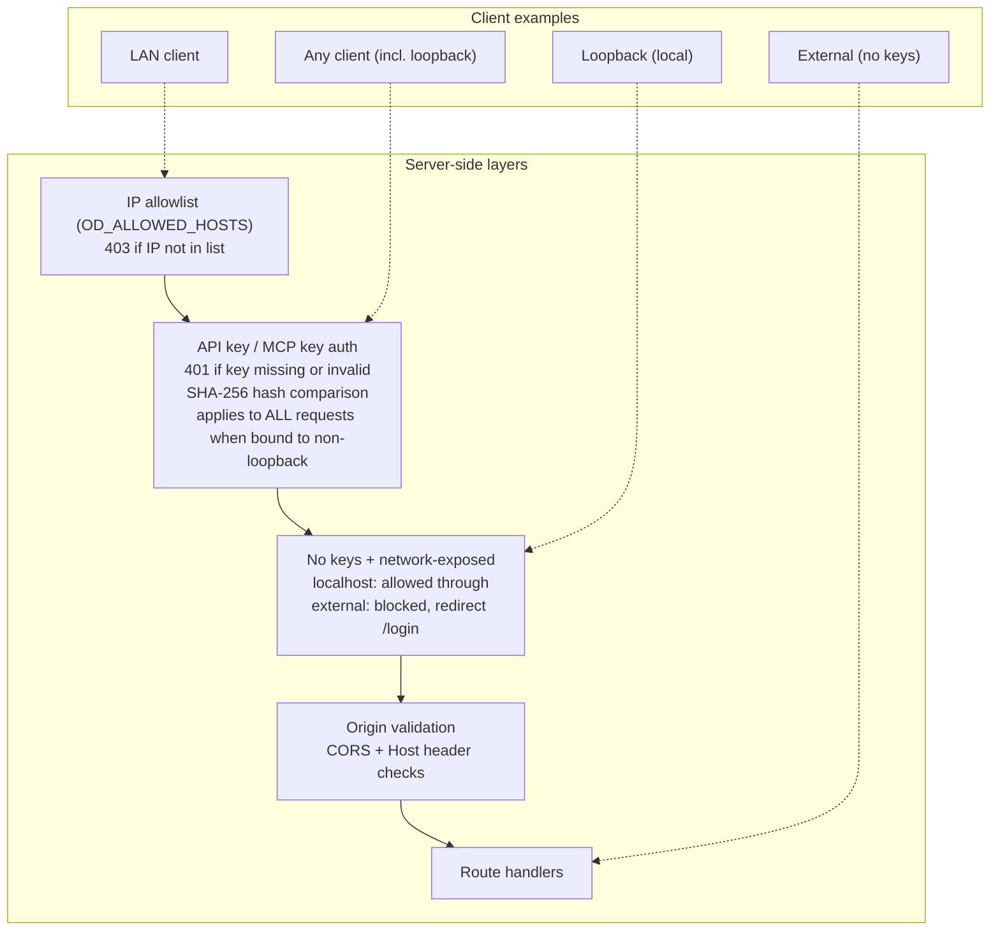

# Network Security Guide

How to expose the Open Design daemon to your network safely.

## When you need this

The daemon defaults to `127.0.0.1` (localhost only). Change the bind address when you want to:

- Access the daemon from another device on your LAN
- Run the daemon on a headless server and connect from your laptop
- Share a single daemon instance across a team

## Quick reference

```bash
# Bind to all interfaces (LAN-accessible)
od --host 0.0.0.0 --port 7456

# Bind to a specific interface (e.g. Tailscale)
od --host 100.64.0.1 --port 7456

# With API key authentication
od auth key generate --label "my-laptop"
# => od_abc123...
od --host 0.0.0.0

# With IP allowlist
OD_ALLOWED_HOSTS=192.168.1.0/24,10.0.0.5 od --host 0.0.0.0

# Tailscale: bind to tailnet IP only
od --host $(tailscale ip -4) --port 7456
```

## Configuration

| Setting | CLI flag | Env var | Default |
|---------|----------|---------|---------|
| Bind address | `--host` | `OD_BIND_HOST` | `127.0.0.1` |
| Port | `--port` | `OD_PORT` | `7456` |
| IP allowlist | — | `OD_ALLOWED_HOSTS` | (empty = allow all) |
| Extra CORS origins | — | `OD_ALLOWED_ORIGINS` | (empty) |

## Security layers

When the daemon is bound to a non-loopback address, two security layers activate automatically:

### 1. IP allowlist (`OD_ALLOWED_HOSTS`)

Comma-separated list of **client** IPs and CIDR ranges. Only these hosts can connect. Loopback (`127.0.0.1`, `::1`) is always allowed.

> **Important:** Enter the IP addresses of the *connecting devices*, not the server. For example, if the server is `192.168.1.10` and your phone is `192.168.1.42`, add the phone's IP or the whole subnet.

```bash
# Only allow one specific client IP
OD_ALLOWED_HOSTS=192.168.1.42 od --host 0.0.0.0

# Allow all devices on your LAN (recommended)
OD_ALLOWED_HOSTS=192.168.1.0/24 od --host 0.0.0.0

# Multiple entries: LAN + Tailscale
OD_ALLOWED_HOSTS=192.168.1.0/24,100.64.0.0/10 od --host 0.0.0.0
```

Common CIDR ranges:

| Range | Covers |
|-------|--------|
| `192.168.0.0/16` | All private LAN (`192.168.x.x`) |
| `192.168.1.0/24` | One subnet (`192.168.1.x`) |
| `10.0.0.0/8` | All `10.x.x.x` private |
| `100.64.0.0/10` | All Tailscale IPs |
| `192.168.1.42` | Single IP (auto-treated as `/32`) |

IP allowlist can also be configured from **Settings → Network** in the web UI. Settings are persisted across daemon restarts.

If unset, all network hosts can connect.

### 2. API key authentication

When bound to a non-loopback address, non-loopback requests must carry a valid API key or MCP key.

```bash
# Generate a key
od auth key generate --label "my-laptop"
# Output: Generated API key (id: a1b2c3d4):
#         od_abc123...
# The raw key is shown ONCE — only a SHA-256 hash is stored on disk.

# Use the key
curl -H "Authorization: Bearer od_abc123..." http://192.168.1.10:7456/api/health

# Or via header
curl -H "X-API-Key: od_abc123..." http://192.168.1.10:7456/api/health
```

API keys are stored as SHA-256 hashes in the data directory. The raw key is displayed only at generation time and cannot be recovered from the stored file. If a key is lost, revoke it and generate a new one.

#### Emergency key reset

If all keys are lost, you can reset from **localhost** only:

1. Open `http://127.0.0.1:7456/login` on the server machine
2. Click **"Lost all keys?"** at the bottom of the login page
3. Confirm the reset — this deletes all API keys and MCP keys
4. The daemon returns to an unauthenticated state

This endpoint (`POST /api/auth/reset-keys`) only works from `127.0.0.1` / `::1`. Remote devices cannot trigger a key reset.

Key management:

```bash
od auth key list              # list key IDs + labels
od auth key revoke <id>       # revoke a key
od auth key generate          # generate a new key
```

#### MCP keys (UI-retrievable)

MCP keys are a separate key type designed for MCP client authentication. Unlike API keys (SHA-256 hash only), MCP keys are AES-256-GCM encrypted and can be revealed from the UI at any time — this lets the Settings → MCP server panel include the actual key in config snippets.

Both key types use the same authentication mechanism (SHA-256 hash comparison via `timingSafeEqual`). The auth middleware checks against all valid API key hashes and MCP key hashes.

MCP keys are managed from **Settings → MCP server** in the web UI:

- **Generate**: creates a new key with `od_mcp_` prefix
- **Reveal**: decrypts and displays the full key
- **Revoke**: deletes the key permanently

When MCP keys exist, the install-info endpoint automatically includes the first key in the config snippet so users can copy-paste without manual key lookup.

### When auth is required

**Bound to `127.0.0.1` (default / desktop app)**: authentication is disabled entirely — all requests are trusted.

**Bound to a non-loopback address with API/MCP keys**: all requests — including those from localhost — require a valid API key or MCP key. This prevents tunnel proxies (Cloudflare Tunnel, ngrok) from bypassing auth when they proxy through localhost.

**Bound to a non-loopback address with NO keys**: only localhost (`127.0.0.1`, `::1`) can access the daemon. All external requests are blocked and redirected to the login page. This is a safe default — the admin can generate keys from localhost at `http://127.0.0.1:<port>/login` or via the CLI:

```bash
od auth key generate --label "my-laptop"
# Output: Generated API key (id: a1b2c3d4):
#         od_abc123...
# The raw key is shown ONCE — only a SHA-256 hash is stored on disk.
```

Once at least one API key or MCP key exists, the daemon switches to full authentication mode.

### What is skipped

- `OPTIONS` requests (CORS preflight)
- `GET /api/health` (health checks)

## Startup warnings

When bound to a non-loopback address, the daemon logs warnings on startup:

```
[od] daemon bound to 0.0.0.0 — accessible from the network
[od] WARNING: no IP allowlist (OD_ALLOWED_HOSTS) configured; all network hosts can connect
[od] WARNING: no API keys configured — only localhost access allowed; run `od auth key generate` to create one
[od] WARNING: no MCP keys configured; generate one in Settings → MCP server
```

## Nix / Home Manager

```nix
services.open-design = {
  enable = true;
  port = 7456;
  autoStart = true;
};
# Set env vars in the service definition for network exposure:
# OD_ALLOWED_HOSTS = "192.168.1.0/24";
```

## LaunchAgent (manual)

Add `OD_ALLOWED_HOSTS` to the plist `EnvironmentVariables` dict:

```xml
<key>EnvironmentVariables</key>
<dict>
  <key>OD_ALLOWED_HOSTS</key>
  <string>192.168.1.0/24</string>
</dict>
```

## Tailscale

[Tailscale](https://tailscale.com) provides a zero-config WireGuard mesh VPN. When you bind the daemon to the Tailscale interface, only authenticated devices in your tailnet can reach it — which means you can skip API key authentication entirely.

### Why Tailscale

- Each device authenticates via your identity provider (Google, GitHub, SSO, etc.)
- Traffic is end-to-end encrypted (WireGuard)
- No need to open firewall ports or manage API keys
- Works across LAN, WAN, and NAT — access your daemon from anywhere

### Setup

**1. Install Tailscale**

```bash
# macOS
brew install tailscale

# Or download from https://tailscale.com/download
```

**2. Authenticate**

```bash
sudo tailscale up
# Opens browser for login
```

**3. Find your Tailscale IP**

```bash
tailscale ip -4
# e.g. 100.64.0.1
```

**4. Bind the daemon to the Tailscale interface**

```bash
# Bind only to Tailscale IP — unreachable from regular LAN
od --host 100.64.0.1 --port 7456
```

Or via environment variable:

```bash
OD_BIND_HOST=100.64.0.1 OD_PORT=7456 od
```

**5. Connect from another device**

From any device in your tailnet:

```bash
curl http://100.64.0.1:7456/api/health
```

Open the web UI in a browser at `http://100.64.0.1:7456`.

### Bind to all interfaces with Tailscale-based allowlist

If you need both local and Tailscale access, bind to `0.0.0.0` and restrict to your tailnet range:

```bash
# Tailscale assigns IPs from 100.64.0.0/10 (CGNAT range)
OD_ALLOWED_HOSTS=127.0.0.1,100.64.0.0/10 od --host 0.0.0.0
```

This allows:
- Loopback (`127.0.0.1`) — local tools and desktop app
- Tailscale (`100.64.0.0/10`) — tailnet devices only
- Blocks everything else

### API keys with Tailscale

Tailscale provides network-level isolation, but the daemon no longer auto-bypasses API key auth for Tailscale addresses. This prevents tunnel proxies from bypassing auth. For tailnet-only setups, you can:

1. **Bind to the Tailscale IP directly** (`--host 100.64.0.1`) — only tailnet devices can reach it, and you may skip API keys if you trust all tailnet users.
2. **Bind to `0.0.0.0` with API keys** — all clients (including tailnet) must authenticate. Use `OD_ALLOWED_HOSTS=100.64.0.0/10` to restrict to tailnet devices while still requiring API keys.

```bash
# Option 1: Tailscale-only, no API keys needed
od --host 100.64.0.1 --port 7456

# Option 2: Tailscale + API keys
od auth key generate --label "tailnet-user"
OD_ALLOWED_HOSTS=100.64.0.0/10 od --host 0.0.0.0
```

### Tailscale Serve (alternative)

If you prefer HTTPS and a stable URL over an IP address, use [Tailscale Serve](https://tailscale.com/kb/1242/tailscale-serve):

```bash
# Expose the daemon over HTTPS with a stable tailnet URL
# Tailscale assigns the https://<hostname>.ts.net URL automatically
tailscale serve --bg http://localhost:7456
```

This lets you:
- Keep the daemon on `127.0.0.1` (no network exposure at all)
- Access it at `https://my-od.tail1234.ts.net` from any tailnet device
- Get automatic TLS certificates

### LaunchAgent with Tailscale

```xml
<?xml version="1.0" encoding="UTF-8"?>
<!DOCTYPE plist PUBLIC "-//Apple//DTD PLIST 1.0//EN"
  "http://www.apple.com/DTDs/PropertyList-1.0.dtd">
<plist version="1.0">
<dict>
  <key>Label</key>
  <string>com.open-design.daemon</string>
  <key>ProgramArguments</key>
  <array>
    <string>/usr/local/bin/od</string>
    <string>--host</string>
    <string>100.64.0.1</string>
    <string>--port</string>
    <string>7456</string>
  </array>
  <key>RunAtLoad</key>
  <true/>
  <key>KeepAlive</key>
  <true/>
  <key>StandardOutPath</key>
  <string>/tmp/open-design-daemon.log</string>
  <key>StandardErrorPath</key>
  <string>/tmp/open-design-daemon.err</string>
</dict>
</plist>
```

### Nix / Home Manager with Tailscale

```nix
services.open-design = {
  enable = true;
  port = 7456;
  autoStart = true;
  extraEnv.OD_BIND_HOST = "100.64.0.1";  # Tailscale IP
};
```

## Cloudflare Tunnel

Exposes the daemon over HTTPS without opening any firewall port.

```bash
# Install cloudflared
brew install cloudflare/cloudflare/cloudflared   # macOS
# or: https://developers.cloudflare.com/cloudflare-one/connections/connect-apps/install-and-setup/

# Start a quick tunnel (temporary URL, no account needed)
cloudflared tunnel --url http://localhost:7456
```

Cloudflared prints a public `https://*.trycloudflare.com` URL. The tunnel is active as long as the process runs.

For a permanent URL with a custom domain:

```bash
cloudflared tunnel login
cloudflared tunnel create open-design
cloudflared tunnel route dns open-design od.yourdomain.com
cloudflared tunnel run open-design
```

Add `OD_ALLOWED_ORIGINS=https://od.yourdomain.com` and generate an API key when exposing over a public URL.

## ngrok

```bash
# Install: https://ngrok.com/download
ngrok http 7456
```

ngrok prints a public `https://<id>.ngrok-free.app` URL. Free tier tunnels expire after a few hours; use a paid plan or Cloudflare Tunnel for persistent URLs.

## Linux systemd

```bash
CLI_JS=$(which od | xargs realpath 2>/dev/null || echo "$HOME/.local/share/pnpm/global/5/node_modules/@open-design/daemon/dist/cli.js")
NODE_BIN=$(dirname "$(which node)")

mkdir -p ~/.config/systemd/user

cat > ~/.config/systemd/user/open-design.service << EOF
[Unit]
Description=Open Design daemon
After=network.target

[Service]
ExecStart=$(which node) ${CLI_JS} --port 7456 --no-open
Environment=PATH=${NODE_BIN}:${HOME}/.local/share/pnpm:/usr/local/bin:/usr/bin:/bin
Restart=on-failure
RestartSec=5

[Install]
WantedBy=default.target
EOF

systemctl --user daemon-reload
systemctl --user enable --now open-design
journalctl --user -u open-design -f
```

## Connecting external devices

When the daemon is bound to a non-loopback address, other devices on your network (or tailnet / tunnel) can access it. The steps differ by topology.

### Step 1 — Find the server IP

The **server IP** is whatever you passed to `--host` (or set in `OD_BIND_HOST` / Settings → Network). If you used `0.0.0.0`, you need the machine's actual IP on the relevant interface.

```bash
# LAN IP (the IP your router assigned)
ifconfig | grep "inet " | grep -v 127.0.0.1
# macOS: look for en0 (Wi-Fi) or en1 (Ethernet)
# Linux: ip addr show | grep "inet " | grep -v 127.0.0.1

# Tailscale IP
tailscale ip -4
# e.g. 100.64.0.1
```

### Step 2 — Configure access on the server

Choose the topology that matches your setup:

| Topology | Daemon bind | IP allowlist | Auth |
|----------|-------------|--------------|------|
| LAN only | `0.0.0.0` | `192.168.x.0/24` | API key required |
| Tailscale direct | `100.64.x.x` | (not needed) | Optional |
| Tailscale `0.0.0.0` | `0.0.0.0` | `100.64.0.0/10` | API key required |
| Cloudflare / ngrok | `127.0.0.1` | (not needed) | API key required |

```bash
# Generate an API key (needed for LAN and tunnel topologies)
od auth key generate --label "my-phone"
# => od_abc123...
```

### Step 3 — Connect from the client device

#### Mobile browser / tablet

1. Find your device's IP to confirm network connectivity:
   - **iOS**: Settings → Wi-Fi → tap the network name → IP Address
   - **Android**: Settings → Network → Wi-Fi → tap the network → IP Address
2. Open `http://<server-ip>:7456` in the browser
3. Enter the API key on the login page

#### Mobile app (MCP client)

MCP clients (e.g. Claude mobile app, Cursor, etc.) connect to `http://<server-ip>:7456/sse` using an MCP key:

1. Generate an MCP key: Settings → MCP server → Generate
2. Copy the config snippet (includes the key and URL)
3. Paste into your MCP client's config

The URL in the config snippet depends on the topology:
- **LAN**: `http://192.168.x.x:7456/sse`
- **Tailscale**: `http://100.64.x.x:7456/sse` or `https://my-od.tail1234.ts.net/sse`
- **Cloudflare/ngrok**: `https://<tunnel-url>/sse`

#### Desktop app on another machine

The Open Design desktop app on a different machine discovers the daemon via the URL you provide at launch:

1. Start the desktop app
2. When prompted, enter `http://<server-ip>:7456`
3. If API key auth is active, you'll be redirected to the login page

#### CLI / curl

```bash
# Test connectivity first
curl http://<server-ip>:7456/api/health

# Authenticated request
curl -H "Authorization: Bearer od_abc123..." http://<server-ip>:7456/api/projects
```

### Finding client IPs for the allowlist

`OD_ALLOWED_HOSTS` controls which **client** IPs can connect. You need the IP of each connecting device, not the server.

```bash
# On the server — watch for incoming connections (useful for debugging)
# The daemon logs blocked IPs when allowlist is active:
# [od] ip-allowlist: blocked 192.168.1.42 (not in [192.168.1.0/24])
```

| How to find | Device |
|-------------|--------|
| `ifconfig` / `ip addr` | Any device's terminal |
| Settings → Wi-Fi → IP Address | iOS / Android |
| `tailscale ip -4` | Tailscale device |
| Check router's DHCP client list | Any LAN device |

Instead of listing individual IPs, prefer CIDR ranges to cover all devices on your network:

| Range | Includes |
|-------|----------|
| `192.168.0.0/16` | All `192.168.x.x` devices |
| `192.168.1.0/24` | Only `192.168.1.x` devices |
| `100.64.0.0/10` | All Tailscale devices |
| `10.0.0.0/8` | All `10.x.x.x` devices |

## Verifying connectivity

After setup, verify each layer works:

### 1. Health check (no auth required)

```bash
# From the server
curl http://127.0.0.1:7456/api/health
# => {"status":"ok"}

# From the client device
curl http://<server-ip>:7456/api/health
# => {"status":"ok"}
```

If this fails, the daemon is not reachable — check `--host`, firewall rules, and network connectivity.

### 2. Auth check

```bash
# Without key — should return 401
curl http://<server-ip>:7456/api/projects
# => {"error":"UNAUTHORIZED","reason":"API key required"}

# With key — should return 200
curl -H "Authorization: Bearer od_abc123..." http://<server-ip>:7456/api/projects
# => [...]
```

### 3. Browser check

Open `http://<server-ip>:7456` in a browser:

- **No key / unauthenticated**: redirected to `/login`
- **After login**: the main Open Design UI loads

### 4. Tailscale-specific checks

```bash
# On the server — verify Tailscale is running
tailscale status
# Should show your devices

# On the client — verify it can reach the server's Tailscale IP
ping 100.64.0.1
curl http://100.64.0.1:7456/api/health

# Check that regular LAN devices CANNOT reach Tailscale-bound daemon
# (from a non-Tailscale device)
curl http://100.64.0.1:7456/api/health
# => should timeout (Tailscale IP is not routable from regular LAN)
```

### 5. Cloudflare Tunnel checks

```bash
# After starting the tunnel, cloudflared prints the URL:
# https://some-uuid.trycloudflare.com

# Test from any device (including outside your network)
curl https://some-uuid.trycloudflare.com/api/health
# => {"status":"ok"}

# Authenticated
curl -H "Authorization: Bearer od_abc123..." https://some-uuid.trycloudflare.com/api/projects
```

For permanent tunnels, verify DNS resolution:

```bash
dig od.yourdomain.com
# Should resolve to Cloudflare IPs
```

### Troubleshooting

| Symptom | Cause | Fix |
|---------|-------|-----|
| Connection refused | Daemon not running or wrong port | Check `od` is running, verify `--port` |
| Timeout from LAN | Firewall blocking | Allow port in OS firewall (macOS: System Settings → Network → Firewall) |
| Timeout from Tailscale | Tailscale not running on client | Run `tailscale up` on the client device |
| 403 Forbidden | IP not in allowlist | Add device IP or CIDR to `OD_ALLOWED_HOSTS` |
| 401 Unauthorized | Missing or invalid API key | Generate key: `od auth key generate` |
| 302 redirect to /login | Browser request without session | Log in with API key on the login page |
| CORS error in browser | Missing origin in allowlist | Set `OD_ALLOWED_ORIGINS=https://your-origin` |
| Health check works but API doesn't | Auth layer is active (expected) | Add `Authorization: Bearer od_...` header |

## Security recommendations

1. **Use Tailscale** for cross-network access. Bind to the Tailscale IP and skip API keys entirely — identity-based auth + WireGuard encryption is stronger than shared secrets on an open LAN.
2. **Always set `OD_ALLOWED_HOSTS`** when binding to `0.0.0.0`. Without it, any device on the network can reach the daemon.
3. **Generate at least one API key** before exposing to the network without Tailscale.
4. **Prefer specific interface binding** (`--host 192.168.1.10` or `--host 100.64.0.1`) over `0.0.0.0` when possible.
5. **Use a reverse proxy** (Caddy, nginx) with TLS for production deployments. The daemon itself is HTTP-only.
6. **Do not expose the daemon to the public internet** without a VPN (Tailscale, WireGuard) or SSH tunnel.
7. **Session cookies are transmitted over HTTP.** The daemon does not support TLS, so on a LAN without encryption an attacker who can sniff traffic (ARP spoofing, rogue AP) can capture session tokens. Use Tailscale (WireGuard encryption) or a TLS-terminating reverse proxy for protection.

## Architecture



When bound to `127.0.0.1` (default / desktop app), all security layers are disabled — local-only access. When bound to any other address (`0.0.0.0`, Tailscale IP, LAN IP), API key or MCP key authentication is required for all requests including those from localhost. If no keys exist, only localhost is allowed — external devices are blocked and redirected to the login page.

## References

- Self-hosting guide: [`docs/self-hosting.md`](./self-hosting.md)
- Nix flake: `nix/README.md`
- Origin validation source: `apps/daemon/src/origin-validation.ts`
