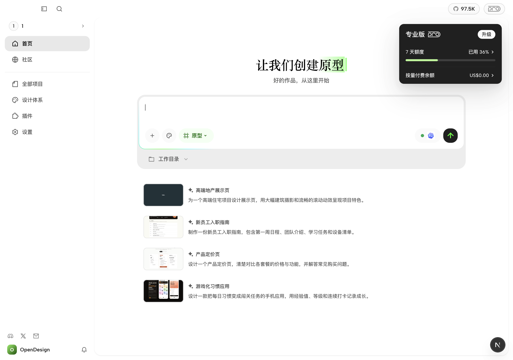
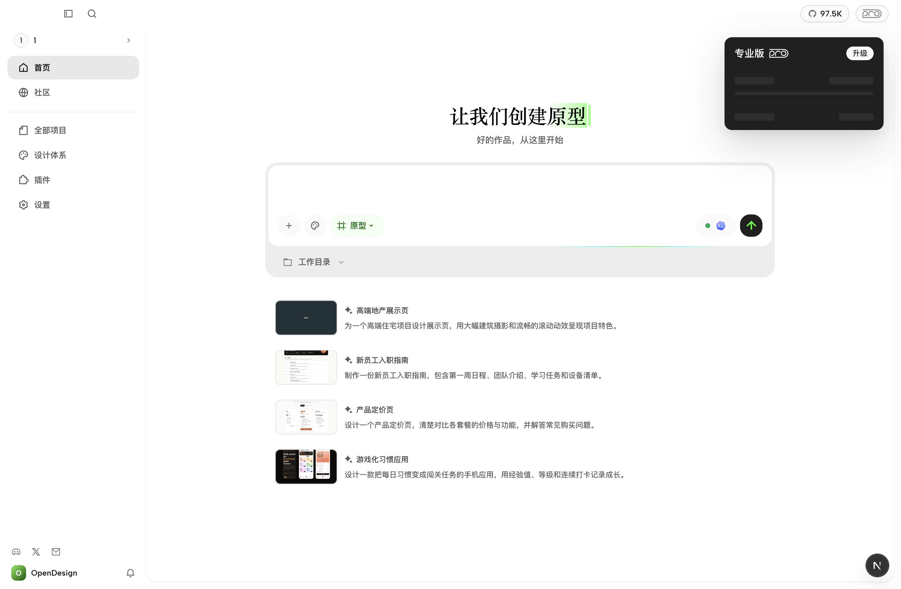

# 套餐面板 — 仅 UI 和交互示意

本目录与 `ProPlanPreview` 仅用于设计评审，未接入真实套餐权益、余额、支付或订阅逻辑。所有额度、周期、余额、套餐名称及升级/管理行为均为展示示例，不作为产品计费规则。Loading 使用模拟延迟。

## 独立 HTML

直接用浏览器打开 `index.html`，无需构建或联网。Free、Plus、Pro、Max 并排展示，顶部以英文文字区分；面板内嵌来自 https://open-design.ai/zh/pricing/ 的官方 SVG 标志。切换「全部」和「Loading 态」可持续查看对应状态。Free 不展示套餐额度或进度条。

HTML 仅展示面板常规态、hover 和 Loading 态。面板内不支持点击、跳转或弹窗；仅顶部「全部 / Loading 态」按钮用于切换展示状态。

## Electron 客户端预览

在仓库根目录通过既有开发入口启动：

```sh
NEXT_PUBLIC_PRO_PLAN_PREVIEW=1 pnpm tools-dev start desktop
```

如需隔离环境，可沿用项目 `AGENTS.md` 中的数据目录规则与 `tools-dev` 的 namespace / port 参数。

仅在 development 且显式设置 `NEXT_PUBLIC_PRO_PLAN_PREVIEW=1` 时替换右上角套餐入口，默认及生产行为保持不变。

悬停或点击 Pro 入口可展开面板；首次展开及重新展开模拟约 900ms 骨架加载，加载期间额度和钱包入口不可点击。支持 Escape、焦点离开和鼠标移出关闭；尊重减少动态效果偏好。

- 固定展示 7 天额度，不提供周期切换。
- 钱包余额与额度文字统一字号、字重、颜色；数值与箭头间距为 2px。
- 钱包余额链接指向本地控制台 `http://127.0.0.1:5454/dashboard?workspaceId=personal_workspace&billing=recharge`。该地址依赖本地独立控制台服务，本 PR 不包含该服务或其自动弹出充值窗口的实现。
- 升级入口指向官网定价页。

## 截图

客户端正常态（最终文案为「钱包余额」）：



客户端 Loading 态：


