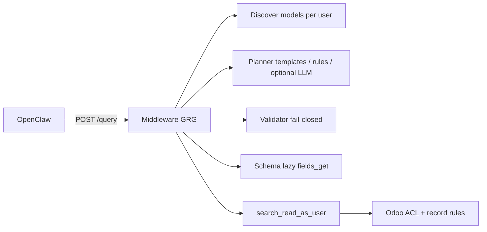

# Governed Read Gateway (GRG)

Dynamic, compliance-safe Odoo reads for the Telegram agent without hardcoding every model in middleware.

## Problem

Static `query_builder` mappings do not scale: each new question type (e.g. `WH/OUT/00036` detail, helpdesk tickets) required middleware code changes. The agent compensated with wrong tools and exposed internal errors.

## Architecture (B + C)



| Layer | Responsibility |
|-------|----------------|
| **C — Discovery** | Odoo `POST /agent/v1/model/discover` lists readable models from installed modules + ACL |
| **B — Schema** | Lazy `POST /agent/v1/model/fields_get` per model, cached with PII tiers |
| **Planner** | KPI templates → reference rules (S00007, WH/OUT…) → **LLM schema-aware** (`GRG_LLM_ENABLED`) |
| **Validator** | Model ∈ discovered, fields allowed, domain complexity caps |
| **Executor** | Always `search_read_as_user`; optional 1-hop related enrichment |

## Agent contract

- **Reads:** only `POST /v1/tools/odoo/query` with natural language `question`
- **Writes:** `POST /v1/tools/odoo/write/plan` → `POST /v1/tools/odoo/command` + approval buttons (see [GWG](governed-write-gateway.md))
- **Deprecated for agents:** unauthenticated `GET /search`, `/fields`, `/models` → **410** without `channel` + `user_id`

Auxiliary endpoints (`GET /models`, `/fields`, `/search`) remain for debugging with linked identity; agents must not use them as final answers.

## KPI templates (fast path)

| Alias / frase | Modelo Odoo | Notas |
|---------------|-------------|-------|
| ventas del mes | `sale.report` | Mes calendario actual |
| stock bajo | `stock.quant` | Cantidad &lt; 10 |
| cobranza vencida / facturas vencidas | `account.move` | `out_invoice` vencidas |
| cuentas por pagar / pagos vencidos | `account.move` | `in_invoice` vencidas |
| compras pendientes | `purchase.order` | draft / sent / to approve |
| entregas pendientes | `stock.picking` | Salidas no done/cancel |
| top clientes / mejores clientes | `res.partner` | Por `sale_order_count` |

## Rule planner (referencias y desambiguación)

Solo reglas determinísticas de **bajo mantenimiento**:

| Pregunta ejemplo | Modelo | Enriquecimiento |
|------------------|--------|-----------------|
| `detalle WH/OUT/00036` | `stock.picking` | + `stock.move` lines |
| `detalle pedido S00007` / `SO7` | `sale.order` | + `sale.order.line` |
| `detalle orden compra P00011` / `po 11` | `purchase.order` | + `purchase.order.line` |
| `factura INV/2026/00004` | `account.move` | — |
| `"orders"` ambiguo | — | Clarificación venta vs compra |

**Todo lo demás** (impuestos, empleados, flota, helpdesk, etc.) lo resuelve el **LLM planner** usando:
- Catálogo filtrado por relevancia (`rank_models_for_question`)
- `fields_get` del top-2 modelos candidatos
- Validator fail-closed antes de ejecutar

## Rule planner (legacy keyword table — removed)

<!--
Old per-model keyword routing removed to avoid maintaining every Odoo model in code.
See LLM planner + discovery instead.
-->

## Odoo module endpoints

| Method | Path | Description |
|--------|------|-------------|
| GET | `/agent/v1/health` | Module version (e.g. `19.0.1.7.0`) |
| POST | `/agent/v1/model/discover` | Models readable by `actor_user_id` |
| POST | `/agent/v1/model/fields_get` | Field metadata scoped to actor ACL |
| POST | `/agent/v1/model/search_read` | Governed read |
| POST | `/agent/v1/model/execute` | Governed write (via middleware command only) |

Discovery excludes infrastructure models (`ir.*`, `res.users`, etc.) — see `agent_model_policy.py`.

## Configuration

### Middleware (`.env`)

| Variable | Default | Description |
|----------|---------|-------------|
| `GRG_ENABLED` | `true` | Enable GRG on `/query` |
| `GRG_LLM_ENABLED` | `true` in dev/staging; `false` in prod until metrics review | LLM planner (needs `OPENAI_API_KEY`) |
| `GRG_DISCOVERY_TTL_SECONDS` | `86400` | Discovery cache TTL |
| `GRG_SCHEMA_TTL_SECONDS` | `86400` | Schema cache TTL |
| `GRG_PLAN_CONFIDENCE_MIN` | `0.7` | Minimum confidence to execute |
| `GRG_MAX_RECORDS` | `50` | Max rows per read |
| `ODOO_INTERNAL_API_TOKEN` | — | Bearer for Odoo `/agent/v1/*` and invalidate hook |

If Odoo discover returns **404** (module &lt; `19.0.1.6.0`), middleware falls back to legacy `query_builder` for known KPIs.

### Odoo — cache invalidation (recommended)

When a new Odoo app is installed, discovery cache must refresh. Options:

1. **Odoo Settings** (module ≥ `19.0.1.7.0`): **Settings → Odi Agentic → Middleware URL**
2. **Odoo.sh env vars:** `ODI_MIDDLEWARE_URL`, `ODI_MIDDLEWARE_INTERNAL_TOKEN`
3. **System parameters:** `odi_api.middleware_url`, `odi_api.middleware_internal_token`
4. **Manual:** `POST /v1/internal/discovery/invalidate` with Bearer token

**Important:** `ODI_MIDDLEWARE_URL` must be **reachable from Odoo.sh** (public URL or tunnel). `http://127.0.0.1:8169` does not work from cloud Odoo.

Local dev tunnel example:

```bash
cloudflared tunnel --url http://127.0.0.1:8169
```

## Error responses (user-facing)

| Situation | HTTP | `status` | Message pattern |
|-----------|------|----------|-----------------|
| Query not understood | 200 | `clarification_needed` | Suggests KPI templates (`ventas_mes`, …) |
| Module not installed (Flota, Helpdesk) | 200 | `clarification_needed` | *"El módulo X no está instalado…"* |
| Model not in user ACL | 200 | `clarification_needed` | *"No tengo permiso para leer…"* |
| Stale discovery cache | 200 or 500→fixed | varies | Invalidate cache after installing apps |
| Plan denied (complex domain) | 403 | — | `query_plan_denied` |
| No Telegram identity | 403 | — | `identity_not_linked` |
| Deprecated GET without identity | 410 | — | `deprecated_use_query` |

## New Odoo modules

When a module is installed and the linked user has read ACL:

1. Odoo discover returns new models (after TTL or invalidation hook)
2. Rule planner can target keywords (e.g. `helpdesk.ticket`) without middleware deploy
3. KPI templates still need explicit aliases for common phrases

## Compliance preserved

- Identity + consent required
- Fail-closed validator before Odoo calls
- `search_read_as_user` only (no API-key reads for linked users)
- `odoo_model_execute` cannot perform reads
- Audit trail includes plan model, fields, domain hash, template_id
- PII redaction unchanged

## Rollout checklist

1. Upgrade Odoo module `administranet_agentic_odi` ≥ **`19.0.1.7.0`**
2. Align `ODOO_BASE_URL`, `ODOO_DB_NAME`, `ODOO_API_KEY` with the **same** Odoo.sh instance
3. Run `odi sync-write-token` (API key must be from that instance)
4. Deploy middleware with `GRG_ENABLED=true`, `GRG_LLM_ENABLED=false`
5. Configure middleware URL invalidation (see above)
6. Validate: `WH/OUT/00036`, `P00011`, `cobranza vencida`, `ordenes de produccion`, `empleados activos`
7. Enable LLM planner only after reviewing deny/clarification metrics

## References

- Odoo module: `infra/odoo/administranet_agentic_odi/README.md`
- Compliance: `docs/compliance/control-evidence-matrix.md`
- Agent skill: `openclaw/workspace/skills/odoo-query/SKILL.md`
