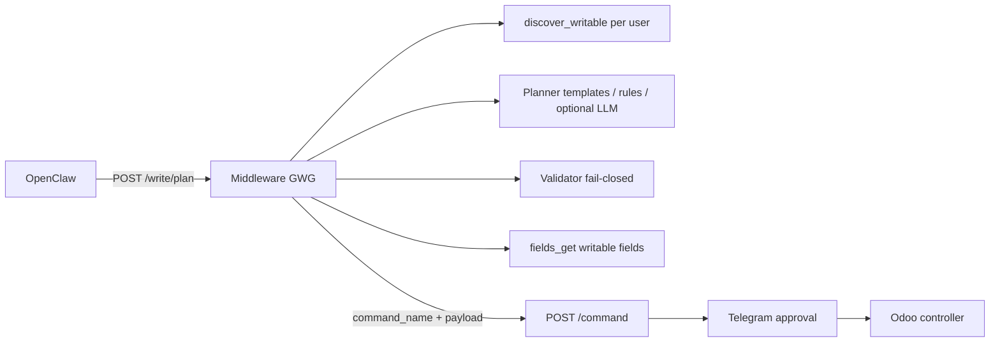

# Governed Write Gateway (GWG)

Dynamic, compliance-safe Odoo writes for the Telegram agent — symmetric to [GRG](governed-read-gateway.md).

## Problem

Writes still required the agent to hand-build `odoo_model_execute` payloads. When no named command existed (e.g. stock +5 units), the agent guessed private methods and policy blocked execution.

## Architecture



| Layer | Responsibility |
|-------|----------------|
| **Discovery** | Odoo `POST /agent/v1/model/discover_writable` — models with create/write/unlink ACL |
| **Schema** | Reuses GRG `fields_get` cache; validator rejects readonly/forbidden fields |
| **Planner** | Intent templates (stock adjust, list_price) → rules → **LLM** (`GWG_LLM_ENABLED`) |
| **Validator** | Model ∈ writable, method allowed, field sanitization |
| **Execution** | Existing `/command` + approval; domain actions via dedicated Odoo endpoints |

## Agent contract

| Step | Endpoint |
|------|----------|
| 1. Read (if needed) | `POST /v1/tools/odoo/query` |
| 2. Plan write | `POST /v1/tools/odoo/write/plan` with `intent` + optional `context_data` |
| 3. Execute | `POST /v1/tools/odoo/command` with returned `command_name` + `command_payload` |

**Do not** hand-build `odoo_model_execute` when `/write/plan` can plan the intent.

### context_data (from prior /query)

Pass resolved ids to avoid replanning loops:

```json
{
  "context_data": {
    "product_id": 2,
    "product_name": "Escritorio",
    "sale_order_id": 15
  }
}
```

## Intent templates (v1)

| Intent example | template_id | command |
|----------------|-------------|---------|
| agregar 5 unidades al producto 2 | `inventory_adjust` | `gwg_stock_inventory_adjust` |
| cambiar precio de venta a 150000 | `update_list_price` | `odoo_model_execute` (write list_price) |
| confirmar pedido (with sale_order_id) | `confirm_sale_order` | `confirm_sale_order` |

## Intent templates (Phase 2)

| Intent example | template_id | command |
|----------------|-------------|---------|
| crear proveedor "ACME SA" | `create_partner` | `create_supplier` |
| dar de alta cliente ... | `create_partner` | `create_customer` |
| regla reabastecimiento min 10 | `create_orderpoint` | `odoo_model_execute` (create orderpoint) |
| nota interna en pedido | `post_internal_note` | `post_internal_note` |
| actividad de seguimiento | `create_activity` | `create_activity` |
| confirmar pedido S00007 | `confirm_sale_order` | `confirm_sale_order` |

Named commands reuse existing `/command` handlers (approval, address resolution, audit).

## Metrics (Phase 2)

Prometheus counter `gwg_plans_total{outcome,source,template_id}`:
- `outcome`: `plan_ready` | `clarification`
- `source`: `gwg_template` | `gwg_rule` | `gwg_llm` | `gwg`
- Use before enabling `GWG_LLM_ENABLED=true` in production

Domain actions (multi-step Odoo logic) live in Odoo controllers, not in the agent.

## Odoo module endpoints

| Method | Path | Description |
|--------|------|-------------|
| POST | `/agent/v1/model/discover_writable` | Writable models for `actor_user_id` |
| POST | `/agent/v1/stock/inventory/adjust` | Signed quantity delta (+N / -N) |
| POST | `/agent/v1/model/execute` | Generic governed execute (from validated plans) |

Requires module ≥ **`19.0.1.8.0`**.

## Configuration

| Variable | Default | Description |
|----------|---------|-------------|
| `GWG_ENABLED` | `true` | Enable `/write/plan` |
| `GWG_LLM_ENABLED` | `false` | LLM fallback planner |
| `GWG_LLM_MODEL` | `gpt-4o-mini` | OpenAI model for GWG LLM |
| `GWG_DISCOVERY_TTL_SECONDS` | `86400` | Writable discovery cache TTL |
| `GWG_PLAN_CONFIDENCE_MIN` | `0.7` | Minimum confidence to return plan |

## Rollout checklist

1. Upgrade Odoo module `administranet_agentic_odi` ≥ **19.0.1.8.0**
2. Deploy middleware with `GWG_ENABLED=true`
3. Restart stack: `odi stop && odi start`
4. Validate: `/write/plan` intent *"Agregale 5 unidades"* with `context_data.product_id`
5. Confirm Telegram approval → stock updated in Odoo
6. Enable `GWG_LLM_ENABLED` after reviewing plan/clarification metrics

## References

- GRG: `docs/architecture/governed-read-gateway.md`
- Agent skill: `openclaw/workspace/skills/odoo-query/SKILL.md`
