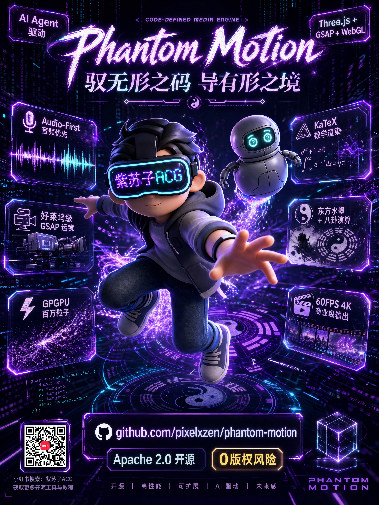

<div align="center">
  
  
  <h3>代码定义媒体引擎</h3>

  <p>
    <b>Phantom Motion</b> 是一个极致硬核的交互式动态图形生成器。<br>
    它超越了代码生成的范畴，将 <b>好莱坞级 GSAP 电影运镜</b>、<b>GPGPU 百万粒子物理</b>、<b>KaTeX 顶级数学渲染</b>、
    以及 <b>东方哲学运算</b> 融合为新一代 HTML5/WebGL 动画引擎。配合 Hyperframes 与无头浏览器，
    将 AI 生成的纯文本剧本压缩为 <b>60FPS、4K 分辨率、微秒级同步的商业级 MP4 大片</b>，全程零卡顿。
  </p>

  <p>
    <a href="./README.md">🇨🇳 简体中文</a> | <a href="./README_EN.md">🇺🇸 English Version</a>
  </p>

  <p>
    
    
    
    
    
  </p>
</div>

<div align="center">
  
</div>

---

## 🌟 为什么它超越了传统影视工业流？

市面上的代码动画往往是"生硬的元素平移"配上"高度机器人感的旁白"。**Phantom Motion** 的诞生，就是为了终结这一切——在一个 AI Agent 中融合导演的克制与图形学的极致：

- **🎙️ 声音先行引擎**：先出声，后画画。利用 TTS 获取绝对时间轴，实现 GSAP `Duck & Swell`（BGM 自动让位人声）的微秒级音画同步。支持 Gemini 3.1 Flash TTS 最新 API Schema。
- **🎥 剧本驱动电影运镜**：严禁随机飞行镜头！内置经典电影运镜手法。LLM 根据剧本情绪精确调度 3D 摄像机，采用 GSAP 跟踪代理技术。
- **🏛️ 3D 文物与全息引擎**：直接支持 GLTF/GLB 高面数 PBR 模型加载，一键切换 `Hologram Mode`（发光网格透视）。支持精确 30FPS/60FPS 物理级帧录制。
- **📊 高级数据可视化引擎**：抛弃掉帧图表库，采用 `D3.js + GSAP` 将真实数据映射为高端平滑曲线（Spline），实现与旁白同步的动态增长动画。
- **🏷️ SVGL 品牌库集成**：原生接入 SVGL API。只需提供知名品牌名称（如 GitHub、OpenAI），AI 自动下载并内联其高清矢量 SVG Logo。
- **✨ AetherViz 交互架构 (V9.0)**：引入混合坐标系和毛玻璃控制面板，实现从静态展示到 3D 交互实验室模式的无缝转换。
- **📚 Monocle 旗舰版式引擎 (V10.0)**：深度融合 *Monocle* 杂志美学，30+ 非对称网格模板、Playfair 衬线字体排版、精英视觉叙事幻灯片。
- **✨ 所见即所得交互套件 (Phantom Edit)**：每个 Phantom Deck 模板原生支持"所见即所得"编辑。双击任意文本即可修改，实时视觉反馈，自动保存并兼容 GSAP 时间轴。
- **🚫 零版权与法律风险**：所有核心特效均由原生 WebGL、Three.js Shader 及开源库组合而成。拒绝任何闭源付费插件，生成的 MP4 视频 100% 归创作者所有。

---

## 📂 仓库结构

```text
phantom-motion/
├── assets/                 # 公共媒体资源（赞助二维码、Logo 等）
├── references/             # 核心组件库（Three.js 代码片段、GSAP 运镜预设等）
├── scripts/                # 核心引擎脚本（TTS 生成、BGM 生成、HTML 合成）
├── templates/              # 最小化演示模板
│   └── phantom-space-cosmos/  # 宇宙主题演示模板（含字幕 fixture）
├── SKILL.md                # 核心 Agent 逻辑系统指令库（System Prompt V11.0）
├── logo.svg                # 动态 SVG Logo
├── README.md               # 中文文档
└── README_EN.md            # 英文文档
```

---

## 🚀 快速开始

Phantom Motion 被设计为极致优雅的 CLI Agent Skill。可挂载到当前主流的边缘或云端代码智能体：

1. **环境准备**
   确保已安装 Node.js 和 Python3，然后在本项目目录执行：
   ```bash
   npm install
   pip install requests
   ```

2. **安装到 Agent**
   可将本仓库配置为以下 AI IDE 的核心 Skill 或 Workspace：
   - **Claude Code**: 直接将本目录作为独立 Workspace 加载，或通过自定义 Skill 命令映射 `SKILL.md`。
   - **Codex / Openclaw / Hermes / Antigravity**: 将 `SKILL.md` 内容注册到你的自定义 Agent Prompt 库中，并允许 Agent 读取 `scripts/` 和 `references/` 目录。

3. **唤醒 Agent**
   在终端或对话框中输入触发词：
   > *"帮我生成一个关于量子力学的代码动画"*

4. **全自动生成**
   AI 自动分解剧本 -> 调研数据 -> 生成 TTS 与 BGM -> 组装 HTML 骨架 -> 挂载特效代码 -> 最终合成。

---

## ⚠️ 顶级 LLM 与 API Key 脱敏警告

> **【模型推荐】** 
> 好的代码动画需要反复迭代打磨才能做出精品！不要指望一句话就能出大片。精品需要与 AI 反复推敲分镜与代码迭代。
> 因此，**我们强烈建议使用顶级模型**：`Claude Opus 4.7+`、`Gemini 3.1+ Pro`、`ChatGPT 5.5+`。只有它们的海量上下文和编码逻辑才能驾驭这个级别的视觉叙事。

> **【API Key 声明】**
> 本项目的音频管线（Gemini 3.1 Flash TTS、MiniMax Music API）需要用户自行配置 API Key 和 Group ID 环境变量。
> **绝对不要将包含个人 API Key 的代码同步到 GitHub 等公共仓库！** 生成演示文件后，务必进行脱敏处理！

---

## ⚙️ 环境配置

由于引擎深度集成了 AI 语音和音乐生成能力，在渲染前请确保以下 API Key 已配置在系统环境变量（或 `.env` 文件）中：

```bash
# Gemini 3.1 Flash TTS 生成（必需）
export GEMINI_API_KEY="your_gemini_api_key_here"

# MiniMax Music 生成 API（可选，用于高级动态 BGM）
export MINIMAX_API_KEY="your_minimax_api_key_here"
export MINIMAX_GROUP_ID="your_minimax_group_id_here"
```

> ⚠️ **安全警告**：绝对不要将包含个人 API Key 或实名信息的代码/日志同步到 GitHub 等公共仓库！提交 PR 前请确保脱敏！

---

## 🚀 快速验证

无需 API Key 即可本地验证渲染管线：

```bash
# 将生成模拟音频并将模板渲染为 MP4 视频
./validate.sh
```

检查生成的视频：`phantom-output/test_cosmos.mp4`

---

## 📈 Star History

[](https://star-history.com/#Pixelxzen/phantom-motion&Date)

---

## 🤝 致谢与许可

本项目由 **紫苏子ACG (Zisuzi ACG)** 原创开发。
- **Phantom Motion 核心代码**：以 [Apache-2.0 License](./LICENSE) 开源。
- **字体与数学引擎**：基于 MIT 协议的 [KaTeX](https://github.com/KaTeX/KaTeX) 和 [SplitType](https://github.com/lukePeeters/SplitType)。
- **图形与动画**：由 [Three.js](https://threejs.org/) 和 [GSAP](https://greensock.com/) 驱动，部分数据图表渲染由 [D3.js](https://d3js.org/) 支持。
- **无头渲染引擎**：致谢 [Hyperframes](https://github.com/hyperframes/hyperframes)（技术栈版权归原作者所有）。

工具生成的最终 MP4 视频产品版权归用户所有。

---

## ☕ 支持与联系

如果你喜欢这个项目，欢迎关注我的社交媒体或请我喝杯咖啡！

<div align="center">
  <p>
    <a href="https://www.xiaohongshu.com/user/profile/5b80023bd72b6300011273e6"></a>
    
    
    <a href="https://x.com/Pixelxzen"></a>
  </p>
  
  <p><b>扫码赞助，支持开源：</b></p>
  
</div>
